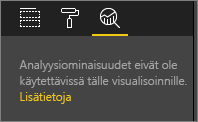

# Dynaamisten viiteviivojen luominen visualisointeihin Power BI -palvelussa

**Power BI -palvelun** **Analytiikka**-ruudussa voit lisätä dynaamisia *viiteviivoja* visualisointeihin ja määrittää kohdistuksen tärkeille trendeille tai merkityksellisille tiedoille.

> [!NOTE]
> **Analytiikka**-ruutu näkyy ainoastaan, jos valitset visualisoinnin raporttipohjalla.
> 
> 

## Analytiikka-ruudun käyttäminen
**Analytiikka**-ruudussa voit luoda seuraavanlaisia dynaamisia viiteviivoja (kaikki viivat eivät ole käytettävissä kaikkien visualisointityyppien tapauksessa):

* X-akselin yhtenäinen viiva
* Y-akselin yhtenäinen viiva
* Pienimmän arvon viiva
* Suurimman arvon viiva
* Keskiarvon viiva
* Mediaanin viiva
* Prosenttipisteviiva

Voit tarkastella tietylle visualisoinnille käytettävissä olevia dynaamisia viiteviivoja noudattamalla seuraavia ohjeita:

1. Valitse tai luo visualisointi ja valitse sitten **Analytiikka**-kuvake  **Visualisoinnit**-ruudusta.

2. Valitse alanuoli luotavan viivatyypin kohdalla, jotta saat sen asetukset näkyviin. Tässä tapauksessa valitaan **Keskiarvon viiva**.
   
   

3. Jos haluat luoda uuden viivan, valitse **+ Lisää** ja päätä mittayksikkö, jota käytetään viivan luomisessa.  Avattava **Mittayksikkö**-luettelo täytetään automaattisesti valitun visualisoinnin käytettävissä olevilla tiedoilla. Käytetään määrettä **Avoimien myymälöiden lukumäärä**.

5. Voit valita viivalle kaikenlaisia vaihtoehtoja, kuten värin, läpinäkyvyyden, tyylin ja sijainnin (liittyen visualisoinnin tietoelementteihin). Jos haluat antaa viivalle otsikon, anna sille otsikko ja siirrä sitten **Arvopisteen otsikko** -liukusäädin asentoon **Käytössä**.  Tässä tapauksessa annamme viivalle otsikon *Avoimien myymälöiden keskim. määrä* ja muutamme muutamia muita asetuksia, kuten jäljempänä esitetään.
   
   

1. Huomioi luku, joka näkyy **Keskiarvon viiva** -kohdan vieressä **Analytiikka**-ruudussa. Se kertoo sinulle, kuinka monta dynaamista viivaa sinulla on tällä hetkellä visualisoinnissa ja minkä tyyppisiä ne ovat. Jos lisäämme **yhtenäisen viivan** myymälämäärän tavoitteelle 9, huomaa, että **Analytiikka**-ruudussa näkyy, että tässä visualisoinnissa on nyt käytössä myös **Yhtenäinen viiva** -viiteviiva.
   
   
   

Voit korostaa kaikenlaisia merkityksellisiä tietoja luomalla dynaamisia viiteviivoja **Analytiikka**-ruudun avulla.

## Huomioon otettavat seikat ja vianmääritys

Jos valitsemassasi visualisoinnissa (tässä tapauksessa **Kartta**-visualisoinnissa) ei voi käyttää dynaamisia viiteviivoja, näkyviin tulee seuraava viesti, kun valitset **Analytiikka**-ruudun.
   

Dynaamisten viiteviivojen käyttömahdollisuus perustuu käytössä olevan visualisoinnin tyyppiin. Seuraavassa luettelossa esitetään, mitkä dynaamiset viivat ovat tällä hetkellä käytettävissä eri visualisoinneissa:

Seuraavissa visualisoinneissa voidaan käyttää kaikkia dynaamisia viivoja:

* Aluekaavio
* Viivakaavio
* Pistekaavio
* Klusteroitu pylväskaavio
* Klusteroitu palkkikaavio

Seuraavissa visualisoinneissa voidaan käyttää vain *yhtenäistä viivaa* **Analytiikka**-ruudusta:

* Pinottu aluekaavio
* Pinottu palkkikaavio
* Pinottu pylväskaavio
* 100 % pinottu palkkikaavio
* 100 % pinottu pylväskaavio

Seuraavissa visualisoinneissa ainoa valittavissa oleva vaihtoehto on tällä hetkellä *trendiviiva*:

* Pinoamaton viiva
* Klusteroitu pylväskaavio

Lopuksi tulee huomioida, että **Analytiikka**-ruudusta valittavia dynaamisia viiteviivoja ei voida tällä hetkellä käyttää ei-karteesisissa visualisoinneissa, kuten seuraavissa:

* Matriisi
* Ympyräkaavio
* Ympyrä
* Taulukko

## Seuraavat vaiheet
[Analytiikkaruutu Power BI Desktopissa](desktop-analytics-pane.md)

Onko sinulla muuta kysyttävää? [Kokeile Power BI -yhteisöä](http://community.powerbi.com/)

