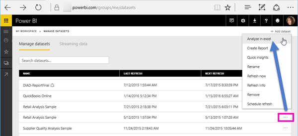
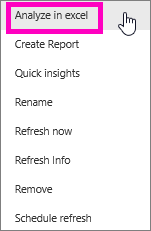
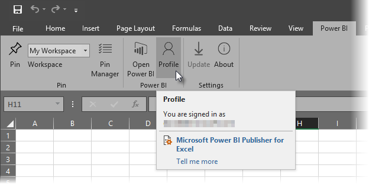

# Analysoi Excelissä
Joskus saatat haluta tarkastella ja käsitellä Power BI:ssä olevaa tietojoukkoa Excelillä. **Analysoi Excelissä** -toiminnon avulla voit tehdä niin ja käyttää pivot-taulukko-, kaavio- ja osittajaominaisuuksia Excelissä Power BI:ssä olevan tietojoukon perusteella.

## Vaatimukset
**Analysoi Excelissä** -toiminnon käyttöön liittyy joitakin vaatimuksia:

* **Analysoi Excelissä** -toimintoa tuetaan Microsoft Excel 2010 SP1:ssä ja sitä uudemmissa versioissa.
* Excelin pivot-taulukot eivät tue numeeristen kenttien koostamista vetämällä ja pudottamalla. Power BI -tietojoukossasi *on oltava ennalta määritetyt mittayksiköt*.
* Joissakin organisaatioissa voi olla ryhmäkäytäntösääntöjä, jotka estävät vaadittujen **Analysoi Excelissä** -päivitysten asentamisen Exceliin. Jos et pysty asentamaan päivityksiä, ota yhteyttä järjestelmänvalvojaan.
* **Analysoi Excelissä** edellyttää Pro-käyttöoikeutta. Saat lisätietoja toimintojen eroista maksuttoman ja Pro-käyttöoikeuden välillä artikkelista [Maksuton versio vs. Power BI Pro](service-free-vs-pro.md). 

## Toimintaperiaate
Kun valitset **Analysoi Excelissä** kolmen pisteen valikosta (...), joka liittyy tietojoukkoon tai raporttiin **Power BI:ssä**, Power BI luo .ODC-tiedoston ja lataa sen selaimesta tietokoneeseesi.

Kun avaat tiedoston Excelissä, näkyviin tulee tyhjä **pivot-taulukko** ja **Kentät**-luettelo, joka sisältää Power BI -tietojoukosta peräisin olevat taulukot, kentät ja mittayksiköt. Voit luoda pivot-taulukoita ja kaavioita ja analysoida kyseistä tietojoukkoa samaan tapaan kuin paikallista tietojoukkoa Excelissä.

. ODC-tiedostossa on MSOLAP-yhteysmerkkijono, joka muodostaa yhteyden tietojoukkoosi Power BI:ssä. Kun analysoit tai käsittelet tietoja, Excel tekee kyselyjä kyseisestä tietojoukosta Power BI:ssä ja palauttaa tulokset Exceliin. Jos tietojoukko muodostaa yhteyden reaaliaikaiseen tietolähteeseen DirectQueryn avulla, Power BI tekee kyselyjä tietolähteestä ja palauttaa tuloksen Exceliin.

**Analysoi Excelissä** on erittäin hyödyllinen toiminto tietojoukoille ja raporteille, jotka muodostavat yhteyden *Analysis Services* -taulukkomuotoon tai *moniulotteisiin* tietokantoihin tai Power BI Desktop -tiedostoista tai Excel-työkirjoista tietomalleihin, joissa on Data Analysis Expressions (DAX) -kielellä luotuja mittayksikkömalleja.

## Analysoi Excelissä -toiminnon käytön aloittaminen
Valitse Power BI:ssä raportin tai tietojoukon vieressä oleva kolmen pisteen valikko (... raportin tai tietojoukon nimen vieressä) ja valitse näyttöön tulevasta valikosta **Analysoi Excelissä**.

### Excel-päivitysten asentaminen
Kun käytät **Analysoi Excelissä** -toimintoa ensimmäistä kertaa, sinun on asennettava päivityksiä Excel-kirjastoihin. Sinua pyydetään lataamaan ja suorittamaan Excel-päivitykset (tämä käynnistää Windows-asennusohjelmapaketin *SQL_AS_OLEDDB.msi* asennuksen). Paketti asentaa **SQL Server 2016 RC0:n Microsoft AS OLE DB -palvelun (esiversio)**.

> [!NOTE]
> Muista valita **Älä näytä tätä uudelleen** **Asenna Excel-päivitykset** -valintaikkunassa. Sinun tarvitsee asentaa päivitys vain kerran.
> 
> 

Jos sinun on asennettava **Analysoi Excelissä** -toiminnon Excel-päivitykset uudelleen, voit ladata päivityksen Power BI:n **Lataa**-kuvakkeesta seuraavassa kuvassa esitetyllä tavalla.

### Kirjautuminen Power BI:hin
Vaikka olet kirjautunut sisään Power BI:hin selaimessa, ensimmäisellä kerralla, kun avaat uuden .ODC-tiedoston Excelissä, sinua saatetaan pyytää kirjautumaan Power BI:hin Power BI -tililläsi. Tämä todentaa yhteyden Excelistä Power BI:hin.

### Käyttäjät, joilla on useita Power BI -tilejä
Joillakin käyttäjillä on useita Power BI -tilejä, ja tällaiset käyttäjät saattavat kohdata tilanteen, jossa he ovat kirjautuneet Power BI:hin yhdellä tilillä mutta tili, jolla on Analysoi Excelissä -toiminnossa käytettävän tietojoukon käyttöoikeudet, on eri tili. Saatat näissä tilanteissa saada **Kielletty**-virheen tai kirjautumisvirheen, kun yrität käyttää Analysoi Excelissä -työkirjassa käytettävää tietojoukkoa.

Saat mahdollisuuden kirjautua sisään uudelleen, jolloin voit kirjautua sisään Power BI -tilillä, jolla voidaan käyttää Analysoi Excelissä -toiminnon käyttämää tietojoukkoa. Voit myös valita Excelin **Power BI** -valintanauhan välilehdeltä **Profiili**, joka yksilöi tilin, jolla olet parhaillaan kirjautuneena, ja antaa linkin, jonka avulla voit kirjautua ulos (ja kirjautua sen jälkeen sisään käyttäen eri tiliä).

### Tietoyhteyksien käyttöönotto
Jotta voit analysoida Power BI -tietojasi Excelissä, sinua kehotetaan vahvistamaan .odc-tiedoston tiedostonimi ja polku. Valitse sitten **Ota käyttöön**.

> [!NOTE]
> Power BI -vuokraajien järjestelmänvalvojat voivat *Power BI -hallintaportaalissa* poistaa käytöstä **Analysoi Excelissä** -toiminnon käyttämisen Analysis Services (AS) -tietokannoissa säilytettävissä paikallisissa tietojoukoissa. Kun asetus on poistettu käytöstä, **Analysoi Excelissä** on poistettu käytöstä AS-tietokannoista, mutta se on edelleen käytettävissä muissa tietojoukoissa.
> 
> 

## Analysoiminen
Nyt kun Excel on avattu ja sinulla on tyhjä pivot-taulukko, voit tehdä kaikenlaisia analyyseja Power BI -tietojoukon avulla. Samoin kuin muissa paikallisissa työkirjoissa, Analysoi Excelissä -toiminnon avulla voit luoda pivot-taulukoita ja kaavioita, lisätä tietoja muista lähteistä ja niin edelleen. Tietysti voit luoda myös erilaisia laskentataulukoita, jotka tarjoavat monenlaisia näkymiä tietoihisi.

> [!NOTE]
> On tärkeää tietää, että **Analysoi Excelissä** -toiminnon käyttäminen paljastaa kaikki yksityiskohtaiset tiedot jokaiselle käyttäjälle, jolla on tietojoukon käyttöoikeus.
> 
> 

## Tallentaminen
Voit tallentaa tämän työkirjaan yhdistetyn Power BI -tietojoukon samalla tavalla kuin minkä tahansa muun työkirjan. Et voi kuitenkaan julkaista tai tuoda työkirjaa takaisin Power BI:hin, koska voit julkaista tai tuoda Power BI:hin vain työkirjoja, joiden taulukot sisältävät tietoja tai joissa on tietomalli. Koska uudella työkirjalla on yhteys Power BI:n tietojoukkoon, sen julkaiseminen tai tuominen Power BI:hin kiertäisi kehää.

## Jakaminen
Kun työkirja on tallennettu, voit jakaa sen muiden Power BI -käyttäjien kanssa organisaatiossasi.

Kun käyttäjä, jonka kanssa olet jakanut työkirjan, avaa työkirjan, hän näkee pivot-taulukot ja tiedot sellaisina kuin ne näkyivät työkirjan viimeisen tallennuksen yhteydessä, joten kyseessä ei välttämättä ole tietojen uusin versio. Saadakseen uusimmat tiedot käyttäjien on käytettävä **Tiedot**-valintanauhan **Päivitä**-painiketta. Koska työkirja on yhdistetty Power BI:n tietojoukkoon, työkirjaa päivittävien käyttäjien on kirjauduttava Power BI:hin ja asennettava Excel-päivitykset, kun he yrittävät päivittää ensimmäistä kertaa tällä tavalla.

Koska käyttäjien on päivitettävä tietojoukko, eikä ulkoisten yhteyksien päivittämistä tueta Excel Onlinessa, on suositeltavaa, että käyttäjät avaavat työkirjan Excelin työpöytäversiossa tietokoneellaan.

## Vianmääritys
Analysoi Excelissä -toiminto voi ajoittain antaa odottamattomia tuloksia tai toimia odottamattomalla tavalla. [Tämä sivu sisältää ratkaisuja yleisiin ongelmiin käytettäessä Analysoi Excelissä -toimintoa](desktop-troubleshooting-analyze-in-excel.md)