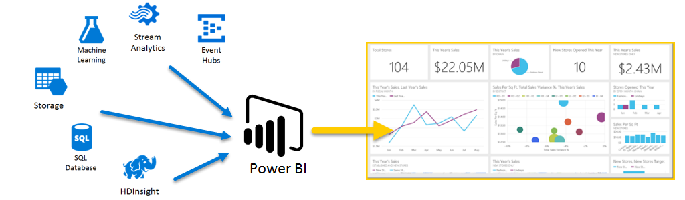
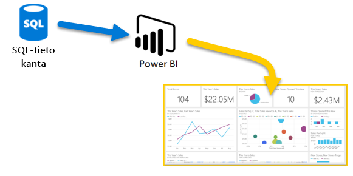
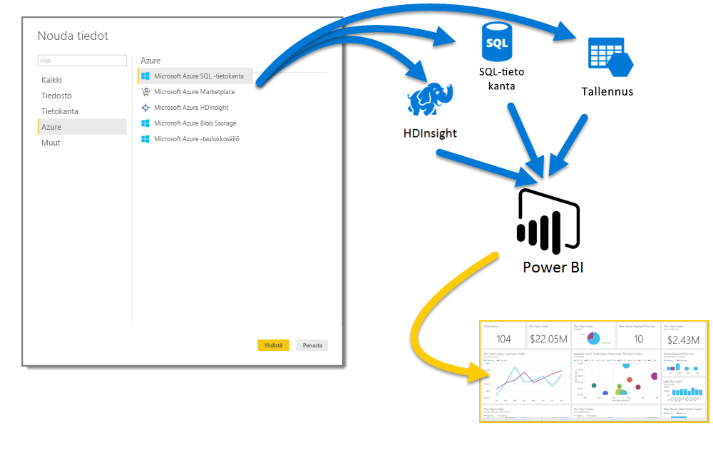
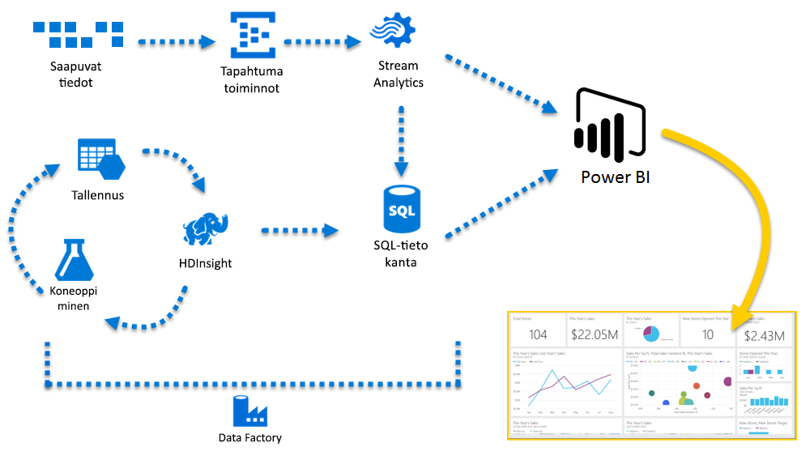

# Azure ja Power BI

**Azure**-palveluiden ja **Power BI:n avulla** voit siirtää tietojenkäsittelyllä saamasi tiedot analyyseihin ja raporttien, joilla saadaan reaaliaikaisia tietoja yrityksestäsi. Oli tietojen käsittely sitten pilvipohjaista tai paikallista, yksinkertaista tai monimutkaista, yhdestä lähteestä tai massiivisesti skaalattua, tallennettua tai reaaliaikaisia, Azure ja Power BI sisältävät kiinteän liitännän ja integraation yrityksesi liiketoimintatiedon hallintaa varten.

Power BI mahdollista monia Azure-yhteyksiä, ja kyseisten palvelujen avulla saatujen liiketoimintatietojen hallinta tapahtuu täysin yrityskohtaisesti ja yksilöllisesti. Voit yhdistää niinkin pienen yksikön kuin yhden Azure-tietolähteen tai useampia ja muotoilla ja jalostaa tietojasi mukautettujen raporttien luomiseksi.

## Azure SQL -tietokanta ja Power BI

Voit aloittaa yksinkertaisesta yhteydestä Azure SQL-tietokantaan ja luoda raportteja liiketoiminnan kehittymisen valvomiseksi. Käyttämällä [Power BI Desktopia](desktop-getting-started.md) voit luoda raportteja, jotka tunnistavat trendejä ja suorituskyvyn mittareita, jotka vievät yritystäsi eteenpäin.

Saat runsaasti lisätietoja kohdasta [Azure SQL -tietokanta](http://azure.microsoft.com/services/sql-database/).

## Pilvipalvelutietojen muuntaminen, muotoilu tai sulauttaminen

Onko sinulla lisää monimutkaista tietoa ja kaikenlaisista lähteistä? Ei huolta. **Power BI Desktop-** ja Azure-palveluilla yhteydet muodostetaan vain napauttamalla **Nouda tiedot** -valintaikkunaa. Samassa kyselyssä voit muodostaa yhteyden **Azure SQL-tietokantaan**, **Azure HDInsight** -tietolähteeseesi ja **Azure Blob -säilöön** (tai **Azure-taulukon tallennustilaan**), ja valitse sitten vain kustakin tarvitsemasi alijoukot ja tarkenna sitä sieltä.

Voit myös luoda erilaisia raportteja eri käyttäjäryhmille käyttämällä samoja tietoyhteyksiä ja jopa samaa kyselyä. Luo uusi sivu, tarkenna visualisointia kullekin käyttäjäryhmälle ja pysyt perillä liiketoimintaasi koskevista asioista.

Lisätietoja saat seuraavista resursseista:

* [Azure SQL -tietokanta](http://azure.microsoft.com/services/sql-database/)
* [Azure HDInsight](http://azure.microsoft.com/services/hdinsight/)
* [Azure-tallennustila](http://azure.microsoft.com/services/storage/) (Blob-tallennustila ja taulukkotallennus)

## Hallitse monimutkaisia tilanteita käyttämällä Azure- ja Power BI -palveluita

Voit laajentua juuri niin paljon kuin pitää Azuren ja Power BI:n avulla. Usean lähteen tietojen hallinta tapahtuu hyödyntämällä valtavia reaaliaikaisia järjestelmiä ottamalla käyttöön [Stream Analytic-](http://azure.microsoft.com/services/stream-analytics/)ja [Event Hubs](http://azure.microsoft.com/services/event-hubs/) ja yhdistämällä vaihtelevat SaaS-palvelut liiketoimintatietojen hallintaan, jolla terävöittää liiketoimintaasi.

## Kontekstipohjaisia merkityksellisiä tietoja Power BI Embeddedin analytiikan avulla

Upota näyttäviä ja vuorovaikutteisia tietojen visualisointeja sovelluksiin, sivustoihin, portaaleihin ja muihin ympäristöihin, niin voit hyödyntää yrityksesi keräämää tietoa. Kun organisaatiollasi on [Power BI Embedded resurssina Azuressa](https://azure.microsoft.com/services/power-bi-embedded/), voit helposti upottaa vuorovaikutteisia raportteja ja raporttinäkymiä, jolloin käyttäjäsi voivat hyötyä yhdenmukaisesta ja korkealaatuisesta kokemuksesta kaikilla laitteilla.  Power BI yhdistettynä analyysien upottamiseen auttaa organisaatiotasi tuottamaan datasta merkityksellisiä tietoja päätösten tueksi.  Lisäksi voit kasvattaa Power BI:n ja Azuren tuottamaa lisäarvoa upottamalla analytiikkaa [organisaation sisäisiin sovelluksiin ja portaaleihin](https://powerbi.microsoft.com/developers/embedded-analytics/organization/).

Power BI API:sta on runsaasti tietoa [Power BI -kehittäjäportaalissa](http://dev.powerbi.com).

Jos haluat lisätietoja, tutustu ohjeaiheeseen [Mitä kehittäjät voivat tehdä Power BI:llä?](developer/what-can-you-do.md).

## Power BI -tietojen upottaminen sovellukseen

Upota näyttäviä ja vuorovaikutteisia tietojen visualisointeja sovelluksiin, sivustoihin, portaaleihin ja muihin ympäristöihin, niin voit esittää yrityksesi keräämää tietoa kontekstissaan. Kun organisaatiosi käyttää [Power BI Embeddediä Azuressa](https://azure.microsoft.com/services/power-bi-embedded/), voit helposti upottaa vuorovaikutteisia raportteja ja raporttinäkymiä, jolloin käyttäjäsi voivat hyötyä yhdenmukaisesta ja korkealaatuisesta kokemuksesta kaikilla laitteilla.

## Mitä Azurella ja Power BI:lla voi tehdä?

On olemassa runsaasti skenaarioita, joissa **Azure** ja **Power BI** voidaan yhdistää. Mahdollisuudet ja tilaisuudet ovat yhtä yksilöllisiä kuin liiketoimintasi. Saat lisätietoja **Azure-palveluista** tutustumalla tähän [yleiskatsaussivuun](https://docs.microsoft.com/azure/machine-learning/team-data-science-process/plan-your-environment), mikä kuvaa **tietojen analysoinnin skenaarioita Azurea käyttämällä** ja lue, miten voit muuntaa tietolähteet osaamiseksi, joka vie liiketoimintaasi eteenpäin.