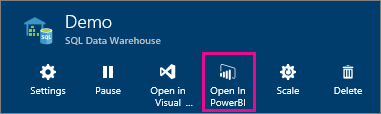
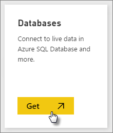
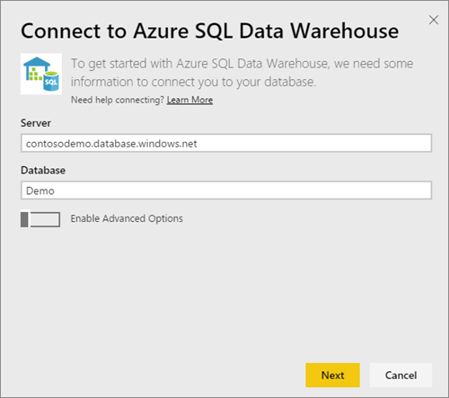
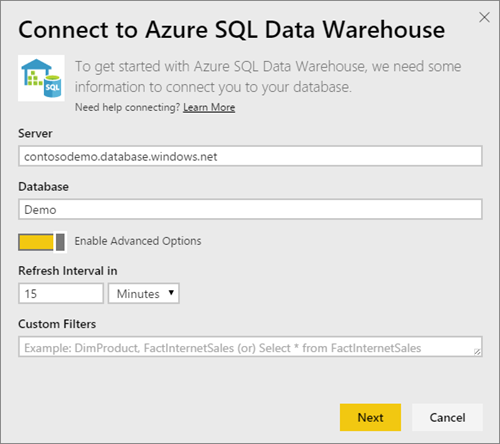

# Azure SQL Data Warehouse ja DirectQuery

Azure SQL Data Warehouse ja DirectQueryn avulla voit luoda dynaamisia raportteja niiden tietojen ja arvojen perusteella, joita sinulla jo on Azure SQL Data Warehousessa. DirectQueryn avulla kyselyt lähetetään takaisin Azure SQL Data Warehouseen reaaliaikaisesti tutkiessasi tietoja. Reaaliaikaiset kyselyt yhdessä SQL Data Warehousen skaalattavuuden kanssa mahdollistavat sen, että käyttäjät voivat luoda dynaamisia raportteja muutamassa minuutissa useista teratavuista tietoja. Lisäksi **Avaa Power BI:ssä** -painikkeen käyttöönoton avulla käyttäjät voivat muodostaa yhdistää Power BI:n suoraan SQL Data Warehouseen ilman, että heidän tarvitsee määrittää manuaalisesti tietoja.

SQL Data Warehouse -yhdistintä käytettäessä

* Määritä palvelimen täydellinen nimi yhteyttä muodostettaessa (katso tiedot alla)
* Varmista, että palvelimen palomuurisääntöjen määrityksenä on ”Salli Azure-palvelujen käyttö”
* Jokainen toiminto, kuten sarakkeen valitseminen tai suodattimen lisääminen, tekee kyselyn suoraan tietovarastoon
* Ruudut on määritetty päivitettäväksi noin 15 minuutin välein, ja päivitystä ei tarvitse ajoittaa.  Päivitystä voidaan muokata Lisäasetukset-kohdassa, kun muodostat yhteyden.
* Q&A ei ole käytettävissä DirectQuery-tietojoukoissa.
* Rakenteen muutoksia ei poimita automaattisesti.

Nämä rajoitukset ja muistiinpanot saattavat muuttua jatkaessamme käyttökokemusten kehittämistä. Yhdistämisen vaiheet on kuvattu alla.

## Avaa Power BI:ssä -painikkeen käyttäminen

> [!Important]
> Olemme parantaneet liitettävyyttämme Azure SQL Data Warehouseen.  Pystyt parhaiten muodostamaan yhteyden Azure SQL Data Warehouse-tietolähteeseen Power BI Desktopin avulla.  Kun olet luonut mallin ja raportin, voit julkaista sen Power BI -palvelussa.  Suora yhdistin Azure SQL Data Warehouselle Power BI-palvelussa on nyt vanhentunut.

Helpoin tapa siirtyä SQL Data Warehousen ja Power BI:n välillä on **Avaa Power BI:ssä** -painikkeella Azure-portaalissa. Tämän painikkeen avulla voit aloittaa saumattomasti uusien koontinäyttöjen luomisen Power BI:ssä.

1. Aloita siirtymällä SQL Data Warehouse -esiintymään Azure-portaalissa. Ota huomioon, että SQL Data Warehousella on näkyvyys ainoastaan Azure-portaalissa tällä hetkellä.

2. Napsauta **Avaa Power BI:ssä** -painiketta

    

3. Jos emme voi kirjata sinua suoraan sisään tai jos sinulla ei ole Power BI -tiliä, sinun on kirjauduttava sisään.

4. Sinut ohjataan SQL Data Warehousen yhteyssivulle, ja SQL Data Warehousen tiedot on täytetty valmiiksi. Anna tunnistetietosi ja muodosta yhteys valitsemalla Yhdistä.

## Yhteyden muodostaminen Power BI:n kautta

SQL Data Warehouse näkyy myös Power BI:n Nouda tiedot -sivulla. 

1. Valitse siirtymisruudun alareunassa **Nouda tiedot**.  

    

2. Valitse **Tietokannat**-kohdassa **Nouda**.

    

3. Valitse **SQL Data Warehouse** \> **Yhdistä**.

    

4. Anna tarvittavat tiedot, jotta voit muodostaa yhteyden. **Parametrien etsiminen** -kohdassa alla näkyy, missä tiedot voivat sijaita Azure-portaalissa.

    

    

    

   > [!NOTE]
   > Käyttäjänimi on käyttäjä, joka on määritetty Azure SQL Data Warehouse -esiintymässä.

5. Poraudu tietojoukkoon valitsemalla uuden ruudun tai juuri luodun tietojoukon, jonka merkkinä on tähti. Tällä tietojoukolla on sama nimi kuin tietokannalla.

    

6. Voit tutkia kaikkia taulukoita ja sarakkeita. Sarakkeen valitseminen lähettää kyselyn takaisin lähteeseen luoden visualisoinnin dynaamisesti. Suodattimet myös käännetään kyselyiksi takaisin tietovarastoon. Nämä visualisoinnit voidaan tallentaa uudessa raportissa ja kiinnittää takaisin koontinäyttöön.

    

## Parametriarvojen etsiminen

Täydellinen palvelimen nimi ja tietokannan nimi löytyvät Azure-portaalista. Ota huomioon, että SQL Data Warehousella on näkyvyys ainoastaan Azure-portaalissa tällä hetkellä.

> [!NOTE]
> Jos Power BI -vuokraaja on samalla alueella kuin Azure SQL Data Warehouse, lähtevän liikenteen maksuja ei ole. Voit etsiä Power BI -vuokraajan sijainnin [näiden ohjeiden](https://docs.microsoft.com/power-bi/service-admin-where-is-my-tenant-located) avulla.

[!INCLUDE [direct-query-sso](includes/direct-query-sso.md)]

## Seuraavat vaiheet

* [Mikä on Power BI?](fundamentals/power-bi-overview.md)  
* [Tietojen noutaminen Power BI:hin](service-get-data.md)  
* [Azure SQL Data Warehouse](/azure/sql-data-warehouse/sql-data-warehouse-overview-what-is/)

Onko sinulla muuta kysyttävää? [Kokeile Power BI -yhteisöä](https://community.powerbi.com/)
