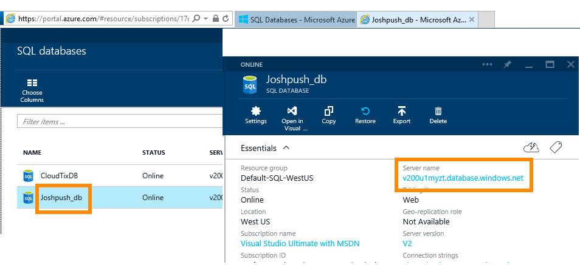
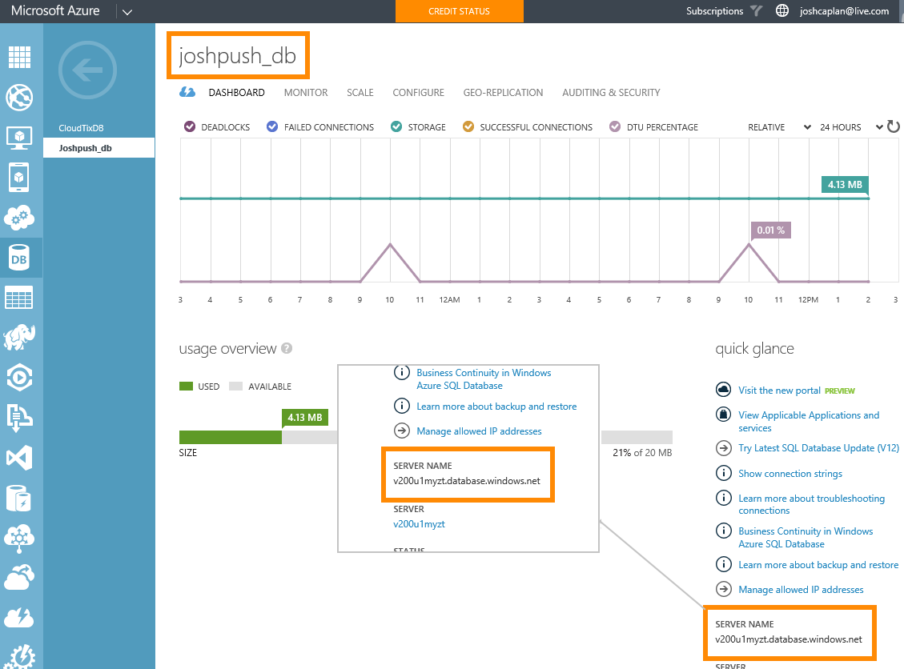

# Azure SQL -tietokanta ja DirectQuery

Lue, miten voit muodostaa yhteyden suoraan Azure SQL -tietokantaan ja luoda raportteja, joissa käytetään reaaliaikaisia tietoja. Voit pitää tietosi lähteessä Power BI:n sijaan.

DirectQueryn avulla kyselyt lähetetään takaisin Microsoft Azuren SQL-tietokantaan tarkastellessasi tietoja raporttinäkymässä. Tätä kokemusta ehdotetaan käyttäjille, jotka ovat perehtyneet tietokantoihin ja entiteetteihin, joihin he ovat muodostamassa yhteyttä.

**Huomautukset:**

* Määritä palvelimen täydellinen nimi yhteyttä muodostettaessa (katso lisätietoja alla).
* Varmista, että tietokannan palomuurisäännöt on määritetty [sallimaan Azure-palveluiden käyttö](https://docs.microsoft.com/azure/sql-database/sql-database-networkaccess-overview#allow-azure-services).
* Jokainen toiminto, kuten sarakkeen valitseminen tai suodattimen lisääminen, lähettää kyselyn takaisin tietokantaan.
* Ruudut päivitetään tunnin välein (päivitystä ei tarvitse ajoittaa). Voit muokata päivitysväliä lisäasetuksissa, kun muodostat yhteyden.
* Q&A ei ole käytettävissä DirectQuery-tietojoukoissa.
* Rakenteen muutoksia ei poimita automaattisesti.

Nämä rajoitukset ja muistiinpanot saattavat muuttua jatkaessamme käyttökokemusten kehittämistä. Yhdistämisen vaiheet on kuvattu alla.

> [!Important]
> Olemme parantaneet liitettävyyttämme Azure SQL -tietokantaan.  Pystyt parhaiten muodostamaan yhteyden Azure SQL -tietokannan tietolähteeseen Power BI Desktopin avulla.  Kun olet luonut mallin ja raportin, voit julkaista sen Power BI -palvelussa.  Suora yhdistin Azure SQL -tietokannalle Power BI-palvelussa on nyt vanhentunut.

## Power BI Desktop ja DirectQuery

Jos haluat muodostaa yhteyden Azure SQL -tietokantaan DirectQueryllä, sinun täytyy käyttää Power BI Desktopia. Tämä lähestymistapa tarjoaa enemmän joustavuutta ja ominaisuuksia. Power BI Desktopin avulla luodut raportit voidaan sitten julkaista Power BI -palveluun. Saat lisätietoja yhteyden muodostamisesta [Microsoft Azuren SQL-tietokantaan DirectQueryä käyttämällä](desktop-use-directquery.md) Power BI Desktopissa.

## Parametriarvojen etsiminen

Voit etsiä täydellisen palvelimen nimen ja tietokannan nimen Azure-portaalista.

[!INCLUDE [direct-query-sso](includes/direct-query-sso.md)]

## Seuraavat vaiheet

* [DirectQueryn käyttö Power BI Desktopissa](desktop-use-directquery.md)  
* [Mikä on Power BI?](fundamentals/power-bi-overview.md)  
* [Tietojen noutaminen Power BI:hin](service-get-data.md)  

Onko sinulla kysyttävää? [Kokeile Power BI -yhteisöä](https://community.powerbi.com/)
