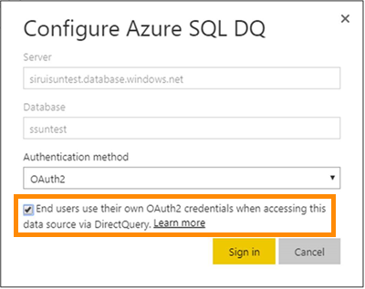

# Azure SQL -tietokanta ja DirectQuery
Lue, miten voit muodostaa yhteyden suoraan Azure SQL -tietokantaan ja luoda raportteja, joissa käytetään reaaliaikaisia tietoja. Voit pitää tietosi lähteessä Power BI:n sijaan.

DirectQueryn avulla kyselyt lähetetään takaisin Microsoft Azuren SQL-tietokantaan tarkastellessasi tietoja raporttinäkymässä. Tätä kokemusta ehdotetaan käyttäjille, jotka ovat perehtyneet tietokantoihin ja entiteetteihin, joihin he ovat muodostamassa yhteyttä.

**Huomautukset:**

* Määritä palvelimen täydellinen nimi yhteyttä muodostettaessa (katso lisätietoja alla)
* Varmista, että tietokannan palomuurisääntöjen määrityksenä on ”[Salli Azure-palvelujen käyttö](https://msdn.microsoft.com/library/azure/ee621782.aspx)”
* Jokainen toiminto, kuten sarakkeen valitseminen tai suodattimen lisääminen, lähettää kyselyn takaisin tietokantaan
* Ruudut päivitetään tunnin välein (päivitystä ei tarvitse ajoittaa). Tätä voidaan muokata Lisäasetukset-kohdassa, kun muodostat yhteyden.
* Q&A ei ole käytettävissä DirectQuery-tietojoukoissa
* Rakenteen muutoksia ei poimita automaattisesti

Nämä rajoitukset ja muistiinpanot saattavat muuttua jatkaessamme käyttökokemusten kehittämistä. Yhdistämisen vaiheet on kuvattu alla. 

## Power BI Desktop ja DirectQuery
Jotta voit muodostaa yhteyden Microsoft Azuren SQL-tietokantaan DirectQueryä käyttämällä, sinun on käytettävä Power BI Desktopia. Tämä lähestymistapa tarjoaa enemmän joustavuutta ja ominaisuuksia. Power BI Desktopin avulla luodut raportit voidaan sitten julkaista Power BI -palveluun. Saat lisätietoja yhteyden muodostamisesta [Microsoft Azuren SQL-tietokantaan DirectQueryä käyttämällä](desktop-use-directquery.md) Power BI Desktopissa. 

## Kertakirjautuminen

Kun julkaiset Azure SQL DirectQuery -tietojoukon palveluun, voit ottaa kertakirjautumisen (SSO) käyttöön Azure Active Directory (Azure AD) OAuth2:n käyttäjillesi. 

Voit ottaa kertakirjautumisen käyttöön siirtymällä tietojoukon asetuksiin, avaamalla **Tietolähteet**-välilehden ja valitsemalla Kertakirjautuminen-valintaruudun.

Kun SSO-asetus on käytössä ja käyttäjät käyttävät raportteja, jotka on luotu tietolähteeseen, Power BI lähettää todennetut Azure AD -tunnistetiedot kyselyissä Azure SQL -tietokantaan. Näin Power BI voi noudattaa tietoturva-asetuksia, jotka on määritetty tietolähteen tasolla.

Kertakirjautumisen asetus tulee voimaan kaikissa tietojoukoissa, jotka käyttävät tätä tietolähdettä. Se ei vaikuta tuontitilanteissa käytettyihin todentamismenetelmiin.

## Parametriarvojen etsiminen
Täydellinen palvelimen nimi ja tietokannan nimi löytyvät Azure-portaalista.

## Seuraavat vaiheet
[DirectQueryn käyttö Power BI Desktopissa](desktop-use-directquery.md)  
[Power BI:n käytön aloittaminen](service-get-started.md)  
[Tietojen noutaminen Power BI:hin](service-get-data.md)  
Onko sinulla muuta kysyttävää? [Kokeile Power BI -yhteisöä](http://community.powerbi.com/)
