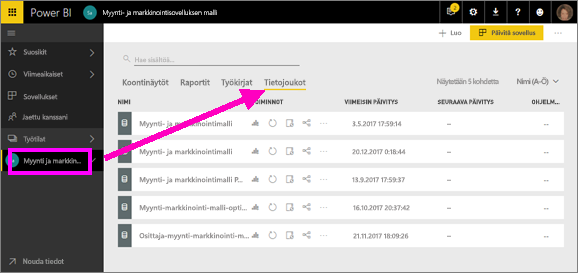
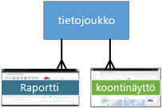
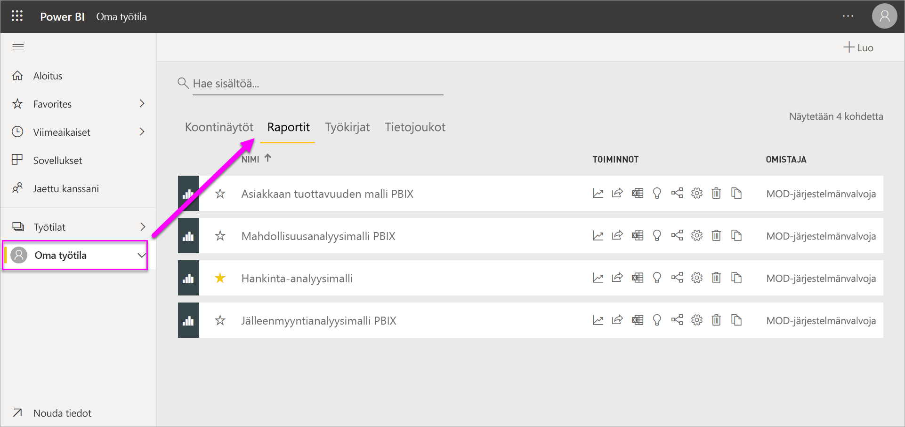
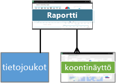
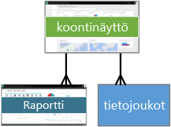
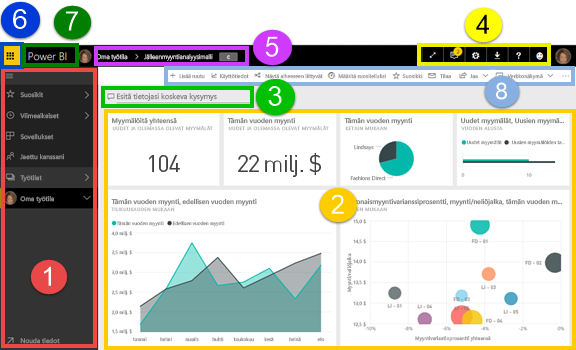
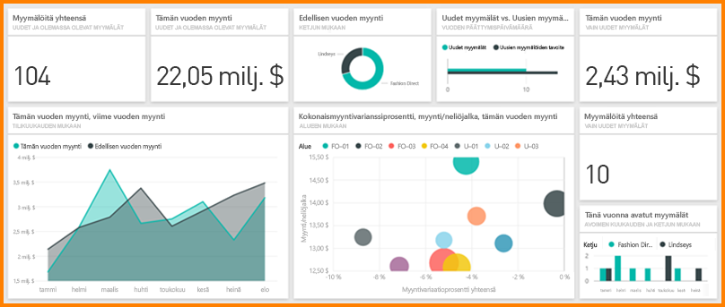

# Power BI -palvelun peruskäsitteitä suunnittelijoille

Tässä artikkelissa esitellään Power BI -palvelua: mitä ovat sen eri elementit, miten ne toimivat yhteen ja miten voit käyttää niitä. Saatat hyötyä artikkelista eniten, jos olet jo [rekisteröitynyt Power BI -palvelun käyttäjäksi](service-self-service-signup-for-power-bi.md) ja [lisännyt palveluun joitakin tietoja](service-get-data.md). Suunnittelijana työnkulkusi alkaa yleensä raporttien luomisesta Power BI Desktopissa. Seuraavaksi julkaiset ne Power BI -palveluun, jossa voit jatkaa niiden muokkaamista. Power BI -palvelussa luot myös raportteihisi perustuvat koontinäytöt. 

Jos sinulla ei ole vielä omia raportteja, yritä asentaa [Power BI -mallin sisältöpaketti](sample-datasets.md#the-power-bi-samples-as-content-packs) tätä artikkelia varten.

Kun avaat Power BI -palvelun selaimessa, palvelun Aloitussivu avautuu. Saatat nähdä seuraavia elementtejä:

1. Siirtymisruutu (vasen siirtymispalkki)
2. Office 365 -sovellusten käynnistystoiminto
3. Power BI:n aloituspainike
4. Kuvakepainikkeet, mukaan lukien asetukset, ohjeet ja palautteet
5. Hakuruutu
6. Suosituimmat ja yleisimmät koontinäytöt, raportit ja työtilat
7. Viimeisimmät koontinäytöt, raportit ja työtilat
8. Omat työtilat

Raporttiesi ja koontinäyttöjesi käyttäjät aloittavat samasta näkymästä käyttäessään Power BI -palvelua selaimella (samoin kuin sinä itsekin).

Tutustumme näihin ominaisuuksiin myöhemmin tarkemmin, mutta käydään ensin läpi muutamia Power BI:n peruskäsitteitä. Vaihtoehtoisesti voit katsoa tämän videon ensin.  Videolla Will kertoo peruskäsitteistä ja esittelee Power BI -palvelua.

<iframe width="560" height="315" src="https://www.youtube.com/embed/B2vd4MQrz4M" frameborder="0" allowfullscreen></iframe>

## Power BI:n käsitteet
Power BI:n neljä peruselementtiä ovat: **_koontinäytöt_** , **_raportit_** , **_työkirjat_** ja **_tietojoukot_** . Ne on kaikki järjestetty **_työtiloiksi_** . Työtilojen käsite on tärkeä ymmärtää ennen neljään peruselementtiin tutustumista, joten aloitetaan siitä.

## Työtilat
Työtilat ovat Power BI:ssä olevia säilöjä koontinäytöille, raporteille, työkirjoille ja tietojoukoille. Työtiloja on kahdenlaisia: *Oma työtila* ja *työtilat*. Entä mitä tarkoitetaan *sovelluksella*? Power BI -*sovellus* on kokoelma koontinäyttöjä ja raportteja, joiden avulla voit kuvata keskeisiä mittalukuja organisaatiosi Power BI -loppukäyttäjille. Sovellukset ovat vuorovaikutteisia, mutta loppukäyttäjät eivät voi muokata niitä.

- *Oma työtila* on jokaisen Power BI -asiakkaan henkilökohtainen työtila oman sisällön käsittelyyn. Vain sinulla on käyttöoikeus omaan työtilaasi. Oman työtilan kautta voi jakaa raporttinäkymiä ja raportteja. Jos haluat käsitellä koontinäyttöjä ja raportteja yhteistyössä tai luoda sovelluksen, sinun kannattaa käyttää työtilaa.      
-  *Työtiloja* käytetään yhteistyöhön ja sisällön jakamiseen kollegoiden kanssa. Niissä voi myös luoda, julkaista ja hallita sovelluksia organisaatiollesi. Niitä voi ajatella tietynlaisina valmisteluympäristöinä ja säilöinä sisällölle, josta muodostuu Power BI -sovellus. Voit lisätä kollegoita työtilan käyttäjiksi ja käsitellä koontinäyttöjä, raportteja, työkirjoja ja tietojoukkoja yhteistyössä. Kaikki työtilan jäsenet tarvitsevat Power BI Pro -käyttöoikeudet. Sovelluksen kuluttajilla (sovelluksen käyttöoikeuden saaneilla kollegoilla) ei välttämättä tarvitse olla Pro-käyttöoikeuksia. Lue lisää [uusista työtiloista](service-create-the-new-workspaces.md).  

Lisätietoja jakamisesta yleisesti saat artikkelista [Tapoja jakaa koontinäyttöjä töistäsi](service-how-to-collaborate-distribute-dashboards-reports.md).

Siirrytään nyt Power BI:n peruselementteihin. Raporttinäkymiä tai raportteja ei voi olla ilman tietoja – tai tyhjinä niistä ei ainakaan ole hyötyä –, joten aloitetaan **tietojoukoista**.

## Tietojoukot
*Tietojoukko* on kokoelma tietoja, jotka voit *tuoda* tai joihin voit *muodostaa yhteyden*. Power BI:n avulla voit koota yhteen kaikenlaisia tietojoukkoja muodostamalla niihin yhteyden ja tuomalla niitä.  

Tietojoukot liittyvät *työtiloihin*, ja yksi tietojoukko voi olla osa useita työtiloja. Kun avaat työtilan, siihen liittyvät tietojoukot luetellaan **Tietojoukot**-välilehdellä. Jokainen luettelon tietojoukko edustaa yhtä tietolähdettä, kuten Excel-laskentataulukkoa OneDrivessa, paikallista taulukkomuotoista SSAS-tietojoukkoa tai Salesforce-tietojoukkoa. Tuettuja tietolähteitä on monenlaisia, ja uusia lisätään koko ajan. Katso luettelo [Power BI:n kanssa käytettävistä tietojoukkotyypeistä](service-get-data.md).

Alla olevassa esimerkissä olen valinnut Myynti ja markkinointi -työtilan ja napsauttanut **Tietojoukot**-välilehteä.

**YHTÄ** tietojoukkoa...

* voi käyttää yhä uudelleen yhdessä tai useissa työtiloissa.
* voi käyttää useissa erilaisissa raporteissa.
* Tämän yhden tietojoukon visualisointeja voi näyttää useissa eri koontinäytöissä.

  

Voit [yhdistää tietojoukkoon tai tuoda tietojoukon](service-get-data.md) valitsemalla **Nouda tiedot** vasemman siirtymisruudun alareunassa. Noudata ohjeita yhteyden muodostamiseen tiettyyn lähteeseen tai lähteen tuomiseen. Lisää tietojoukko aktiiviseen työtilaan. Uudet tietojoukot on merkitty keltaisella tähdellä. Power BI:ssä tekemäsi työ ei muuta pohjana olevaa tietojoukkoa.

Yhden työtilan jäsenen lisäämät tietojoukot ovat työtilan muiden jäsenten käytettävissä *järjestelmänvalvoja*-, *jäsen*- tai *osallistuja*-rooleille.

Tietojoukkoja voi päivittää, nimetä uudelleen, tarkastella ja poistaa. Tietojoukon avulla voit luoda raportin alusta alkaen tai [Nopeat merkitykselliset tiedot](service-insights.md) -toiminnolla.  Valitsemalla **Näytä aiheeseen liittyvät** voit nähdä, mitkä raportit ja koontinäytöt käyttävät jo tietojoukkoa. Voit tutustua tietojoukkoon valitsemalla sen. Silloin käytännössä avaat tietojoukon raporttieditorissa, jossa voit aloittaa tietoihin pureutumisen ja visualisointien luomisen. Siirrytään siis seuraavaan aiheeseen eli raportteihin.

### Pureudu syvemmälle
* [Mikä on Power BI Premium?](service-premium-what-is.md)
* [Tietojen noutaminen Power BI:hin](service-get-data.md)
* [Mallitietojoukkoja Power BI:lle](sample-datasets.md)

## Raportit
Power BI -raportti sisältää yhden tai useamman sivun verran visualisointeja, kuten viivakaavioita, karttoja ja puukarttoja. Visualisointeja voidaan kutsua myös **_graafeiksi_** . Kaikki raportin visualisoinnit ovat peräisin yhdestä tietojoukosta. Raportteja voi luoda alusta alkaen Power BI:ssä, tai niitä voi tuoda raporttinäkyminä, joita kollegat jakavat kanssasi. Power BI voi myös luoda niitä muodostaessasi yhteyden tietojoukkoihin Excelissä, Power BI Desktopissa, tietokannoissa ja SaaS-sovelluksissa.  Kun esimerkiksi muodostat yhteyden Power View -taulukoita sisältävään Excel-työkirjaan, Power BI luo raportin näiden taulukoiden perusteella. Ja kun muodostat yhteyden SaaS-sovellukseen, Power BI tuo valmiiksi luodun raportin.

Voit tarkastella ja käsitellä raportteja kahdessa tilassa: *lukunäkymässä* ja *muokkausnäkymässä*. Kun avaat raportin, se avautuu lukunäkymässä. Jos sinulla on muokkausoikeudet, näet **Muokkaa raporttia** vasemmassa yläkulmassa ja voit tarkastella raporttia muokkausnäkymässä.  Jos raportti on työtilassa, kaikki, joilla on *järjestelmänvalvoja*-, *jäsen*- tai *osallistuja*-rooli, voivat muokata sitä. He voivat käyttää kaikkia raportin tutkimis-, suunnittelu-, luonti- ja jakamisominaisuuksia. Henkilöt, joille raportti jaetaan, voivat tarkastella ja käsitellä sitä lukunäkymässä.   

Kun avaat työtilan, siihen liittyvät raportit luetellaan **Raportit**-välilehdellä. Jokainen luettelon raportti edustaa yhtä tai useampaa visualisointien sivua, joka perustuu vain yhteen pohjana olevista tietojoukoista. Avaa raportti valitsemalla se.

Kun avaat sovelluksen, näet koontinäytön.  Voit käyttää sen pohjana olevaa raporttia valitsemalla raporttinäkymän ruudun (näistä lisää myöhemmin), joka oli kiinnitetty raportista. Pidä mielessä, että kaikkia ruutuja ei ole kiinnitetty raporteista, joten saatat joutua napsauttamaan useita ruutuja, ennen kuin löydät raportin.

Raportti avautuu oletusarvoisesti lukunäkymässä.  Valitse **Muokkaa raporttia**, niin se avautuu muokkausnäkymässä, jos sinulla on tarvittavat oikeudet.

Alla olevassa esimerkissä olen valinnut Myynti ja markkinointi -työtilan ja napsauttanut **Raportit**-välilehteä.

**YKSI** raportti...

* sisältyy yhteen työtilaan.
* voidaan liittää useisiin koontinäyttöihin kyseisessä työtilassa. Tästä yhdestä raportista kiinnitettyjä ruutuja voi olla useissa koontinäytöissä.
* voidaan luoda käyttämällä yhden tietojoukon tietoja. Power BI Desktopissa on mahdollista yhdistää useampi kuin yksi tietolähde yhteen tietojoukkoon raportissa, ja tämä raportti voidaan tuoda Power BI:hin.

  

### Pureudu syvemmälle
- [Raportin luominen Power BI -palvelussa tuomalla tietojoukko](service-report-create-new.md)
- [Power BI -mobiilisovellusten raporttien optimointi](desktop-create-phone-report.md)

## Koontinäytöt
*Koontinäytön* voit luoda itse **Power BI -palvelussa**, tai vaihtoehtoisesti kollega luo sen **Power BI -palvelussa** ja jakaa sen kanssasi. Se on yksittäinen kangas, joka sisältää ruutuja ja pienoissovelluksia – tai voi olla myös tyhjä. Jokainen raportista tai [Q&A](power-bi-q-and-a.md)-tuloksista kiinnitetty ruutu näyttää yksittäisen [visualisoinnin](power-bi-report-visualizations.md), jotka on luotu tietojoukosta ja kiinnitetty koontinäyttöön. Myös raportin kokonaisia sivuja voi kiinnittää koontinäyttöön yksittäisenä ruutuna. Ruutuja voi lisätä koontinäyttöön monella tavalla, joista kaikkia ei käsitellä tässä yleiskatsauksessa. Lisätietoja on artikkelissa [Koontinäyttöruudut Power BI:ssä](service-dashboard-tiles.md).

Miksi koontinäyttöjä luodaan?  Tässä on vain muutamia syitä:

* Voit nähdä kaikki tarvittavat tiedot päätöksenteon tueksi yhdellä silmäyksellä.
* Voit valvoa liiketoimintasi tärkeimpiä tietoja.
* Voit varmistaa, että kaikki kollegat näkevät ja käyttävät samalla sivulla samoja tietoja.
* Voit valvoa yrityksen, liiketoimintayksikön, tuotteen tai markkinointikampanjan menestymistä.
* Voit luoda mukautetun näkymän suuremmasta koontinäytöstä ja valita siihen itsellesi tärkeimmät tiedot.

Kun avaat työtilan, siihen liittyvät koontinäytöt luetellaan **Koontinäytöt**-välilehdellä. Avaa raporttinäkymä valitsemalla se. Kun avaat sovelluksen, näet koontinäytön.  Jokainen koontinäyttö edustaa mukautettua näkymää pohjana olevan tietojoukon tai tietojoukkojen tietystä alijoukosta.  Jos omistat koontinäytön, sinulla on myös muokkausoikeus pohjana oleviin tietojoukkoihin ja raportteihin.  Jos koontinäyttö jaettiin kanssasi, pystyt käyttämään sitä ja pohjana olevia raportteja, mutta et voi tallentaa tekemiäsi muutoksia.

[Koontinäytön voi jakaa](service-share-dashboards.md) monilla eri tavoilla. Koontinäytön jakamiseen ja mahdollisesti myös jaetun koontinäytön tarkasteluun vaaditaan Power BI Pro.

**YKSI** koontinäyttö...

* liittyy yksittäiseen työtilaan
* voi näyttää visualisointeja monista eri tietojoukoista
* voi näyttää visualisointeja monista eri raporteista
* voi näyttää visualisointeja, jotka on kiinnitetty muista työkaluista (esimerkiksi Excelistä)

  

### Pureudu syvemmälle
* [Luo tyhjä koontinäyttö ja hae siihen tietoja](service-dashboard-create.md).
* [Koontinäytön monistaminen](service-dashboard-copy.md)
* [Koontinäytön puhelinnäkymän luominen](service-create-dashboard-mobile-phone-view.md)

## Työkirjat
Työkirjat ovat omanlaisensa tietojoukkotyyppi. Jos luit yllä olevan **Tietojoukot**-osion, tiedät jo työkirjoistakin melkein kaiken tarvittavan. Saatat kuitenkin ihmetellä, miksi Power BI joskus luokittelee Excel-työkirjan **tietojoukoksi** ja joskus taas **työkirjaksi**.

Kun käytät **Nouda tiedot** -toimintoa Excel-tiedostoihin, voit joko *tuoda tiedot* tai *muodostaa yhteyden* tiedostoon. Kun valitset Muodosta yhteys, työkirjasi näkyy Power BI:ssä aivan samalla tavalla kuin se näkyisi Excel Onlinessa. Mutta toisin kuin Excel Onlinessa, käytettävissäsi on käteviä ominaisuuksia, joilla voit kiinnittää laskentataulukoiden elementtejä suoraan koontinäyttöihin.

Työkirjaa ei voi muokata Power BI:ssä. Jos muutoksia on tehtävä, voit valita Muokkaa-vaihtoehdon ja sitten työkirjan muokkaamisen joko Excel Onlinessa tai tietokoneesi Excelissä. Tekemäsi muutokset tallennetaan työkirjaan OneDrivessa.

### Pureudu syvemmälle
* [Tietojen hakeminen Excel-työkirjatiedostoista](service-excel-workbook-files.md)
* [Julkaiseminen Excelistä Power BI:hin](service-publish-from-excel.md)

## Koontinäyttö Omassa työtilassa
Olemme nyt käsitelleet työtilat ja Power BI:n elementit. Tuodaanpa ne nyt yhteen ja tarkastellaan osia, jotka muodostavat koontinäyttökokemuksen Power BI -palvelussa.

### 1. **Siirtymisruutu** (vasen siirtymispalkki)
Siirtymisruudun avulla voit etsiä työtiloja ja Power BI:n elementtejä sekä siirtyä niiden välillä. Elementtejä ovat koontinäytöt, raportit, työkirjat ja tietojoukot.  

  

* Valitse **Nouda tiedot**, kun haluat [lisätä tietojoukkoja, raportteja ja koontinäyttöjä Power BI:hin](service-get-data.md).
* Laajenna ja kutista siirtymisruutua tällä kuvakkeella .
* Avaa tai hallitse suosikkisisältöäsi valitsemalla **Suosikit**.
* Tarkastele ja avaa viimeksi käytettyä sisältöä valitsemalla **Viimeaikaiset**
* Tarkastele, avaa tai poista sovelluksia valitsemalla **Sovellukset**.
* Jakoiko kollega sisältöä kanssasi? Valitse **Jaettu kanssani**, niin voit hakea ja lajitella jaettua sisältöä.
* Näytä ja avaa työtiloja valitsemalla **Työtilat**.

Napsauta näitä elementtejä kerran:

* kuvaketta tai otsikkoa, niin avaat kohteen sisältönäkymässä
* oikeaa nuolta (>), niin avaat pikaikkunan, jossa valittavina ovat Suosikit, Viimeaikaiset ja Työtilat.
* alanuolta (), niin näet vieritettävän **Oma työtila** -luettelon, joka sisältää koontinäytöt, raportit, työkirjat ja tietojoukot.

### 2. **Kangas**
Koska olemme olet avanneet koontinäytön, kangasalue näyttää visualisointien ruudut. Jos olisimme avanneet esimerkiksi raporttieditorin, alustalla näkyisi raporttisivu.

Koontinäytöt koostuvat [ruuduista](service-dashboard-tiles.md).  Ruudut luodaan raportin muokkausnäkymässä, Q&A-kysymysruudussa tai muissa koontinäytöissä. Niitä voi liittää Excelistä, SSRS:stä ja muista lähteistä. [Pienoissovelluksiksi](service-dashboard-add-widget.md) kutsutut erikoisruudut lisätään suoraan koontinäyttöön. Koontinäytössä näkyvät ruudut ovat raportin tekijän tai omistajan siihen varta vasten lisäämiä.  Ruudun lisäämistä koontinäyttöön kutsutaan *kiinnittämiseksi*.

Lisätietoja on ohjeaiheessa [Koontinäytöt](#dashboards) (yllä).

### 3. **Q&A-kysymysruutu**
Yksi tapa tarkastella tietoja on kysyä kysymyksiä ja antaa Power BI:n Q&A-toiminnon antaa vastaukset visualisoinnin muodossa. Q&A-kysymyksillä voidaan lisätä sisältöä koontinäyttöön tai raporttiin.

Q&A-toiminto etsii vastausta koontinäyttöön yhdistetyistä tietojoukoista.  Yhdistetty tietojoukko on tietojoukko, jolla on vähintään yksi kiinnitetty ruutu koontinäytössä.

Kun alat kirjoittaa kysymystä, siirryt Q&A-sivulle. Kirjoittaessasi Q&A-toiminto auttaa oikean kysymyksen kysymisessä ja parhaan vastauksen löytämisessä. Se esimerkiksi ehdottaa kysymyksen uudelleenmuotoilua sekä tarjoaa automaattista täyttöä ja ehdotuksia. Kun olet saanut haluamasi visualisoinnin, kiinnitä se koontinäyttöön. Lisätietoja on artikkelissa [Power BI:n Q&A-toiminto](power-bi-q-and-a.md).

### 4. **Kuvakkeita mustalla otsikkorivillä**
Oikeassa yläkulmassa olevilla kuvakkeiden kautta voit säätää asetuksia, tarkastella ilmoituksia, ladata sisältöä, hankkia ohjeita, ottaa **uuden ulkoasun** käyttöön sekä poistaa sen käytöstä ja antaa palautetta Power BI -tiimille.  

### 5. **Koontinäytön otsikko** (navigointipolku)
Aina ei ole helppo selvittää, mikä työtila ja koontinäyttö ovat aktiivisina. Siinä auttaa Power BI:n luoma navigointipolku.  Tässä esimerkissä näemme työtilan (Oma työtila) ja raporttinäkymän otsikon (Jälleenmyyntianalyysimalli).  Jos avaamme raportin, raportin nimi liitetään navigointipolun loppuun.  Jokainen polun osa on aktiivinen hyperlinkki.  

Huomaa C-kuvake koontinäytön otsikon perässä. Tällä koontinäytöllä [tietojen luokitustunniste](service-data-classification.md) C, joka tarkoittaa luottamuksellista. Tunniste ilmoittaa tietojen luottamuksellisuus- ja suojaustason. Jos järjestelmänvalvoja on ottanut tietojen luokituksen käyttöön, jokaisella raporttinäkymällä on oletusarvoinen tunnistejoukko. Koontinäytön omistajien tulisi muuttaa tunnistetta vastaamaan koontinäytön todellista suojaustasoa.

### 6. **Office 365 -sovellusten käynnistystoiminto**
Käynnistystoiminnon ansiosta kaikki Office 365 -sovelluksesi ovat helposti käytettävissä yhdellä napsautuksella. Täältä voit nopeasti käynnistää sähköpostin, tiedostot, kalenterin ja paljon muuta.

### 7. **Power BI:n aloitussivu**
Valitsemalla **Power BI**:n palaat takaisin Power BI:n aloitussivulle.

   

### 8. **Nimetyt kuvakkeet harmaalla valikkorivillä**
Tämä näytön alue sisältää lisävaihtoehtoja vuorovaikutukseen sisällön eli tässä tapauksessa koontinäytön kanssa.  Nimettyjen kuvakkeiden lisäksi näet myös **Lisää asetuksia (...)** -kohdan, jota napsauttamalla näet toiminnot koontinäytön monistamiseen, tulostamiseen ja päivittämiseen sekä muita toimintoja.

   

## Seuraavat vaiheet
- [Mikä on Power BI?](fundamentals/power-bi-overview.md)  
- [Power BI -videot](videos.md)  
- [Raporttieditorin esittely](service-the-report-editor-take-a-tour.md)

Onko sinulla muuta kysyttävää? [Voit esittää kysymyksiä Power BI -yhteisössä](http://community.powerbi.com/)
