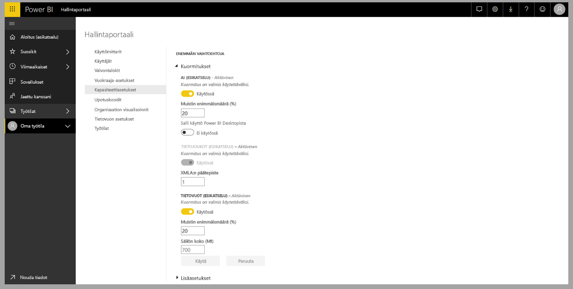
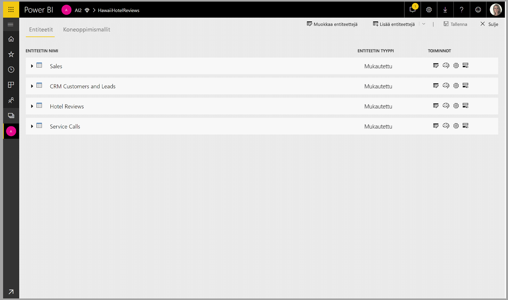
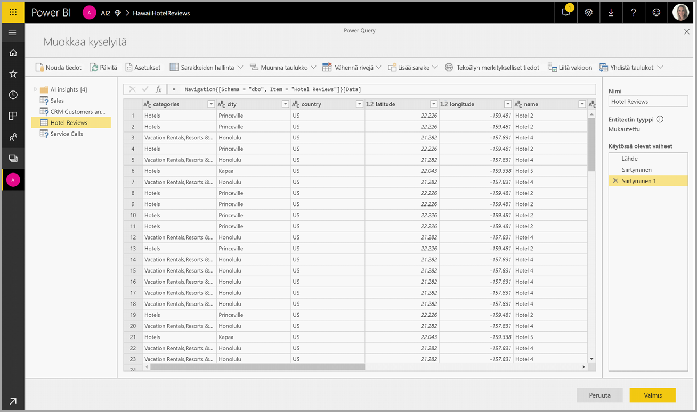
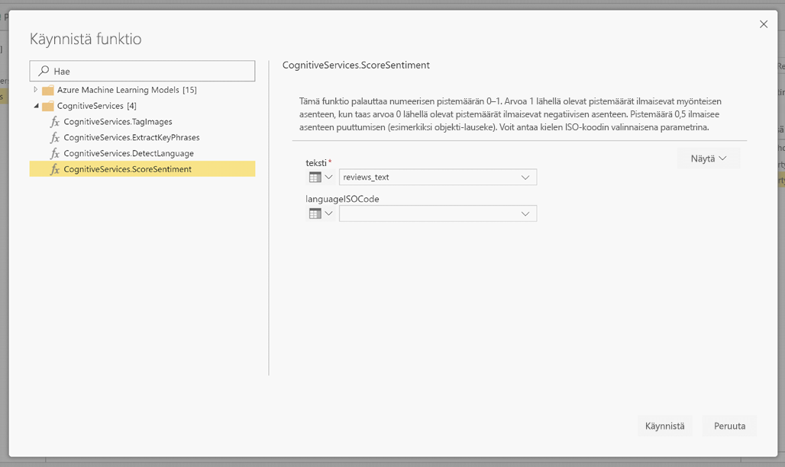
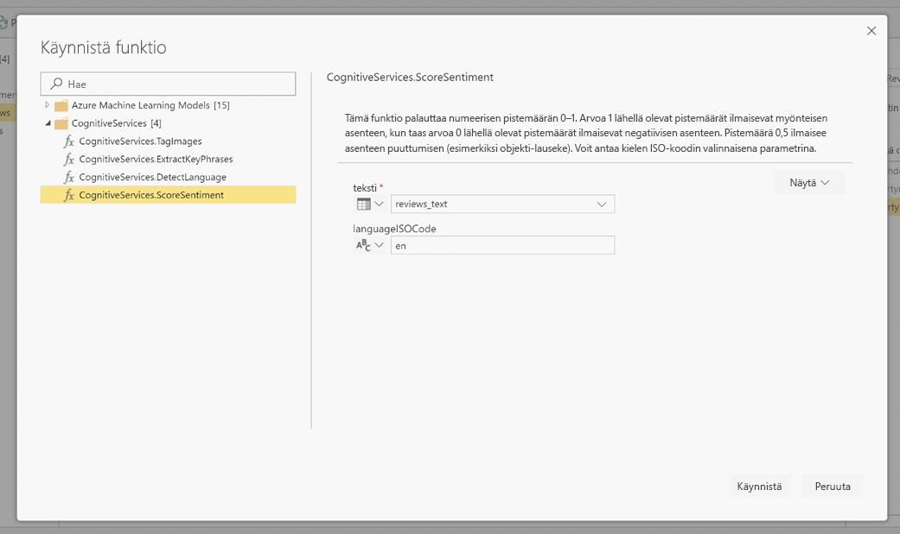
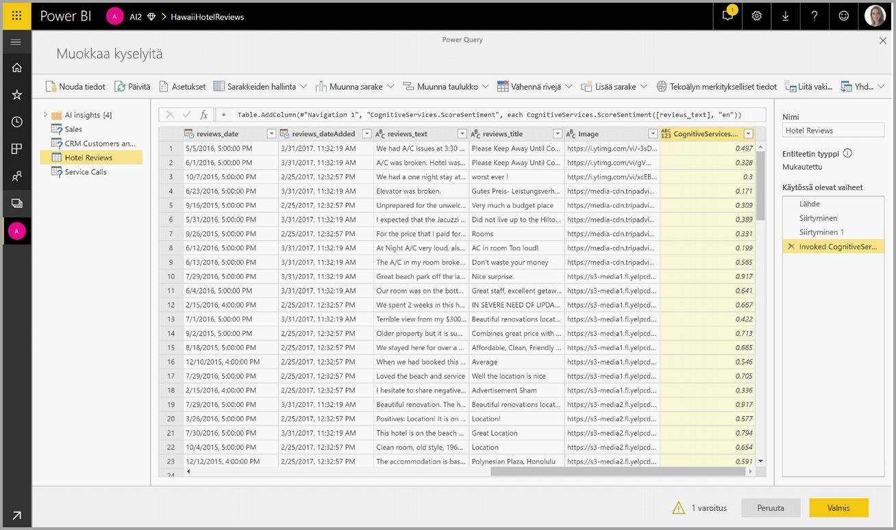
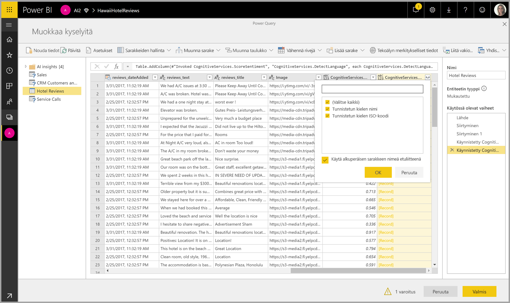

# Kognitiiviset palvelut Power BI:ssä 

Power BI:n kognitiivisten palveluiden avulla voit käyttää [Azuren kognitiivisten palvelujen](https://azure.microsoft.com/services/cognitive-services/) algoritmeja ja rikastaa tietojasi tietovoiden omatoimisessa tietojen valmistelussa.

Tällä hetkellä tuettuja palveluita ovat [asenneanalyysi](https://docs.microsoft.com/azure/cognitive-services/text-analytics/how-tos/text-analytics-how-to-sentiment-analysis), [avainlauseiden poiminta](https://docs.microsoft.com/azure/cognitive-services/text-analytics/how-tos/text-analytics-how-to-keyword-extraction), [kielentunnistus](https://docs.microsoft.com/azure/cognitive-services/text-analytics/how-tos/text-analytics-how-to-language-detection), ja [kuvan merkitseminen](https://docs.microsoft.com/azure/cognitive-services/computer-vision/concept-tagging-images). Muunnokset suoritetaan Power BI -palvelussa, eikä niihin tarvita Azuren kognitiivisten palvelujen tilausta. Tämä toiminto edellyttää Power BI Premiumia.

## **Tekoälyominaisuuksien käyttöönotto**

Kognitiivisia palveluja tuetaan Premium-kapasiteetin solmuissa EM2, A2 tai P1 ja suuremmat. Kapasiteetissa käytettään erillistä tekoälykuormitusta kognitiivisten palveluiden suorittamiseen. Julkisen esikatselun aikana (ennen kesäkuuta 2019) tämä kuormitus oli oletusarvon mukaan poistettu käytöstä. Ennen kuin käytät kognitiivisia palveluita Power BI:ssä, tekoälyn kuormitus on otettava käyttöön hallintaportaalin kapasiteettiasetuksissa. Voit ottaa tekoälyn kuormituksen käyttöön kuormitukset-osassa sekä määrittää muistin enimmäismäärän, jonka haluat tämän kuormituksen käyttävän. Suositeltu muistiraja on 20 %. Tämän rajan ylittäminen hidastaa kyselyä.

## **Kognitiivisten palveluiden käytön aloittaminen Power BI:ssä**

Kognitiivisten palvelujen muunnokset ovat osa [tietovoiden omatoimista tietojen valmistelua](https://powerbi.microsoft.com/blog/introducing-power-bi-data-prep-wtih-dataflows/). Jos haluat rikastuttaa tietoja kognitiivisten palveluiden avulla, aloita muokkaamalla tietovuota.

Valitse Power Query -editorin ylävalintanauhasta **Tekoälyn merkitykselliset tiedot** -painike.

Valitse ponnahdusikkunassa funktio, jota haluat käyttää, ja tiedot, jotka haluat muuntaa. Tässä esimerkissä pisteytän tarkistustekstiä sisältävän sarakkeen asenteen.

**CultureInfo** on valinnainen syöte, joka määrittää tekstin kielen. Tämä kenttä odottaa ISO-koodia. Voit käyttää Cultureinfo-syötteenä saraketta tai staattista kenttää. Tässä esimerkissä kieleksi on määritetty englanti (en) koko sarakkeen osalta. Jos tämä kenttä jätetään tyhjäksi, Power BI tunnistaa kielen automaattisesti ennen funktion käyttöä. Valitse seuraavaksi **Käynnistä**.

Kun funktio on käynnistetty, tulos lisätään taulukkoon uutena sarakkeena. Muunnos lisätään myös kyselyn käytössä olevana vaiheena.

Jos funktio palauttaa useita tulostekenttiä, funktion käynnistäminen lisää uuden sarakkeen, jossa on useiden tulostekenttien tietue.

Laajenna-asetuksen avulla voit lisätä jommankumman tai molemmat arvot sarakkeiksi tietoihisi.

## **Käytettävissä olevat funktiot**

Tässä osassa kuvataan Power BI:n kognitiivisissa palveluissa käytettävissä olevat funktiot.

### **Tunnista kieli**

Kielen tunnistusfunktio arvioi tekstisyötteen sekä palauttaa kullekin kentälle kielen nimen ja ISO-tunnuksen. Tästä funktiosta on hyötyä, jos tietosarakkeet keräävät satunnaista tekstiä, jonka kieli on tuntematon. Funktio odottaa syötteenä tekstimuotoisia tietoja.

Tekstianalyysi tunnistaa jopa 120 kieltä. Jos haluat lisätietoja, katso [tuetut kielet](https://docs.microsoft.com/azure/cognitive-services/text-analytics/text-analytics-supported-languages).

### **Poimi avainlauseet**

**Avainlauseiden poimimis**funktio arvioi rakenteettoman tekstin sekä palauttaa kunkin tekstikentän osalta luettelon avainlauseita. Funktio edellyttää syötteenä tekstikenttää, ja se hyväksyy valinnaisen syötteen kohteesta **Cultureinfo**. (Lisätietoja on tämän artikkelin **Aloittaminen**-osassa).

Avainlauseiden poiminta toimii parhaiten, kun annat sille työstettäväksi suurehkoja tekstilohkoja. Tämä toimii toisin kuin asenneanalyysi, joka toimii paremmin pienten tekstilohkojen yhteydessä. Jotta saisit parhaat tulokset molemmista toiminnoista, harkitse syötteiden jäsentämistä uudelleen vastaavasti.

### **Asennepisteytys**

**Asennepisteytys**-funktio arvioi tekstisyötteen ja palauttaa kullekin asiakirjalle asennepistemäärän, jonka arvo on väliltä 1 (positiivinen) - 0 (negatiivinen). Tämän funktion avulla voi havaita positiivisia ja negatiivisia asenteita sosiaalisessa mediassa, asiakkaiden arvosteluissa ja keskustelupalstoilla.

Tekstianalyysi käyttää koneoppimisen luokitusalgoritmia ja luo asennepistemäärän, joka on arvoltaan 0–1. Arvoa 1 lähellä olevat pistemäärät ilmaisevat myönteisen asenteen, kun taas arvoa 0 lähellä olevat pistemäärät ilmaisevat negatiivisen asenteen. Malli on harjoitettu valmiiksi kattavalla tekstimäärällä, jossa on asenneliitoksia. Tällä hetkellä ei ole mahdollista antaa omia harjoitustietoja. Malli käyttää tekstianalyysin aikana useita tekniikoita, kuten tekstin käsittelyä, sanaluokkien analyysia, sanojen sijoitusta ja sana-assosiaatiota. Lisätietoja algoritmista on artikkelissa [Tekstianalyysin esittely](https://blogs.technet.microsoft.com/machinelearning/2015/04/08/introducing-text-analytics-in-the-azure-ml-marketplace/).

Asenneanalyysi suoritetaan koko syöttökenttään, joten asennetta ei poimita tekstin mistään tietystä entiteetistä. Käytännössä pisteytystarkkuus yleensä paranee, jos asiakirjassa on suuren tekstilohkon sijasta yksi tai kaksi lausetta. Puolueettomuuden arviointivaiheessa malli määrittää, onko syötekenttä kokonaisuudessaan puolueeton vai sisältääkö se asennetta. Suurimmaksi osaksi puolueeton syötekenttä ei etene asenteen havaitsemisvaiheeseen, jolloin tuloksena on pistemäärä 0,50 eikä jatkokäsittelyä. Jos syötekenttä jatkaa putkessa, seuraava vaihe luo pistemäärän, joka on suurempi tai pienempi kuin 0,50 sen mukaan, minkä asteinen asenne syötekentässä havaittiin.

Asenneanalyysi tukee tällä hetkellä englantia, saksaa, espanjaa ja ranskaa. Muut kielet ovat esikatseluvaiheessa. Jos haluat lisätietoja, katso [Tuetut kielet](https://docs.microsoft.com/azure/cognitive-services/text-analytics/text-analytics-supported-languages).

### **Merkitse kuvat**

**Merkitse kuvat** -funktio palauttaa tunnisteet, jotka perustuvat yli 2 000 tunnistettavissa olevaan objektiin, elävään olentoon, maisemaan ja toimintoon. Jos tunnisteet ovat moniselitteisiä tai eivät yleisesti tunnettuja, tuloste sisältää ”vihjeitä”, jotka selventävät tunnisteen merkitystä tunnetun paikan kontekstissa. Tunnisteita ei ole luokiteltu, eikä periytymishierarkioita ole. Sisältötunnisteiden kokoelma muodostaa kuvan ”kuvauksen” perustan, ja tämä kuvaus näytetään ihmisten tulkittavissa olevalla kielellä, joka on muotoiltu kokonaisiksi lauseiksi.

Kun kuva on ladattu tai kuvan URL-osoite määritetty, Konenäkö-algoritmit tulostavat tunnisteita sen mukaan, mitä esineitä, elollisia olentoja ja toimintoja kuvassa tunnistettiin. Tunnisteet eivät rajoitu pääaiheeseen, kuten kuvan edustalla olevaan henkilöön, vaan ne sisältävät myös paikan (sisällä tai ulkona), huonekalut, työkalut, kasvit, eläimet, tarvikkeet, laitteet ja niin edelleen.

Tämä funktio edellyttää syötteeksi kuvan URL-osoitetta tai abase-64-kenttää. Tällä hetkellä kuvan merkitseminen tukee englantia, espanjaa, japania, portugalia ja yksinkertaistettua kiinaa. Jos haluat lisätietoja, katso [Tuetut kielet](https://docs.microsoft.com/rest/api/cognitiveservices/computervision/tagimage/tagimage#uri-parameters).

## Seuraavat vaiheet

Tässä artikkelissa on yleiskatsaus kognitiivisten palvelujen käytöstä Power BI -palvelun kanssa. Myös seuraavat artikkelit voivat olla kiinnostavia ja hyödyllisiä. 

* [Opetusohjelma: Automaattianalyysipalveluiden studion (perinteisen) mallin käynnistäminen Power BI:ssä](service-tutorial-invoke-machine-learning-model.md)
* [Automaattianalyysipalveluiden integrointi Power BI:ssä](service-machine-learning-integration.md)
* [Opetusohjelma: Kognitiivisten palvelujen käyttö Power BI:ssä](service-tutorial-use-cognitive-services.md)

Lisätietoja tietovoista on seuraavissa artikkeleissa:
* [Tietovoiden luominen ja käyttäminen Power BI:ssä](service-dataflows-create-use.md)
* [Laskettujen entiteettien käyttäminen Power BI Premiumissa](service-dataflows-computed-entities-premium.md)
* [Tietovoiden käyttö paikallisiin tietolähteisiin](service-dataflows-on-premises-gateways.md)
* [Kehittäjien resurssit Power BI -tietovoille](service-dataflows-developer-resources.md)
* [Tietovuot ja Azure Data Lake -integrointi (esikatselu)](service-dataflows-azure-data-lake-integration.md)