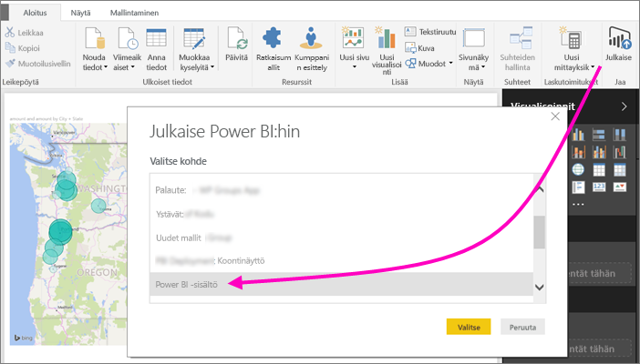
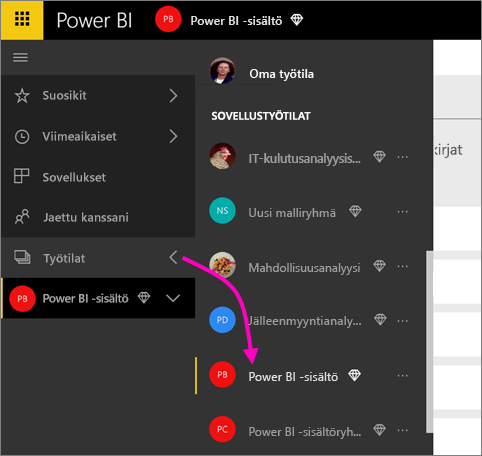
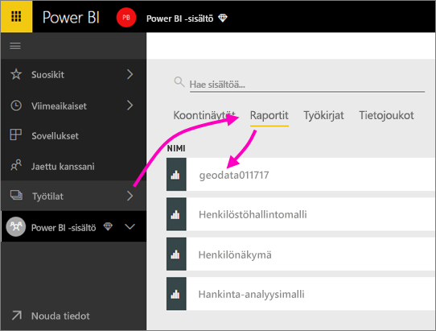
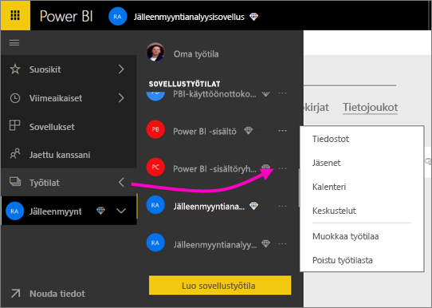
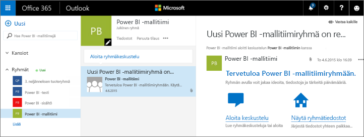
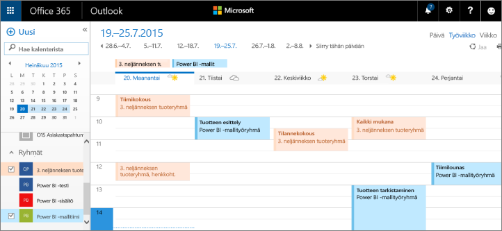

# Yhteiskäyttö Power BI -sovelluksen työtilassa
Power BI -sovelluksen työtilat on käteviä paikkoja tehdä yhteistyötä työtovereidesi kanssa raporttinäkymässä, raporteissa ja tietojoukoissa *sovellusten* luomiseksi. Sillä yhteistyötä varten työtiloja on suunniteltu. Sen jälkeen, kun lopetat yhteiskäytön raporttinäkymässä ja raporttien parissa työtovereiden kanssa, voit pakata sen sovellukseksi ja jakaa sitä. Lue lisää [sovellusten ja sovelluksen työtilojen luomisesta Power BI:ssa](service-create-distribute-apps.md). 

Yhteiskäyttö ei pääty Power BI:n työtiloihin. Office 365 tarjoaa muita ryhmäpalveluita kuten tiedostojen jakaminen OneDrive for Business -palvelussa, keskustelut Exchangessa, jaetun kalenterin, tehtävät ja niin edelleen. Lue lisää [Office 365-ryhmistä](https://support.office.com/article/Create-a-group-in-Office-365-7124dc4c-1de9-40d4-b096-e8add19209e9).

Sovellustyötilat ovat käytettävissä vain [Power BI Pro:ssa](service-free-vs-pro.md).

## Power BI Desktop -tiedostojen yhteiskäyttö sovellustyötilassa
Kun olet luonut Power BI Desktop-tiedoston, jos julkaiset sen Power BI-sovelluksen työtilassa, jokainen työtilassasi voi yhteiskäyttää sitä.

1. Valitse Power BI Desktopissa **Julkaise** **Koti**-valintanauhassa ja sitten **Valitse kohde** -ruudusta sovelluksen työtila.
   
    
2. Valitse Power BI -palvelussa kohdan Työtilat vieressä oleva nuoli > valitse sovelluksen työtila.
   
    
3. Valitse raportit-välilehti ja valitse sitten raportti.
   
    
   
    Täältä katsoen se on kuin mikä tahansa raporttia Power BI:ssa. Sinä ja muut sovellukset-työtilassasi voitte [muokata raporttia](service-reports.md) ja tallentaa ruudut haluamaasi raporttinäkymän.

## Tee yhteistyötä Office 365:ssa
Yhteiskäyttö Office 365:ssa alkaa sovelluksen työtilasta Power BI:ssa.

1. Valitse Power BI -palvelussa kohdan Työtilat vieressä oleva nuoli > valitse työtilasi nimen vierestä kolme pistettä (**…**). 
   
   
2. Tästä valikosta voit tehdä yhteistyötä ryhmän kanssa muutamalla eri tavalla: 
   
   * [Ryhmäkeskustelu Office 365:ssa](service-collaborate-power-bi-workspace.md#have-a-group-conversation-in-office-365).
   * [Tapahtuman ajoittaminen](service-collaborate-power-bi-workspace.md#schedule-an-event-on-the-group-workspace-calendar) sovelluksen ryhmän työtilan kalenteriin.
   
   Kun siirryt sovelluksesi ryhmän työtilaan Office 365:ssa ensimmäistä kertaa, se saattaa kestää jonkin aikaa. Odota 15-30 minuuttia ja sitten päivitä selaimen sivu.

## Ryhmäkeskustelu Office 365:ssa
1. Valitse kolme pistettä (...) sovelluksen työtilan nimen vierestä kohdasta \> **Keskustelut**. 
   
    
   
   Sovelluksesi ryhmän työtilan sähköpostin ja keskustelun sivusto avautuu Outlook for Office 365:ssa.
   
   
2. Lue lisää [ryhmäkeskusteluista Outlook for Office 365:ssa](https://support.office.com/Article/Have-a-group-conversation-a0482e24-a769-4e39-a5ba-a7c56e828b22).

## Tapahtuman ajoittaminen sovelluksen ryhmän työtilan kalenteriin
1. Valitse kolme pistettä (**…**) sovelluksen työtilan nimen vierestä kohdasta \> **Kalenteri**. 
   
   
   
   Tämä avaa kalenterin sovelluksesi ryhmätyötilaan Outlook for Office 365:ssa.
   
   
2. Lue lisää [ryhmän kalentereista Outlook in Office 365:ssa](https://support.office.com/Article/Add-edit-and-subscribe-to-group-events-0cf1ad68-1034-4306-b367-d75e9818376a).

## Sovelluksen työtilan hallinta
Jos olet omistaja tai järjestelmänvalvoja sovelluksen työtilassa, voit myös lisätä tai poistaa työtilan jäseniä. Lue lisää [Power BI-sovelluksen työtilan hallinnasta](service-manage-app-workspace-in-power-bi-and-office-365.md).

## Seuraavat vaiheet
* [Sovellusten ja sovellustyötilojen luominen Power BI:ssä](service-create-distribute-apps.md)
* Onko sinulla muuta kysyttävää? [Kokeile Power BI -yhteisöä](http://community.powerbi.com/)
* Haluatko antaa palautetta? Siirry [Power BI:n ideasivulle](https://ideas.powerbi.com/forums/265200-power-bi)

