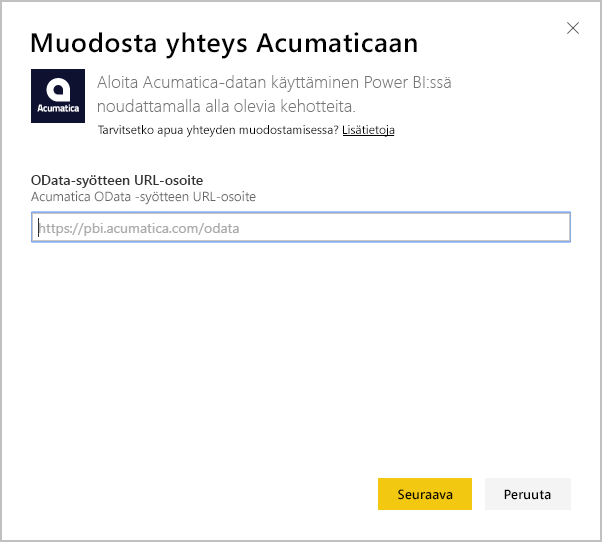

# Yhteyden muodostaminen Acumaticaan Power BI:n avulla
Power BI Acumatica -sisältöpaketin avulla saat nopeasti merkityksellisiä tietoja mahdollisuustiedoistasi. Power BI noutaa tiedot, esimerkiksi mahdollisuudet, tilit ja asiakkaat, ja laatii sitten oletuskoontinäytön ja siihen liittyvät raportit kyseisten tietojen perusteella.

Muodosta yhteys [Acumatica-sisältöpakettiin](https://app.powerbi.com/getdata/services/acumatica) tai lue lisää [Acumatican integroinnista](https://powerbi.microsoft.com/integrations/acumatica) Power BI:hin.

>[!NOTE]
>Tämä sisältöpaketti edellyttää Acumatica v5.2:ta tai uudempaa.

## Yhteyden muodostaminen
1. Valitse vasemman siirtymisruudun alareunassa **Nouda tiedot**.
   
   
2. Valitse **Palvelut**-ruudussa **Nouda**.
   
   
3. Valitse **Acumatica** \> **Nouda**.
   
   
4. Anna Acumatica OData -päätepiste. OData-päätepisteen avulla ulkoinen järjestelmä voi pyytää tietoja Acumaticasta. Acumatica OData -päätepiste on muodoltaan seuraavanlainen ja sen pitäisi käyttää HTTPS-protokollaa:
   
     https://[sitedomain]/odata/[companyname]
   
   Yrityksen nimi tarvitaan vain, jos kyseessä on usean yrityksen käyttöönotto. Alla on lisätietoja siitä, miten tämän parametrin löytää Acumatica-tililtä.
   
   
5. Valitse todennusmenetelmäksi **Perus**. Anna Acumatica-tilisi käyttäjänimi ja salasana ja valitse sitten **Kirjaudu sisään**.
   
    
6. Kun Power BI on tuonut tiedot, näet vasemmassa siirtymisruudussa uuden koontinäytön, raportin ja tietojoukon. Uudet kohteet on merkitty keltaisella tähdellä \*, joka katoaa, kun kohde valitaan ensimmäisen kerran. Kun koontinäyttö valitaan, sen asettelu näyttää seuraavalta:
   
    

**Mitä nyt?**

* Kokeile [kysymyksen esittämistä koontinäytön yläreunassa olevassa Q&A-ruudussa](power-bi-q-and-a.md).
* [Muuta koontinäytön ruutuja](service-dashboard-edit-tile.md).
* [Valitse jokin ruutu](service-dashboard-tiles.md), jolloin siihen liittyvä raportti avautuu.
* Tietojoukko on ajastettu päivittymään päivittäin, mutta voit muuttaa päivitysaikataulua tai kokeilla tietojoukon päivittämistä **Päivitä nyt** -toiminnolla haluamanasi ajankohtana.

## Järjestelmävaatimukset
Tämä sisältöpaketti edellyttää Acumatica v5.2:ta tai uudempaa. Varmista versio Acumatica-järjestelmänvalvojalta.

## Parametrien etsiminen
**Acumatica OData -päätepiste**

Acumatica OData -päätepiste on muodoltaan seuraavanlainen ja sen pitäisi käyttää HTTPS-protokollaa:

    https://[sitedomain]/odata/[companyname]

Kun olet kirjautunut Acumaticaan, sovelluksen sivuston toimialue näkyy selaimen osoiterivillä. Seuraavassa esimerkissä sivuston toimialue on https://pbi.acumatica.com, joten OData-päätepiste on annettava muodossa https://pbi.acumatica.com/odata.

 

Yrityksen nimi tarvitaan vain, jos kyseessä on usean yrityksen käyttöönotto. Nämä tiedot löytyvät Acumatican kirjautumissivulta.

## Vianmääritys
Jos kirjautuminen ei onnistu, tarkista, että antamasi Acumatica OData -päätepiste on oikeassa muodossa.

    https://<application site domain>/odata/<company name>

Jos yhteyden muodostamisessa on ongelmia, varmista käyttämäsi Acumatica-versio järjestelmänvalvojalta. Tämä sisältöpaketti edellyttää versiota 5.2 tai sitä uudempaa versiota.

## Seuraavat vaiheet
[Aloita Power BI:n käyttö](service-get-started.md)

[Nouda tietoja Power BI:ssä](service-get-data.md)

