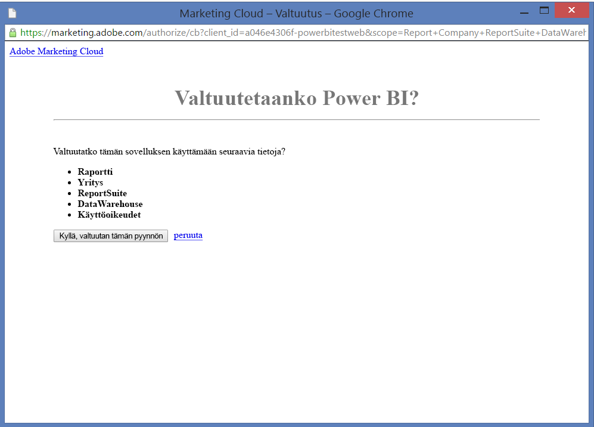

# Adobe Analyticsin yhdistäminen Power BI:hin
Yhteyden muodostaminen Adobe Analyticsiin Power BI:n kautta alkaa muodostamalla yhteys Adobe Analytics Marketing Cloud -tiliin. Saat sovelluksen, jossa on Power BI:n koontinäyttö ja joukko Power BI -raportteja, jotka tarjoavat merkityksellisiä tietoja sivuston liikenne- ja käyttäjädimensioista. Tiedot päivitetään automaattisesti kerran päivässä. Voit käsitellä koontinäyttöä ja raportteja, mutta et voi tallentaa muutoksia.

Muodosta yhteys [Adobe Analyticsiin](https://app.powerbi.com/getdata/services/adobe-analytics) tai lue lisää [Adobe Analyticsin integroinnista](https://powerbi.microsoft.com/integrations/adobe-analytics) Power BI:n kanssa.

## Yhteyden muodostaminen
[!INCLUDE [powerbi-service-apps-get-more-apps](./includes/powerbi-service-apps-get-more-apps.md)]

1. Valitse **Adobe Analytics** \> **Nouda**.
   
   
2. Power BI muodostaa yhteyden tiettyyn Adobe Analytics -yritykseen ja Raportin ohjelmistopaketin tunnukseen (ei Raportin ohjelmistopaketin nimeen). Lisätietoja [näiden parametrien löytämisestä](#FindingParams) on alla.
   
   
3. Valitse **Todennusmenetelmäksi** **oAuth2** \> **Kirjaudu sisään**. Anna pyydettäessä Adobe Analytics -tunnistetietosi. 
   
    
   
    
4. Valitse **Hyväksy**, jotta Power BI voi käyttää Adobe Analytics -tietojasi.
   
   
5. Hyväksyntäsi jälkeen tuontiprosessi alkaa automaattisesti. 

## Adobe Analytics -koontinäytön ja -raporttien tarkasteleminen
[!INCLUDE [powerbi-service-apps-open-app](./includes/powerbi-service-apps-open-app.md)]

      

[!INCLUDE [powerbi-service-apps-open-app](./includes/powerbi-service-apps-what-now.md)]

## Sisältö
Power BI käyttää Adobe Analyticsin raportin API:a raporttien määrittämiseen ja suorittamiseen seuraavissa taulukoissa:

| **Taulukon nimi** | **Sarakkeen tiedot** |
| --- | --- |
| Tuotteet |elements= ”product” (top 25)   metrics="cartadditions", "cartremovals", "carts", "cartviews", "checkouts", "revenue", "units" |
| Selaimet |elements= ”browser” (top 25)   metrics="bounces", "bouncerate", "visitors", "visits", "uniquevisitors", "totaltimespent", "pageviews" |
| Sivut |elements= "page" (top 25)   metrics="cartadditions", "cartremovals", "carts", "cartviews", "checkouts", "revenue", "units", "visits", "uniquevisitors", "pageviews", "bounces", "bouncerate", "totaltimespent" |
| JavaScript käytössä |elements=  "javascriptenabled”, “browser” (top 25) |
| Mobiilikäyttöjärjestelmä |elements= "mobileos"(top 25)  metrics="bounces", "bouncerate", "visitors", "visits", "uniquevisitors", "totaltimespent", "cartadditions", "cartremovals", "checkouts", "revenue", "units", "pageviews" |
| Hakukoneiden hakusanat |elements= "searchengine" "searchenginekeyword"   metrics="bounces", "bouncerate", "visitors", "visits", "entries", "uniquevisitors", "totaltimespent", "cartadditions", "cartremovals", "carts", "cartviews", "checkouts", "revenue", "units", "pageviews" |
| Hakukone tuotteisiin |elements= "searchengine", "product"   metrics="bounces", "bouncerate", "visitors", "visits", "entries", "uniquevisitors", "totaltimespent", "cartadditions", "cartremovals", "carts", "cartviews", "checkouts", "revenue", "units", "pageviews" |
| Viittaavat sivustot |elements= "referrer" (top 15), “page" (top 10)   metrics="bounces", "bouncerate", "visitors", "visits", "entries", "uniquevisitors", "totaltimespent", "cartadditions", "cartremovals", "carts", "cartviews", "checkouts", "revenue", "units", "pageviews" |
| Geocountry-sivut |elements= "geocountry" (Top 20), "page"   metrics="bounces", "bouncerate", "visitors", "visits", "entries", "uniquevisitors", "totaltimespent", "cartadditions", "cartremovals", "carts", "cartviews", "checkouts", "revenue", "units", "pageviews" |
| Geocountry-tuote |elements= "geocountry" (Top 20), "product"  metrics="bounces", "bouncerate", "visitors", "visits", "entries", "uniquevisitors", "totaltimespent", "cartadditions", "cartremovals", "carts", "cartviews", "checkouts", "revenue", "units" |
| Maan ja alueen valinta |elements= "geocountry" (Top 200)   metrics="bounces", "bouncerate", "visitors", "visits", "entries", "uniquevisitors", "totaltimespent", "cartadditions", "cartremovals", "carts", "cartviews", "checkouts", "revenue", "units" |
| Kieli |elements= "language", "browser" (Top 25)   metrics="bounces", "bouncerate", "visitors", "visits", "uniquevisitors", "totaltimespent", "pageviews", "cartadditions", "cartremovals", "checkouts", "carts", "cartviews" |
| Hakukoneiden haku |elements= "searchengine" (top 100)   metrics="bounces", "bouncerate", "visitors", "visits", "entries", "uniquevisitors", "totaltimespent", "cartadditions", "cartremovals", "carts", "cartviews", "checkouts", "revenue", "units" |
| Selaimen haku |elements= ”browser” (top 25) |

## Järjestelmävaatimukset
Tarvitaan [Adobe Analyticsin](http://www.adobe.com/marketing-cloud/web-analytics.html) käyttöoikeus, mukaan lukien käyttöoikeus oikeisiin parametreihin alla olevien ohjeiden mukaisesti.

## Parametrien löytäminen
**Yritys**

Yritys-arvo löytyy tilisi oikeasta yläkulmasta, kun olet kirjautunut sisään. Arvossa otetaan huomioon kirjainkoko ja tyhjät välilyönnit. Kirjoita se täsmälleen samalla tavalla kuin se näkyy tililläsi.

**Raportointipaketin tunnus**

Ohjelmistopaketin tunnus luodaan, kun Raportointipaketti luodaan. Voit ottamalla yhteyttä järjestelmänvalvojaasi tunnusarvon tunnistamiseksi. Huomaa, että tämä ei ole Raportointipaketin nimi.

Adoben [dokumentaatiosta](https://marketing.adobe.com/resources/help/en_US/reference/new_report_suite.html):

## Vianmääritys
Jos näet tunnistetietojen antamisen jälkeen virheen, joka ilmoittaa, että sinulla ei ole oikeuksia, vahvista järjestelmänvalvojalta, että sinulla on Adobe Analytics -ohjelmointirajapinnan käyttöoikeudet. Vahvista myös, että saamasi Adobe-tunnus on linkitetty Marketing Cloud Organizationiin (joka liittyy Adobe Analytics -yritykseen).

Jos olet onnistuneesti antanut tunnistetiedot näytöllä ennen kuin virhe ilmenee, on mahdollista, että raporttien valmistuminen kestää liian kauan. Yleinen virhe on muodossa *”Tietojen saaminen Adobe Analytics -raportista epäonnistui. Sisältöön sisältyi &quot;suosittelija, sivu&quot;, arvioitu kesto oli xx sekuntia ”*. Lue lisätietoja ”Sisältö”-osasta ja vertaa Adobe-esiintymän kokoa. Valitettavasti tämän aikakatkaisun kiertämiseksi ei ole vielä keinoa. Harkitsemme kuitenkin uusia päivityksiä suurempien tahojen tukemiseksi, joten anna palautetta Power BI -työryhmälle osoitteessa https://ideas.powerbi.com

## Seuraavat vaiheet
* [Mitä ovat Power BI:n sovellukset?](consumer/end-user-apps.md)
* [Tietojen noutaminen Power BI:ssä](service-get-data.md)
* Onko sinulla muuta kysyttävää? [Voit esittää kysymyksiä Power BI -yhteisössä](http://community.powerbi.com/)

