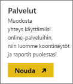
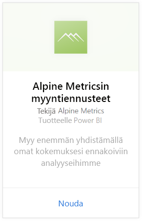
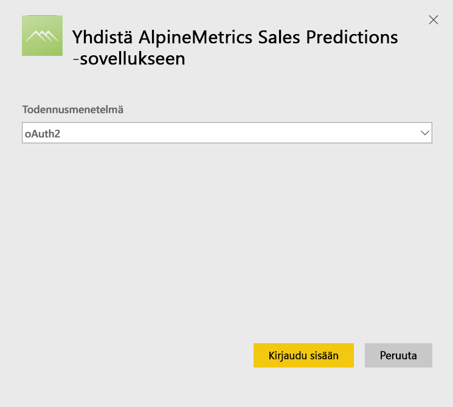
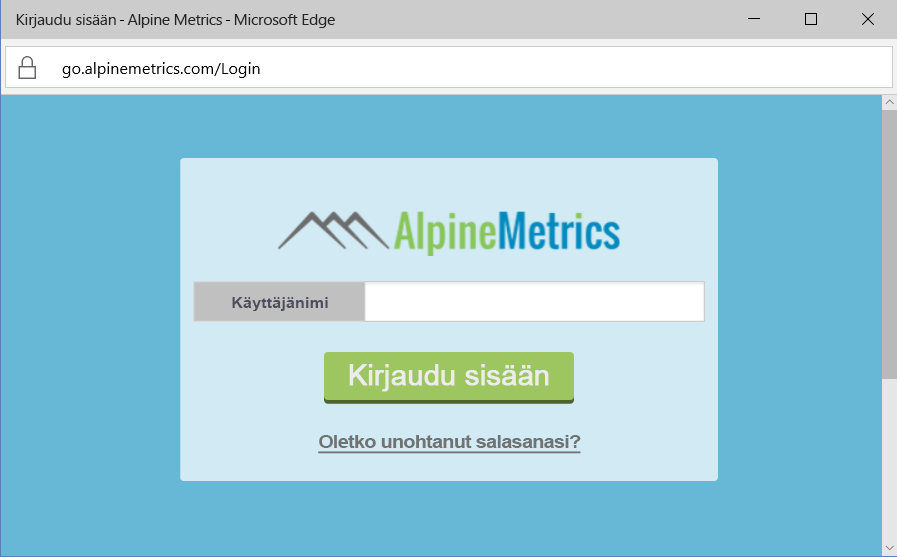
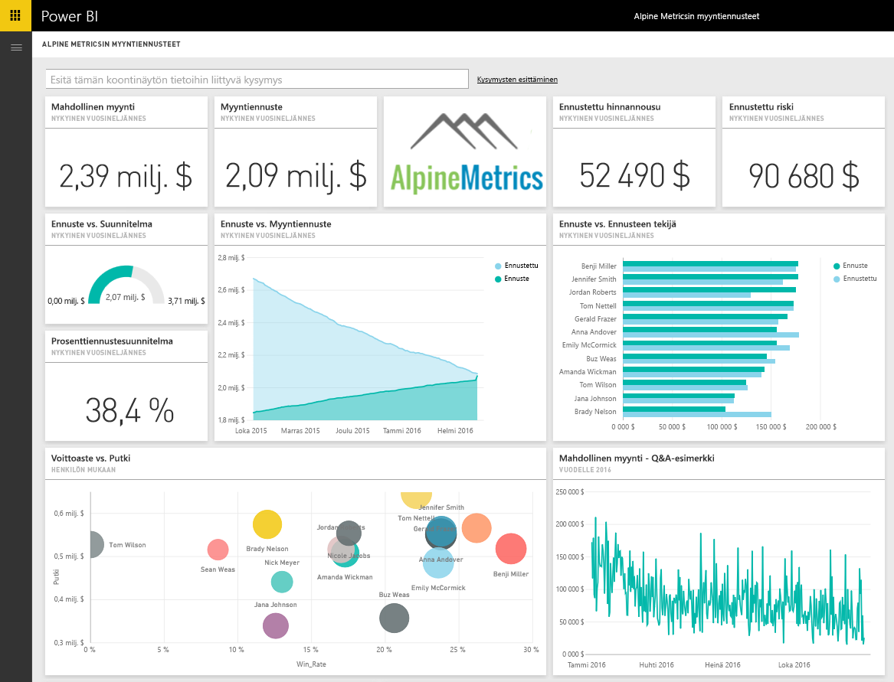

# Yhteyden muodostaminen Alpine Metrics Sales Predictions -sovellukseen Power BI:llä
Alpine Metrics tarjoaa huippuluokan ennakoivan myyntiprosessin optimoinnin pilvipalvelussa ja pyydettäessä suurille ja pienille myyntiorganisaatioille. Alpine Metrics Sales Predictions -sisältöpaketti Power BI:lle sisältää arvoja, kuten mahdolliset ja ennustetut myynnit ja riskit, ja sen ansiosta saat entistä syvemmän näkemyksen liiketoimintasi tulevaisuudesta. 

[!INCLUDE [include-short-name](./includes/service-deprecate-content-packs.md)]

Muodosta yhteys [Alpine Metrics Sales Predictions -sisältöpakettiin](https://app.powerbi.com/getdata/services/alpine-metrics) Power BI:lle.

## Yhteyden muodostaminen
1. Valitse vasemman siirtymisruudun alareunassa Nouda tiedot.  
   
    
2. Valitse **Palvelut**-ruudussa **Nouda**.  
   
    
3. Valitse **AlpineMetrics Sales Predictions** ja sitten **Nouda**.  
   
    
4. Valitse **OAuth 2** ja sitten **Kirjaudu sisään**. Anna pyydettäessä AlpineMetrics-tunnistetietosi.
   
    
   
    
5. Kun yhteys on muodostettu, koontinäyttö, raportti ja tietojoukko ladataan automaattisesti. Tämän jälkeen ruudut päivitetään tilisi tiedoilla.
   
    

**Mitä seuraavaksi?**

* Kokeile [kysymyksen esittämistä raporttinäkymän yläreunassa olevassa Q&A-ruudussa](consumer/end-user-q-and-a.md).
* [Muuta koontinäytön ruutuja](service-dashboard-edit-tile.md).
* [Valitse jokin ruutu](consumer/end-user-tiles.md), jolloin siihen liittyvä raportti avautuu.
* Tietojoukko on ajastettu päivittymään päivittäin, mutta voit muuttaa päivitysaikataulua tai kokeilla tietojoukon päivittämistä **Päivitä nyt** -toiminnolla haluamanasi ajankohtana

## Paketin sisältö
Sisältöpaketti sisältää tietoja seuraavista taulukoista:  

    - Tili    
    - Yritys    
    - Maa    
    - Ala    
    - Mahdollisuus  
    - Henkilö  
    - Ennuste    
    - Ennustehistoria    
    - Tuote  
    - Alue    

## Järjestelmävaatimukset
Alpine Metrics -tili, jolla on edellä mainittujen taulukoiden käyttöoikeudet, on edellytys tämän sisältöpaketin alustamiselle.

## Seuraavat vaiheet
[Mikä on Power BI?](power-bi-overview.md)

[Power BI -palvelun peruskäsitteitä suunnittelijoille](service-basic-concepts.md)

