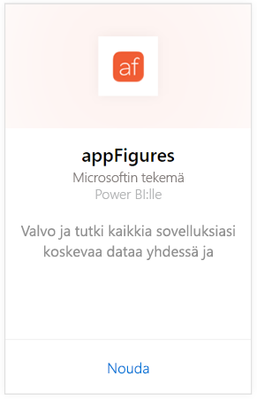
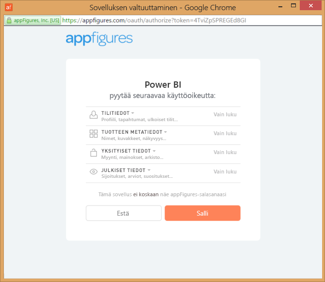
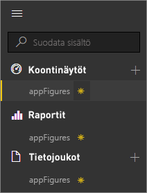
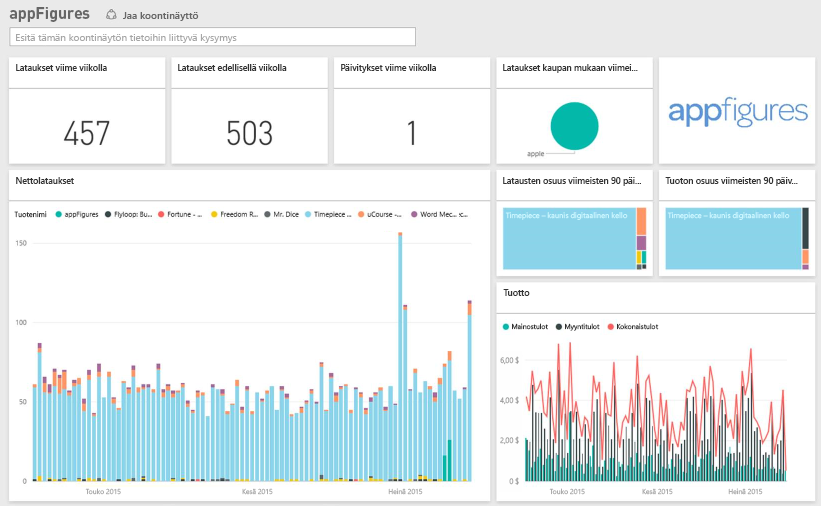
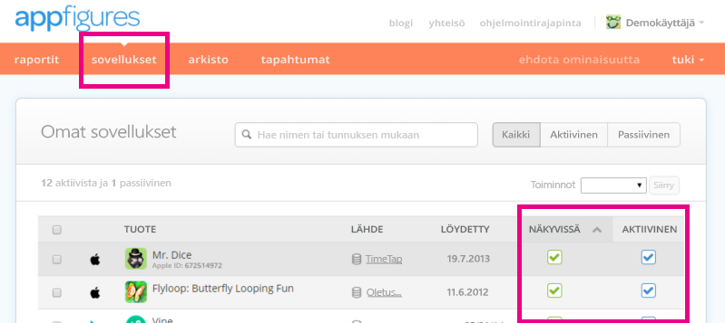

# appFiguresien yhdistäminen Power BI:n avulla
Sovelluksia koskevien tärkeiden tilastotietojen seuraaminen on helppoa Power BI:n ja appFigures-sisältöpaketin avulla. Power BI noutaa tiedot, esimerkiksi sovellusmyynnin, lataukset ja mainostilastot ja laatii sitten oletuskoontinäytön ja siihen liittyvät raportit kyseisten tietojen perusteella.

[!INCLUDE [include-short-name](./includes/service-deprecate-content-packs.md)]

Muodosta yhteys [appFigures-sisältöpakettiin](https://app.powerbi.com/getdata/services/appfigures) tai lue lisää [appFiguresin integroinnista](https://powerbi.microsoft.com/integrations/appfigures) Power BI:hin.

## Yhteyden muodostaminen
1. Valitse vasemman siirtymisruudun alareunassa **Nouda tiedot**.
   
   
2. Valitse **Palvelut**-ruudussa **Nouda**.
   
   
3. Valitse **appFigures** \> **Nouda**.
   
   
4. Valitse **todennusmenetelmäksi** **oAuth2** \> **Kirjaudu sisään**. Anna pyydettäessä appFiguresin tunnistetiedot ja noudata todennusprosessia.
   
   Ensimmäisen kerran, kun muodostat yhteyden, Power BI kysyy, haluatko sallia vain luku -käyttöoikeudet tiliisi. Aloita tuontiprosessi valitsemalla **Salli**. Tämä voi kestää muutamia minuutteja riippuen siitä, kuinka paljon tililläsi on tietoja.
   
   
5. Kun Power BI on tuonut tiedot, näet vasemmassa siirtymisruudussa uuden koontinäytön, raportin ja tietojoukon. Uudet kohteet on merkitty keltaisella tähdellä \*:
   
    
6. Valitse appFigures-koontinäyttö. Tämä on oletuskoontinäyttö, jonka Power BI on luonut tietojesi näyttämistä varten. Voit muokata tätä koontinäyttöä, jotta näet tiedot juuri haluamallasi tavalla.
   
    

**Mitä seuraavaksi?**

* Kokeile [kysymyksen esittämistä raporttinäkymän yläreunassa olevassa Q&A-ruudussa](consumer/end-user-q-and-a.md).
* [Muuta koontinäytön ruutuja](service-dashboard-edit-tile.md).
* [Valitse jokin ruutu](consumer/end-user-tiles.md), jolloin siihen liittyvä raportti avautuu.
* Tietojoukko on ajastettu päivittymään päivittäin, mutta voit muuttaa päivitysaikataulua tai kokeilla tietojoukon päivittämistä **Päivitä nyt** -toiminnolla haluamanasi ajankohtana

## Paketin sisältö
Seuraavat tiedot ovat käytettävissä appFiguresista Power BI:ssä:

| **Taulukon nimi** | **Kuvaus** |
| --- | --- |
| Maat |Tämä taulukko antaa tietoja maan nimestä. |
| Päivämäärät |Tämä taulukko sisältää päivämääriä tästä päivästä taaksepäin niiden sovellusten aikaisimpaan julkaisupäivään, jotka ovat aktiivisia ja näkyvissä  appFigures-tililläsi. |
| Tapahtumat |Tämä taulukko sisältää lataus-, myynti- ja mainostietoja kullekin sovellukselle, maittain ja päivittäin. Huomaa, että sekä sovelluksen että sovelluksen sisäiset ostotiedot ovat kaikki yhdessä taulukossa – voit käyttää <strong>Tyyppi</strong>-saraketta niiden erottamiseen. |
| Inapps |Tämä taulukko sisältää sovelluksen sisäisistä ostotietoja, jotka on liitetty appFigures-tililläsi oleviin aktiivisiin, näkyviin sovelluksiin. |
| Tuotteet |Tämä taulukko sisältää tietoa eri sovelluksista, jotka on liitetty appFigures-tililläsi oleviin aktiivisiin, näkyviin sovelluksiin. |

## Vianmääritys
Jos tietoja jostakin sovelluksesta ei ole näkyvissä Power BI:ssa tarkista, että kyseiset sovellukset ovat näkyvissä ja aktiivisina appFigures-sivun **Sovellukset**-välilehdessä.

## Seuraavat vaiheet
* [Power BI:n käytön aloittaminen](service-get-started.md)
* [Tietojen noutaminen Power BI:ssä](service-get-data.md)

