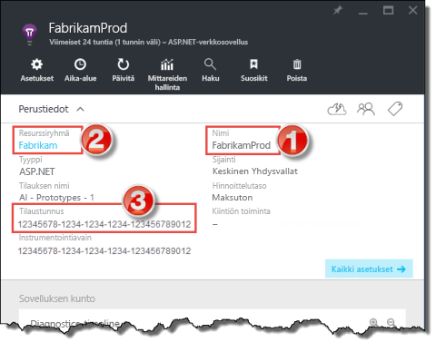

# Application Insightsin yhdistäminen Power BI:hin
Power BI:n avulla voit luoda tehokkaita mukautettuja raporttinäkymiä [Application Insights](https://azure.microsoft.com/documentation/articles/app-insights-overview/) -telemetriatiedoista. Näet sovellustelemetrian uusilla tavoilla. Yhdistä mittareita useista sovelluksista tai komponenttipalveluista yhteen raporttinäkymään. Power BI -sisältöpaketin ensimmäisessä Application Insights -julkaisussa on pienoissovelluksia yleisiä käyttöön liittyviä arvoja varten. Näitä ovat muun muassa aktiiviset käyttäjät, sivunäkymä, istunnot, selain- ja käyttöjärjestelmäversiot sekä käyttäjien maantieteellinen jakauma kartalla.

Muodosta yhteys [Application Insights -sisältöpakettiin Power BI:tä varten](https://app.powerbi.com/getdata/services/application-insights).

>[!NOTE]
>Yhteyden muodostaminen edellyttää, että sinulla on pääsy sovelluksesi Application Insights -yleiskatsausruutuun Azure Preview Portalissa. Lisätietoja vaatimuksista on alla.

## Yhteyden muodostaminen
1. Valitse vasemman siirtymisruudun alareunasta **Nouda tiedot**.
   
    
2. Valitse **Palvelut**-ruudussa **Nouda**.
   
    
3. Valitse **Application Insights** > **Nouda**.
   
    
4. Anna tiedot sovelluksesta, johon haluat muodostaa yhteyden, mukaan lukien **Application Insights -resurssin nimi**, **resurssiryhmä** ja **tilaustunnus**. Lisätietoja on alla kohdassa [Application Insights -parametrien löytäminen](#FindingAppInsightsParams).
   
        
5. Valitse **Kirjaudu sisään** ja muodosta yhteys näytön ohjeiden mukaisesti.
   
    
6. Tuontiprosessi alkaa automaattisesti. Kun se on valmis, näkyviin tulee ilmoitus. Uusi raporttinäkymä, raportti ja tietojoukko näkyvät siirtymisruudussa tähdellä merkittyinä.  Voit tarkastella tuotuja tietoja valitsemalla raporttinäkymän.
   
    

**Mitä seuraavaksi?**

* Kokeile [kysymyksen esittämistä raporttinäkymän yläreunassa olevassa Q&A-ruudussa](power-bi-q-and-a.md).
* [Muuta koontinäytön ruutuja](service-dashboard-edit-tile.md).
* [Valitse jokin ruutu](service-dashboard-tiles.md), jolloin siihen liittyvä raportti avautuu.
* Tietojoukko on ajastettu päivittymään päivittäin, mutta voit muuttaa päivitysaikataulua tai kokeilla tietojoukon päivittämistä **Päivitä nyt** -toiminnolla haluamanasi ajankohtana

## Paketin sisältö
Application Insights -sisältöpaketti sisältää seuraavat taulukot ja arvot:  

    ´´´
    - ApplicationDetails  
    - UniqueUsersLast7Days   
    - UniqueUsersLast30Days   
    - UniqueUsersDailyLast30Days  
    - UniqueUsersByCountryLast7Days  
    - UniqueUsersByCountryLast30Days   
    - PageViewsDailyLast30Days   
    - SessionsLast7Days   
    - SessionsLast30Days  
    - PageViewsByBrowserVersionDailyLast30Days   
    - UniqueUsersByOperatingSystemLast7Days   
    - UniqueUsersByOperatingSystemLast30Days    
    - SessionsDailyLast30Days   
    - SessionsByCountryLast7Days   
    - SessionsByCountryLast30Days   
    - PageViewsByCountryDailyLast30Days  
    ´´´ 

## Parametrien etsiminen
Resurssin nimi, resurssiryhmä ja tilaustunnus löytyvät kaikki Azure-portaalista. Kun valitset nimen, näkyviin tulee yksityiskohtainen näkymä. Löydät kaikki tarvittavat arvot avattavan Essentials-valikon kautta.

Kopioi ja liitä nämä Power BI:n kenttiin:

## Seuraavat vaiheet
[Power BI:n käytön aloittaminen](service-get-started.md)

[Tietojen noutaminen Power BI:ssä](service-get-data.md)

