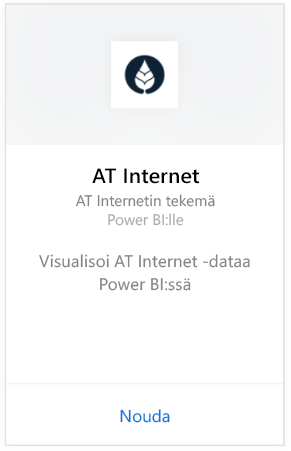
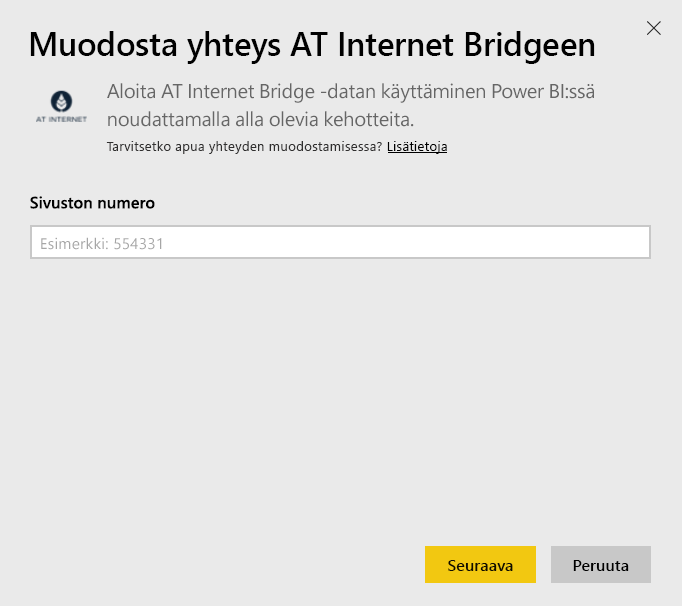
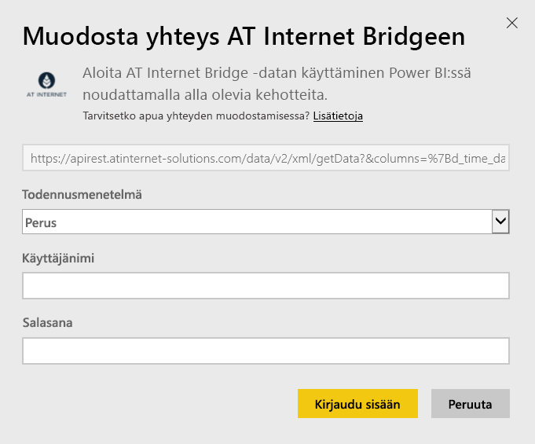

# Yhteyden muodostaminen AT Internet Bridgeen Power BI:n avulla
AT Internetin ja sen digitaalisen Analytics Suite -analyysialustan avulla voit poimia tiedoistasi välittömän arvon. Power BI:lle kehitetty AT Internet Bridge -sisältöpaketti sisältää tietoja, jotka koskevat sivuston vierailuja, lähteitä, lokalisointia ja laitteita.

Yhteyden muodostaminen [AT Internet Bridge -sisältöpakettiin](https://app.powerbi.com/getdata/services/at-internet-bridge) Power BI:ssä.

## Yhteyden muodostaminen
1. Valitse vasemman siirtymisruudun alareunassa **Nouda tiedot**.
   
    
2. Valitse **Palvelut**-ruudussa **Nouda**.
   
    
3. Valitse **AT Internet Bridge** \> **Hanki**.
   
   
4. Määritä AT Internet -sivuston numero, johon haluat muodostaa yhteyden.
   
   
5. Valitse **Perus**-todennusmekanismi, kirjoita AT Internet -käyttäjänimesi ja -salasanasi ja valitse **Kirjaudu sisään**.
   
   
6. Aloita tuontiprosessi valitsemalla **Yhdistä**. Kun kaikki on valmista, uusi raporttinäkymä, raportti ja malli näkyvät siirtymisruudussa. Voit tarkastella tuotuja tietoja valitsemalla raporttinäkymän.
   
    

**Mitä seuraavaksi?**

* Kokeile [kysymyksen esittämistä raporttinäkymän yläreunassa olevassa Q&A-ruudussa](consumer/end-user-q-and-a.md).
* [Muuta koontinäytön ruutuja](service-dashboard-edit-tile.md).
* [Valitse jokin ruutu](consumer/end-user-tiles.md), jolloin siihen liittyvä raportti avautuu.
* Tietojoukko on ajastettu päivittymään päivittäin, mutta voit muuttaa päivitysaikataulua tai kokeilla tietojoukon päivittämistä **Päivitä nyt** -toiminnolla haluamanasi ajankohtana

## Paketin sisältö
Tämä sisältöpaketti sisältää viimeisen 45 päivän tiedot seuraavista taulukoista:  

    - Muunto  
    - Laitteet  
    - Lokalisointi  
    - lähteet  
    - Vierailujen kokonaismäärä  

## Seuraavat vaiheet
[Mikä on Power BI?](power-bi-overview.md)

[Power BI -palvelun peruskäsitteitä suunnittelijoille](service-basic-concepts.md)

