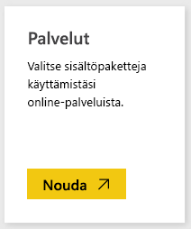

# Muodosta yhteys Azure-valvontalokeihin Power BI:n avulla
Azure-valvontalokien sisältöpaketissa voit analysoida ja visualisoida valvontalokeihin tallennettuja tietoja. Power BI noutaa tiedot ja laatii sitten valmiin koontinäytön ja siihen liittyvät raportit kyseisten tietojen perusteella.

Muodosta yhteys [Azure-valvontalokien sisältöpakettiin](https://app.powerbi.com/getdata/services/azure-audit-logs) tai lue lisää [Azure-valvontalokien integroinnista](https://powerbi.microsoft.com/integrations/azure-audit-logs) Power BI:hin.

## Yhteyden muodostaminen
1. Valitse vasemman siirtymisruudun alareunassa **Nouda tiedot**.  
   
    
2. Valitse **Palvelut**-ruudussa **Nouda**.  
   
     
3. Valitse **Azure-valvontalokit** > **Hae**.  
   
   
4. Anna pyydettäessä **Azure-tilaustunnus**. Tiedot [tilauksen tunnuksen](#FindingParams) hakemisesta on annettu alla.   
   
    
5. Valitse **todennusmenetelmäksi** **oAuth2** \> **Kirjaudu sisään**.
   
    
6. Anna tilin tunnistetiedot kirjautumisprosessin päättämiseksi.
   
    
7. Power BI noutaa Azure-valvontalokitietosi ja luo käyttövalmiin raporttinäkymän ja raportin. 
   
    

**Mitä seuraavaksi?**

* Kokeile [kysymyksen esittämistä raporttinäkymän yläreunassa olevassa Q&A-ruudussa](power-bi-q-and-a.md).
* [Muuta koontinäytön ruutuja](service-dashboard-edit-tile.md).
* [Valitse jokin ruutu](service-dashboard-tiles.md), jolloin siihen liittyvä raportti avautuu.
* Tietojoukko on ajastettu päivittymään päivittäin, mutta voit muuttaa päivitysaikataulua tai kokeilla tietojoukon päivittämistä **Päivitä nyt** -toiminnolla haluamanasi ajankohtana

## Järjestelmävaatimukset
Azure-valvontalokien sisältöpaketti edellyttää pääsyä valvontalokeihin Azure-portaalissa. Saat lisätietoja [tästä](https://azure.microsoft.com/documentation/articles/insights-debugging-with-events/).

## Parametrien löytäminen
On olemassa kaksi helppoa tapaa löytää tilauksen tunnus.

1. Kohdasta https://portal.azure.com -&gt; Selaa -&gt; Tilaukset -&gt; Tilaustunnus
2. Kohdasta https://manage.windowsazure.com -&gt; Asetukset  -&gt; Tilaustunnus

Tilauksen tunnus on pitkä numero- ja merkkisarja, joka on samanlainen kuin esimerkin vaiheessa \#4 yllä. 

## Vianmääritys
Jos näet tunnistetietojen virheen tai virheen yritettäessä päivittää virheellisten tunnistetietojen vuoksi, yritä poistaa kaikki esiintymät Azure-valvontalokien sisältöpaketista ja yritä yhteyden muodostamista uudelleen.

## Seuraavat vaiheet
[Mikä on Power BI?](power-bi-overview.md)  
[Power BI:n peruskäsitteet](service-basic-concepts.md)  

