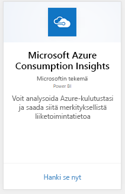
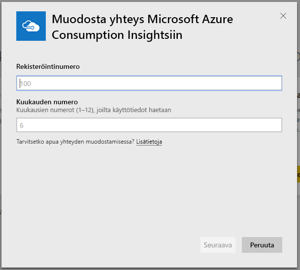
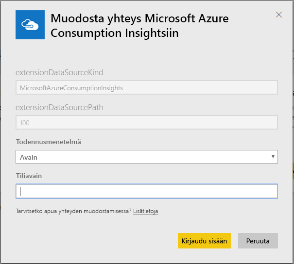
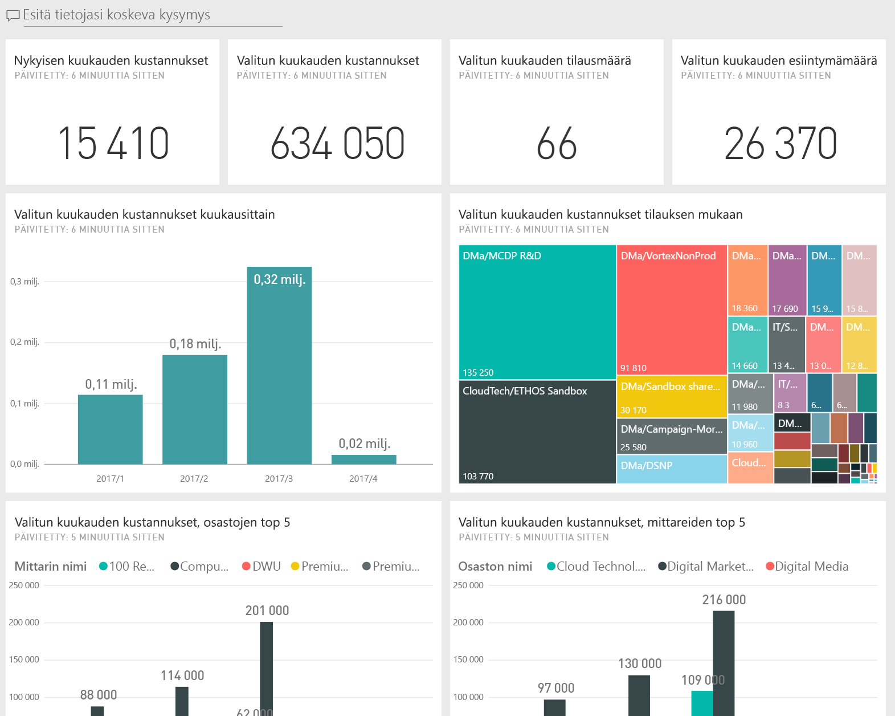
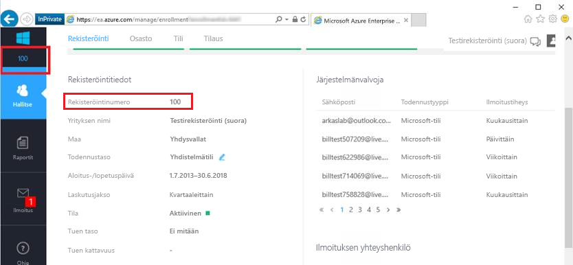
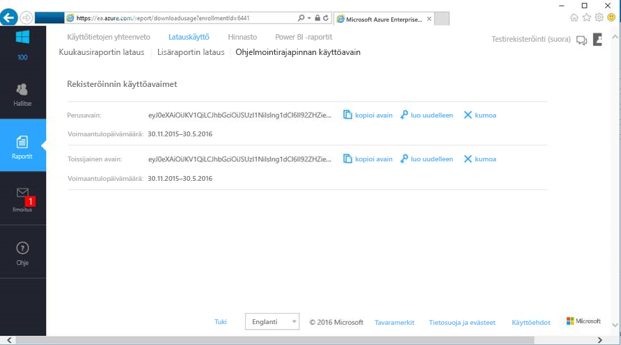

# Yhteyden muodostaminen Microsoft Azure Consumption Insightsiin Power BI:n avulla
Tutki ja valvo Microsoft Azure Enterprise -kulutustietojasi Power BI -palvelussa Power BI -sisältöpaketin avulla. Tiedot päivitetään automaattisesti kerran päivässä.

Muodosta yhteys Power BI -palvelulle suunniteltuun [Microsoft Azure Consumption Insights -sisältöpakettiin](https://app.powerbi.com/getdata/services/azureconsumption).

> [!NOTE]
> Jos haluat mukautetumpia määrityksiä, kokeile [Azure Consumption Insights -liittimen](desktop-connect-azure-consumption-insights.md) käyttöä Power BI Desktopissa.

## Yhteyden muodostaminen
1. Valitse Power BI -palvelun vasemman siirtymisruudun alareunasta **Nouda tiedot**.
   
    
2. Valitse **Palvelut**-ruudussa **Nouda**.
   
   
3. Valitse **Microsoft Azure Consumption Insights** \> **Hanki nyt**. 
   
   
4. Valitse, kuinka monen kuukauden tiedot haluat tuoda, ja anna Azure Enterprise -rekisteröintinumerosi. Lisätietoja [näiden parametrien löytämisestä](#FindingParams) on alla.
   
    
5. Anna Tiliavaimesi yhteyden muodostamista varten. Löydät rekisteröintiavaimen Azure EA -portaalista. 
   
    
6. Tuontiprosessi alkaa automaattisesti. Kun kaikki on valmista, uusi koontinäyttö, raportti ja malli näkyvät siirtymisruudussa. Voit tarkastella tuotuja tietoja valitsemalla raporttinäkymän.
   
   

**Mitä seuraavaksi?**

* Kokeile [kysymyksen esittämistä raporttinäkymän yläreunassa olevassa Q&A-ruudussa](consumer/end-user-q-and-a.md).
* [Muuta koontinäytön ruutuja](service-dashboard-edit-tile.md).
* [Valitse jokin ruutu](consumer/end-user-tiles.md), jolloin siihen liittyvä raportti avautuu.
* Tietojoukko on ajastettu päivittymään päivittäin, mutta voit muuttaa päivitysaikataulua tai kokeilla tietojoukon päivittämistä **Päivitä nyt** -toiminnolla

## Paketin sisältö
Microsoft Azure Consumption Insights -sisältöpaketti sisältää kuukausittaiset raporttitiedot sille kuukausialueelle, jonka olet antanut yhdistettäessä. Alue on liikkuva aikaväli, joten alueeseen kuuluvat päivämäärät päivitetään, kun tietojoukko päivittyy.

## Järjestelmävaatimukset
Sisältöpaketti edellyttää Enterprise-ominaisuuksien käyttöoikeuksia Azure-portaalissa. 

## Parametrien löytäminen
Power BI -raportointi on käytettävissä EA Directille, kumppaneille ja välillisille asiakkaille, jotka voivat tarkastella laskutustietoja. Lue seuraavat tiedot yhteyden työnkulun vaatimien arvojen etsimisestä.

**Kuukausien määrä**

* Kuukausien määrä (1–36) joiden tiedot haluat tuoda.

**Rekisteröintinumero**

* Azure Enterprise -rekisteröintinumerosi, joka löytyy [Azure Enterprise Portalin](https://ea.azure.com/) aloitusnäytöstä kohdasta **Rekisteröinnin tiedot**.
  
    

**Käyttöavain**

* Käyttöavain löytyy Azure Enterprise Portalista kohdasta **Lataa käyttö** > **Ohjelmointirajapinnan käyttöavain**.
  
    

**Lisäapua**

* Saat lisätietoja Azure Enterprise Power BI -paketin määrittämisestä kirjautumalla Azure Enterprise Portaliin ja tarkastelemalla ohjelmointirajapinta-ohjetta kohdassa **Ohjeet**. Lisäohjeita löytyy myös kohdasta **Raportit** -> **Lataa käytön** -> **API-käyttöavain**.
* Jos haluat mukautetumpia määrityksiä, kokeile [Azure Consumption Insights -liittimen](desktop-connect-azure-consumption-insights.md) käyttöä Power BI Desktopissa.

## Seuraavat vaiheet

[Azure Consumption Insights -liitin](desktop-connect-azure-consumption-insights.md) Power BI Desktopissa

[Tietojen noutaminen Power BI:ssä](service-get-data.md)

