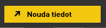

# Yhteyden muodostaminen Microsoft Azure Consumption Insightsiin Power BI:n avulla
Tutki ja valvo Microsoft Azure Enterprise -kulutustietojasi Power BI:ssä Power BI -sisältöpaketin avulla. Tiedot päivitetään automaattisesti kerran päivässä.

Muodosta yhteys Power BI:lle suunniteltuun [Microsoft Azure Consumption Insights -sisältöpakettiin](https://app.powerbi.com/getdata/services/azureconsumption).

## Yhteyden muodostaminen
1. Valitse vasemman siirtymisruudun alareunassa **Nouda tiedot**.
   
    
2. Valitse **Palvelut**-ruudussa **Nouda**.
   
   
3. Valitse **Microsoft Azure Consumption Insights** \> **Hanki**. 
   
   
4. Valitse, kuinka monen kuukauden tiedot haluat tuoda, ja anna Azure Enterprise -rekisteröintinumerosi. Lisätietoja [näiden parametrien löytämisestä](#FindingParams) on alla.
   
    
5. Anna Tiliavaimesi yhteyden muodostamista varten. Rekisteröintisi avain on Azure EA -portaalissa. 
   
    
6. Tuontiprosessi alkaa automaattisesti. Kun kaikki on valmista, uusi raporttinäkymä, raportti ja malli näkyvät siirtymisruudussa. Voit tarkastella tuotuja tietoja valitsemalla raporttinäkymän.
   
   

**Mitä seuraavaksi?**

* Kokeile [kysymyksen esittämistä raporttinäkymän yläreunassa olevassa Q&A-ruudussa](consumer/end-user-q-and-a.md).
* [Muuta koontinäytön ruutuja](service-dashboard-edit-tile.md).
* [Valitse jokin ruutu](consumer/end-user-tiles.md), jolloin siihen liittyvä raportti avautuu.
* Tietojoukko on ajastettu päivittymään päivittäin, mutta voit muuttaa päivitysaikataulua tai kokeilla tietojoukon päivittämistä **Päivitä nyt** -toiminnolla haluamanasi ajankohtana

## Paketin sisältö
Microsoft Azure Consumption Insights -sisältöpaketti sisältää kuukausittaiset raporttitiedot sille kuukausialueelle, jonka olet antanut yhteystyönkulun aikana. Alue on liikkuva aikaväli, joten alueeseen kuuluvat päivämäärät päivittyvät, kun tietojoukko päivittyy.

## Järjestelmävaatimukset
Sisältöpaketti edellyttää yritysominaisuuksien käyttöoikeuksia Azure-portaalissa. 

## Parametrien löytäminen
Power BI -raportointi on käytettävissä EA Directille, kumppaneille ja välillisille asiakkaille, jotka voivat tarkastella laskutustietoja. Lue seuraavat tiedot kunkin arvon etsimisestä, joita yhteyden työnkulku odottaa.

**Kuukausien määrä**

* Tämän on oltava luku välillä 1–36, joka edustaa niiden kuukausien lukumäärää (tästä päivästä lähtien), joiden tiedot haluat tuoda.

**Rekisteröintinumero**

* Tämä on Azure Enterprise -rekisteröintinumerosi, joka löytyy [Azure Enterprise Portalin](https://ea.azure.com/) aloitusnäytöstä kohdasta ”Rekisteröinnin tiedot”.
  
    

**Käyttöavain**

* Avain löytyy Azure Enterprise Portalista kohdasta ”Lataa käyttö” > ”Ohjelmointirajapinnan käyttöavain”
  
    

**Lisäapua**

* Lisäapua Azure Enterprise Power BI -paketin määrittämisestä löytyy kirjautumalla Azure Enterprise Portaliin, jossa voidaan tarkastella ”Ohje”-kohdassa olevaa Ohjelmointirajapinnan ohjetiedostoa, ja lisäohjeita kohdassa Raportit -> Lataa käyttö -> Ohjelmointirajapinnan käyttöavain. 

## Seuraavat vaiheet
[Power BI:n käytön aloittaminen](service-get-started.md)

[Tietojen noutaminen Power BI:ssä](service-get-data.md)

