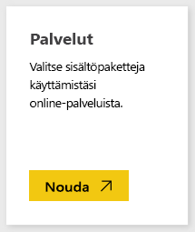
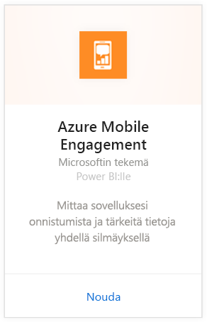
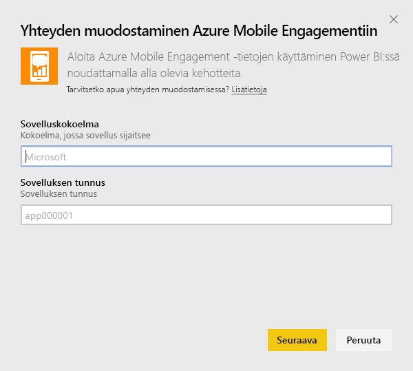
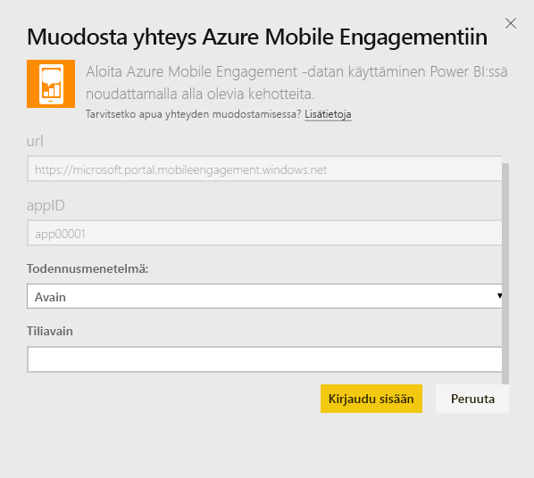
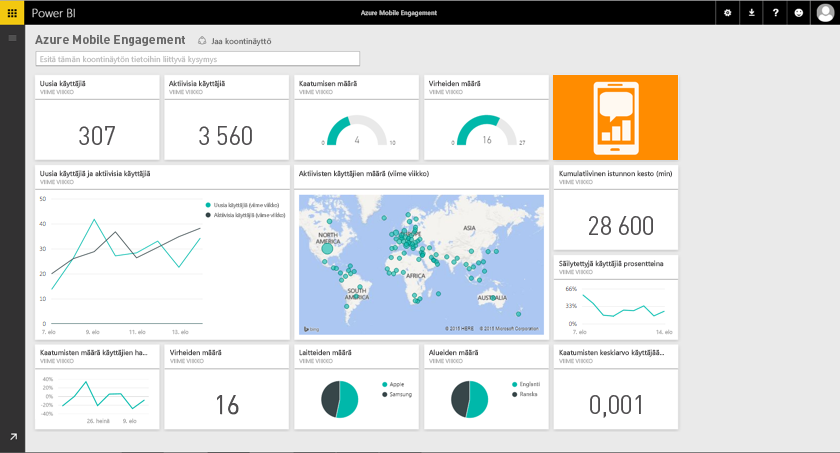

# Yhteyden muodostaminen Azure Mobile Engagementiin Power BI:n avulla
Power BI:n Azure Mobile Engagement -sisältöpaketin avulla teet nopeasti merkityksellisiä havaintoja sovellustiedoistasi.

Muodosta yhteys Power BI:n [Azure Mobile Engagement -sisältöpakettiin](https://app.powerbi.com/groups/me/getdata/services/azme).

## Yhteyden muodostaminen
1. Valitse vasemman siirtymisruudun alareunassa **Nouda tiedot**.
   
    
2. Valitse **Palvelut**-ruudussa **Nouda**.
   
    
3. Valitse **Azure Mobile Engagement** \> **Nouda**.
   
     
4. Määrittele sovelluskokoelmasi ja sovelluksen nimi. Nämä tiedot löytyvät Azure Mobile Engagement -tililtäsi.
   
     
5. Todentamismenetelmää varten anna avain ja napsauta sitten Kirjaudu sisään.
   
    
6. Kun Power BI on tuonut tiedot, näet vasemmassa siirtymisruudussa uuden koontinäytön, raportin ja tietojoukon. Uudet kohteet on merkitty keltaisella tähdellä \* joka katoaa kun valitaan:
   
    

## Mitä nyt?

* Kokeile [kysymyksen esittämistä koontinäytön yläreunassa olevassa Q&A-ruudussa](consumer/end-user-q-and-a.md).
* [Muuta koontinäytön ruutuja](service-dashboard-edit-tile.md).
* [Valitse jokin ruutu](consumer/end-user-tiles.md), jolloin siihen liittyvä raportti avautuu.
* Tietojoukko on ajastettu päivittymään päivittäin, mutta voit muuttaa päivitysaikataulua tai kokeilla tietojoukon päivittämistä **Päivitä nyt** -toiminnolla haluamanasi ajankohtana

## Seuraavat vaiheet
[Power BI:n käytön aloittaminen](service-get-started.md)

[Tietojen noutaminen Power BI:ssä](service-get-data.md)

