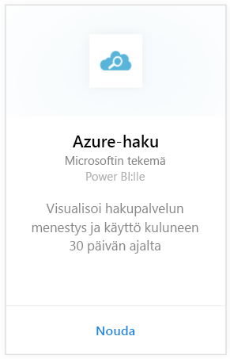
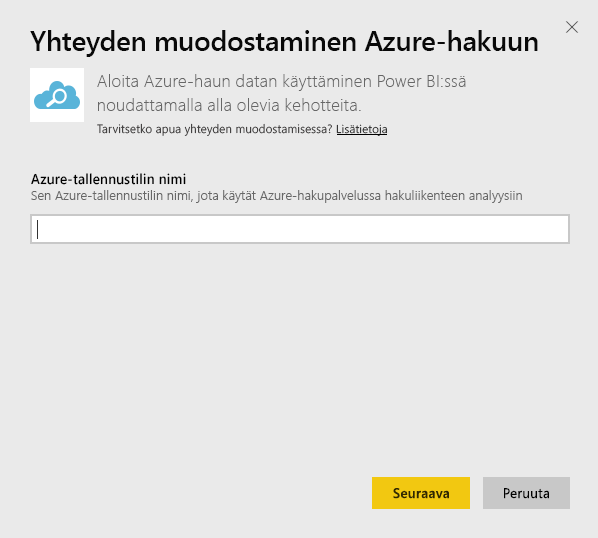
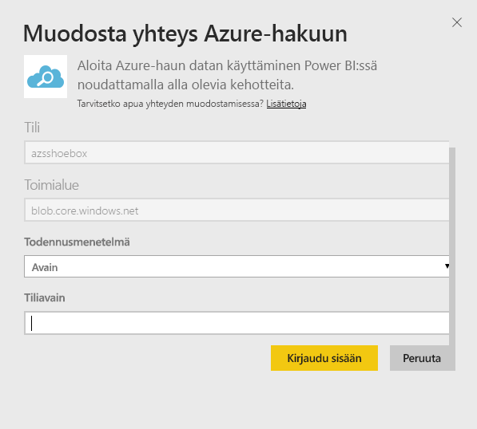
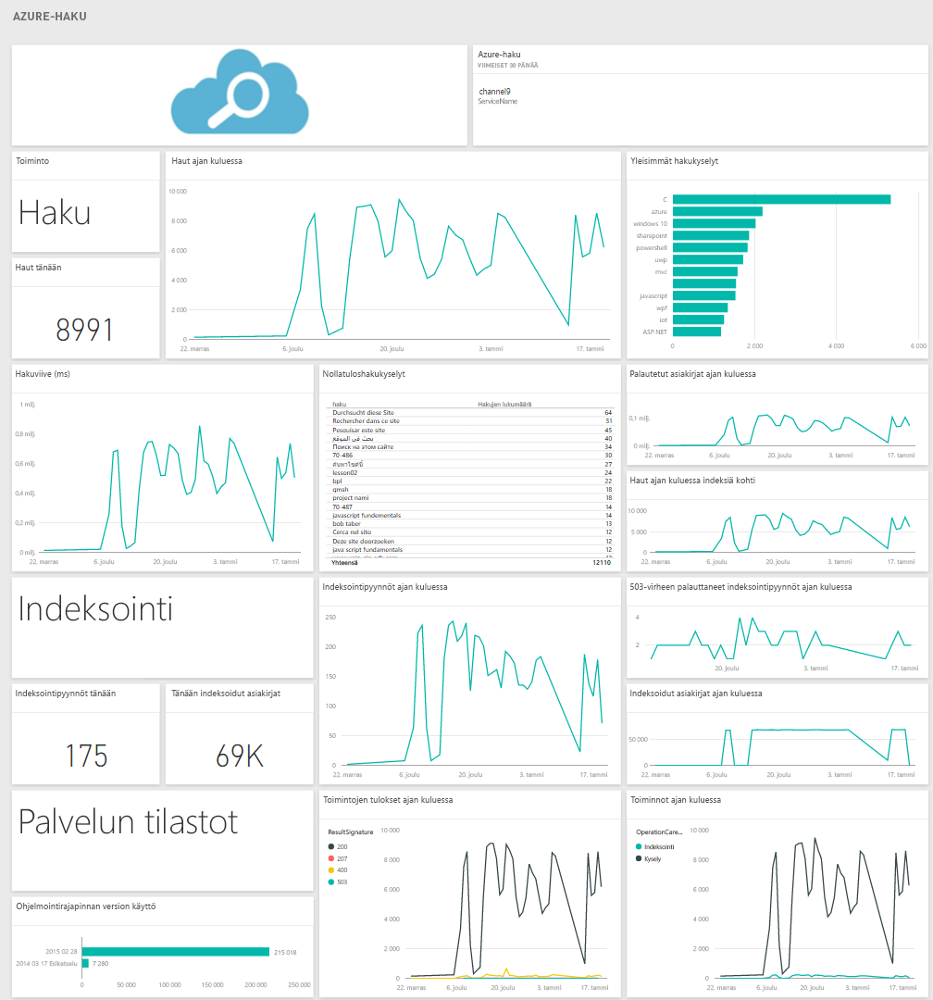

# Yhteyden muodostaminen Azure-hakuun Power BI:n avulla
Azure Search-hakuliikenteen analysoinnin avulla voit valvoa ja ymmärtää liikennettä Azure hakupalvelussa. Azure Search sisältöpaketti Power BI:lle tarjoaa yksityiskohtaisia tietoja haun tiedoista kuten Haku ja Indeksointi, Palvelutilastot ka Viive viimeisten 30 päivän ajalta. Lisätietoja löytyy [Azure-blogikirjoituksesta](https://azure.microsoft.com/blog/analyzing-your-azure-search-traffic/).

Muodosta yhteys [Azure Search -sisältöpakettiin](https://app.powerbi.com/getdata/services/azure-search) Power BI:lle.

## Yhteyden muodostaminen
1. Valitse vasemman siirtymisruudun alareunassa **Nouda tiedot**.
   
    
2. Valitse **Palvelut**-ruudussa **Nouda**.
   
    
3. Valitse **Azure Search** \> **Nouda**.
   
   
4. Anna nimi taulukon tallennustilille, jonne Azure Search -analyysi tallennetaan.
   
   
5. Valitse **Avain** todennusmekanismiksi ja anna tilin tallennusavain. Valitse **Kirjaudu sisään** ja aloita lataaminen.
   
   
6. Kun lataus on valmis, uusi raporttinäkymä, raportti ja malli näkyvät siirtymisruudussa. Voit tarkastella tuotuja tietoja valitsemalla raporttinäkymän.
   
    

**Mitä seuraavaksi?**

* Kokeile [kysymyksen esittämistä raporttinäkymän yläreunassa olevassa Q&A-ruudussa](consumer/end-user-q-and-a.md).
* [Muuta koontinäytön ruutuja](service-dashboard-edit-tile.md).
* [Valitse jokin ruutu](consumer/end-user-tiles.md), jolloin siihen liittyvä raportti avautuu.
* Tietojoukko on ajastettu päivittymään päivittäin, mutta voit muuttaa päivitysaikataulua tai kokeilla tietojoukon päivittämistä **Päivitä nyt** -toiminnolla haluamanasi ajankohtana

## Järjestelmävaatimukset
Azure Search -sisältöpaketti edellyttää Azure Search -liikenteen analyysin käyttöön ottoa tilillä.

## Vianmääritys
Varmista, että tallennustilin nimi on oikein annettu ja että käytössä ovat täydet oikeudet. Tallennustilin nimen tulee vastata Azure Search -liikenteen analyysiin määritettyä tiliä.

## Seuraavat vaiheet
[Mikä on Power BI?](power-bi-overview.md)

[Power BI:n peruskäsitteet](consumer/end-user-basic-concepts.md)

