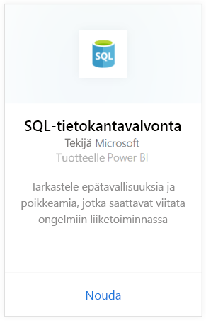
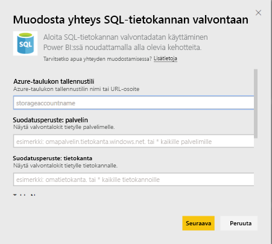
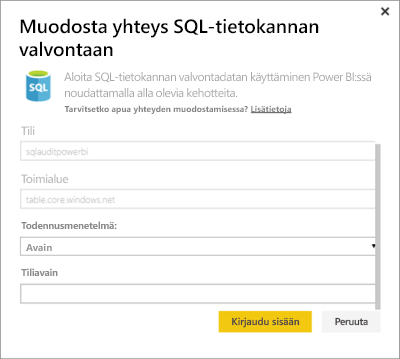
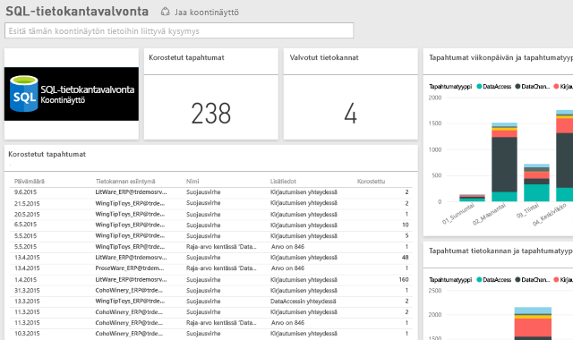

# SQL-tietokantavalvonnan sisältöpaketti Power BI:lle

> [!IMPORTANT]
> SQL-tietokantavalvonnan sisältöpaketti on vanhentunut, eikä se ole enää käytettävissä.
 
Power BI:n sisältöpaketti Azuren [SQL-tietokantavalvontaa](/azure/sql-database/sql-database-auditing/) varten auttaa sinua ymmärtämään tietokantatoimia ja saamaan merkityksellisiä tietoja poikkeamista, jotka saattavat ilmaista ongelmia yrityksessä tai mahdollisia tietoturvarikkomuksia. 

Muodosta yhteys [SQL-tietokantavalvonnan sisältöpakettiin](https://app.powerbi.com/getdata/services/sql-db-auditing) Power BI:tä varten.

>[!NOTE]
>Sisältöpaketti tuo tietoja kaikista taulukoista, joiden nimessä on sana AuditLogs, ja liittää ne yksittäiseen tietomallitaulukkoon nimeltä AuditLogs. Viimeiset 250 000 tapahtumaa sisällytetään ja tiedot päivitetään päivittäin.

## Yhteyden muodostaminen
1. Valitse vasemman siirtymisruudun alareunasta **Nouda tiedot**.
   
    
2. Valitse Palvelut-ruudussa Nouda.
   
    
3. Valitse **SQL-tietokantavalvonta** \> **Nouda**.
   
   
4. SQL-tietokantavalvonnan ikkunassa:
   
   - Anna sen Azure-taulukon tallennustilin nimi tai URL-osoite, johon lokit on tallennettu.
   
   - Anna haluamasi SQL-palvelimen nimi. Lataa kaikkien palvelimien valvontalokit kirjoittamalla ”\*”.
   
   - Anna haluamasi SQL-tietokannan nimi. Lataa kaikkien tietokantojen valvontalokit kirjoittamalla ”\*”.
   
   - Anna haluamasi lokit sisältävän Azure-taulukon nimi. Lataa valvontalokit kaikista taulukoista, joiden nimessä on teksti AuditLogs, kirjoittamalla ”\*”.
   
   >[!IMPORTANT]
   >Suorituskykysyistä on suositeltavaa aina määrittää tarkka taulukkonimi, vaikka kaikki valvontalokit olisi tallennettuna yhteen taulukkoon.
   
   - Anna haluamasi valvontalokien alkamispäivämäärä. Jos haluat ladata valvontalokit ilman ajan alarajaa, kirjoita ”\*”. Lataa valvontalokit viimeisestä päivästä lähtien kirjoittamalla ”1d”.
   
   - Anna haluamasi valvontalokien päättymispäivämäärä. Lataa valvontalokit ilman ajan ylärajaa kirjoittamalla ”\*”.
   
   
5. Valitse todentamismenetelmää varten **Avain**, anna oma **tiliavaimesi** \> **Kirjaudu sisään**.
   
   
6. Kun Power BI on tuonut tiedot, näet vasemmassa siirtymisruudussa uuden koontinäytön, raportin ja tietojoukon. Uudet kohteet on merkitty keltaisella tähdellä \*.
   
   

**Mitä seuraavaksi?**

* Kokeile [kysymyksen esittämistä raporttinäkymän yläreunassa olevassa Q&A-ruudussa](consumer/end-user-q-and-a.md).
* [Muuta koontinäytön ruutuja](service-dashboard-edit-tile.md).
* [Valitse jokin ruutu](consumer/end-user-tiles.md), jolloin siihen liittyvä raportti avautuu.
* Tietojoukko on ajastettu päivittymään päivittäin, mutta voit muuttaa päivitysaikataulua tai kokeilla tietojoukon päivittämistä **Päivitä nyt** -toiminnolla haluamanasi ajankohtana

## Seuraavat vaiheet
[Hanki tietoja Power BI:stä](service-get-data.md)
[Mikä on Power BI?](power-bi-overview.md)
