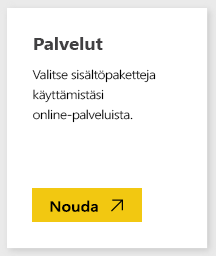
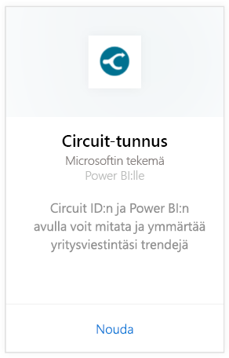
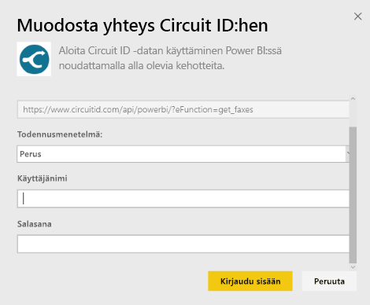
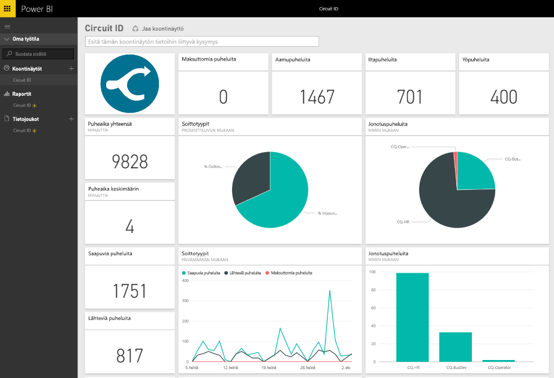

# Yhteyden muodostaminen piiritunnukseen Power BI:n avulla
Viestintätietojen analysointi piiritunnukselta on helppoa Power BI:n avulla. Power BI noutaa tiedot ja laatii sitten oletuskoontinäytön ja siihen liittyvät raportit kyseisten tietojen perusteella. Kun olet luonut yhteyden, voit tarkastella tietojasi ja mukauttaa koontinäyttöä tarpeidesi mukaan. Tiedot päivitetään automaattisesti joka päivä.

Muodosta yhteys [piiritunnuksen sisältöpakettiin](https://app.powerbi.com/getdata/services/circuitid)  Power BI:lle.

## Yhteyden muodostaminen
1. Valitse vasemman siirtymisruudun alareunassa **Nouda tiedot**.
   
    
2. Valitse **Palvelut**-ruudussa **Nouda**.
   
    
3. Valitse **Piiritunnus** \> **Nouda**.
   
    
4. Valitse Todennusmenetelmä-kohdassa Perus ja anna käyttäjänimesi ja salasanasi. Paina Kirjaudu sisään -näppäintä.
   
    
5. Kun Power BI on tuonut tiedot, näet vasemmassa siirtymisruudussa uuden koontinäytön, raportin ja tietojoukon. Uudet kohteet on merkitty keltaisella tähdellä.
   
    

**Mitä seuraavaksi?**

* Kokeile [kysymyksen esittämistä koontinäytön yläreunassa olevassa Q&A-ruudussa](power-bi-q-and-a.md)
* [Muuta koontinäytön ruutuja](service-dashboard-edit-tile.md).
* [Valitse jokin ruutu](service-dashboard-tiles.md), jolloin siihen liittyvä raportti avautuu.
* Tietojoukko on ajastettu päivittymään päivittäin, mutta voit muuttaa päivitysaikataulua tai kokeilla tietojoukon päivittämistä **Päivitä nyt** -toiminnolla haluamanasi ajankohtana

## Seuraavat vaiheet
[Power BI:n käytön aloittaminen](service-get-started.md)

[Tietojen noutaminen Power BI:hin](service-get-data.md)

