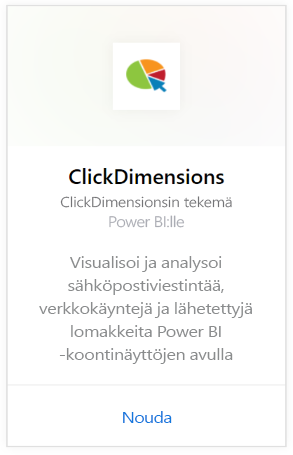

# Yhteyden muodostaminen ClickDimensionsiin Power BI:n avulla
ClickDimensions-sisältöpaketti Power BI:lle antaa käyttäjien hyödyntää ClickDimensionsin markkinointidataa Power BI:ssa, jolloin johtotiimit saavat merkityksellistä tietoa myynti- ja markkinointiponnistelujen tehokkuudesta. Visualisoi ja analysoi sähköpostiviestintää, verkkokäyntejä ja lähetettyjä lomakkeita Power BI -koontinäyttöjen ja raporttien avulla.

Muodosta yhteys [Power BI:n ClickDimensions-sisältöpakettiin.](https://app.powerbi.com/getdata/services/click-dimensions)

## Yhteyden muodostaminen
1. Valitse vasemman siirtymisruudun alareunassa **Nouda tiedot**.
   
   
2. Valitse **Palvelut**-ruudussa **Nouda**.
   
   
3. Valitse **ClickDimensions** \> **Nouda**.  
   
   
4. Anna palvelinkeskuksen sijaintitiedot (Yhdysvallat, EU tai AU) ja valitse **Seuraava**.
   
   
5. Valitse **todennusmenetelmäksi****Basic** \> **Kirjaudu sisään**. Kirjoita ClickDimensions-tunnistetietosi pyydettäessä. Lisätietoja [näiden parametrien löytämisestä](#FindingParams) on alla
   
    
6. Hyväksymisen jälkeen tuontiprosessi alkaa automaattisesti. Kun kaikki on valmista, uusi raporttinäkymä, raportti ja malli näkyvät siirtymisruudussa. Voit tarkastella tuotuja tietoja valitsemalla raporttinäkymän.
   
     

**Mitä seuraavaksi?**

* Kokeile [kysymyksen esittämistä koontinäytön yläreunassa olevassa Q&A-ruudussa](power-bi-q-and-a.md)
* [Muuta koontinäytön ruutuja](service-dashboard-edit-tile.md).
* [Valitse jokin ruutu](service-dashboard-tiles.md), jolloin siihen liittyvä raportti avautuu.
* Tietojoukko on ajastettu päivittymään päivittäin, mutta voit muuttaa päivitysaikataulua tai kokeilla tietojoukon päivittämistä **Päivitä nyt** -toiminnolla haluamanasi ajankohtana

## Järjestelmävaatimukset
Yhteyden muodostamiseksi Power BI -sisältöpakettiin pitää antaa palvelinkeskus, joka vastaa tiliä ja kirjautumista ClickDimensions-tilille. Jos et ole varma, mikä palvelinkeskus pitää antaa, tarkista asia järjestelmänvalvojalta.

## Parametrien löytäminen
Tilin avain löytyy CRM asetuksista \> ClickDimensions -asetuksista. Kopioi tiliavaimesi ClickDimensions-asetuksista ja liitä se Käyttäjän nimi -kenttään.  

  

Kopioi Power BI -tunnus ClickDimensions-asetuksista ja liitä se Salasana -kenttään. Power BI -tunnus löytyy CRM asetuksista \> ClickDimensions -asetuksista.  

  

## Seuraavat vaiheet
[Power BI:n käytön aloittaminen](service-get-started.md)

[Tietojen noutaminen Power BI:ssä](service-get-data.md)

