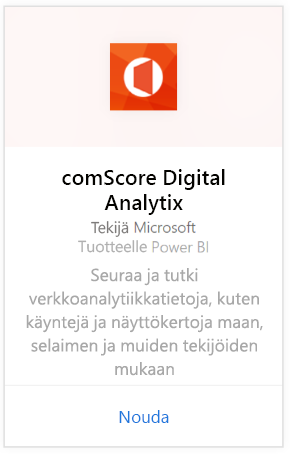
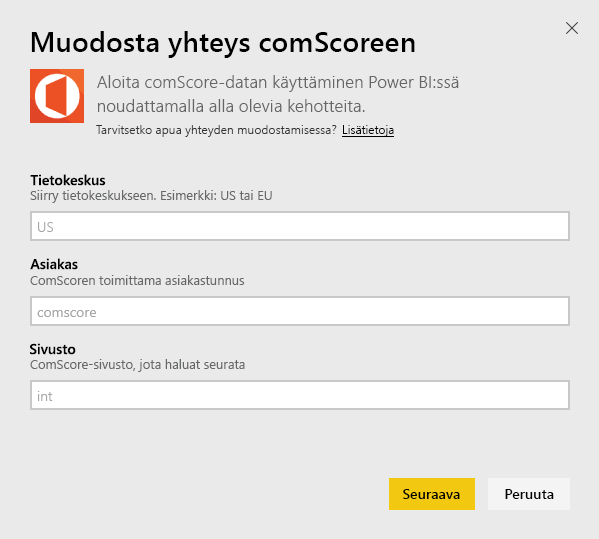
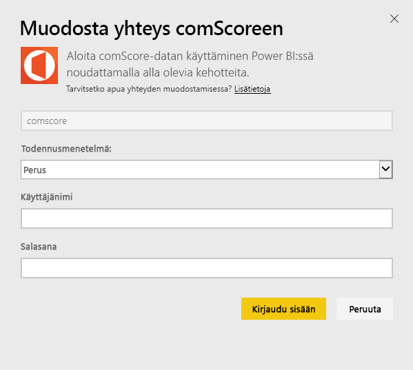
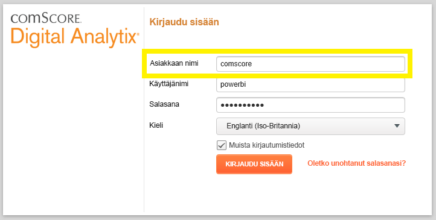
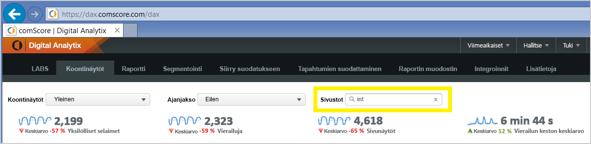

# comScore Digital Analytixiin yhdistäminen Power BI:n avulla
Visualisoi ja tutki comScore Digital Analytixiin -tietoja Power BI:ssä Power BI -sisältöpaketin avulla. Tiedot päivitetään automaattisesti kerran päivässä.

Muodosta yhteys [Power BI:n comScore-sisältöpakettiin.](https://app.powerbi.com/getdata/services/comscore)

>[!NOTE]
>Jotta voit muodostaa yhteyden sisältöpakettiin, tarvitset comScore DAx -käyttäjätilin ja comScore-ohjelmointirajapinnan käyttöoikeuden. Alla on [lisätietoja](#Requirements).

## Yhteyden muodostaminen
1. Valitse vasemman siirtymisruudun alareunassa Nouda tiedot.
   
   
2. Valitse **Palvelut**-ruudussa **Nouda**.
   
   
3. Valitse **comScore Digital Analytix** \> **Nouda**.
   
   
4. Anna tietokeskus, comScore-asiakastunnus ja sivusto, johon haluat muodostaa yhteyden. Lisätietoja siitä, miten löydät nämä arvot, on osiossa [comScore-parametrien löytäminen](#FindingParams) alla.
   
   
5. Muodosta yhteys antamalla comScore käyttäjänimesi ja -salasanasi. Lisätietoja arvon löytämisestä on alla.
   
   
6. Tuontiprosessi alkaa automaattisesti. Kun kaikki on valmista, uusi raporttinäkymä, raportti ja malli näkyvät siirtymisruudussa. Voit tarkastella tuotuja tietoja valitsemalla raporttinäkymän.

**Mitä seuraavaksi?**

* Kokeile [kysymyksen esittämistä raporttinäkymän yläreunassa olevassa Q&A-ruudussa](power-bi-q-and-a.md).
* [Muuta koontinäytön ruutuja](service-dashboard-edit-tile.md).
* [Valitse jokin ruutu](service-dashboard-tiles.md), jolloin siihen liittyvä raportti avautuu.
* Tietojoukko on ajastettu päivittymään päivittäin, mutta voit muuttaa päivitysaikataulua tai kokeilla tietojoukon päivittämistä **Päivitä nyt** -toiminnolla haluamanasi ajankohtana

## Järjestelmävaatimukset
Yhteyden muodostamiseen tarvitaan comScore DAx -käyttäjätili ja comScore DAx -ohjelmointirajapinnan käyttöoikeus. Ota yhteyttä comScore DAx -järjestelmänvalvojaan tilisi vahvistamiseksi.

## Parametrien löytäminen
Löydät kunkin comScore-parametrin alla olevien ohjeiden mukaisesti.

**Tietokeskus**

URL-osoite, johon siirryt comScoressa, määrittää tietokeskuksen, johon muodostat yhteyden.

Jos sinulla on käytössä https://dax.comscore.com, syötä “US”, jos sinulla on käytössä https://dax.comscore.eu, syötä “EU”.

 

**Asiakas**

Asiakas on sama, jota käytät kirjautuessasi comScore DAxiin.

 

**Sivusto**

comScore-sivusto määrittää, mistä sivustosta haluat nähdä tiedot. Voit etsiä sivustoluettelon comScore-tililtäsi.

## Seuraavat vaiheet
[Power BI:n käytön aloittaminen](service-get-started.md)

[Tietojen noutaminen Power BI:ssä](service-get-data.md)

