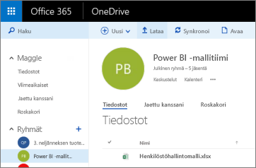
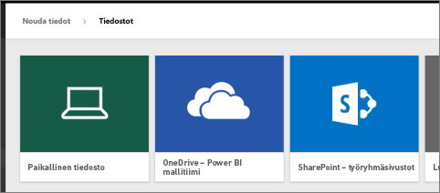
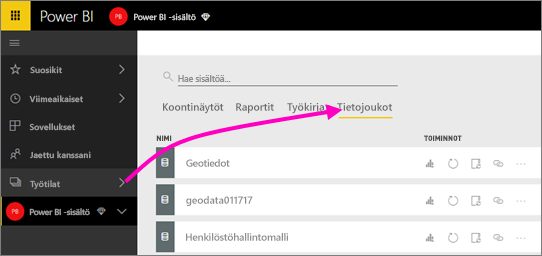
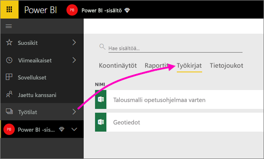

# Yhteyden muodostaminen Power BI -työtilasta OneDriveen tallennettuihin tiedostoihin
[Luotuasi Power BI:hin työtilan](service-create-distribute-apps.md) voit tallentaa Excel-, CSV- ja Power BI Desktop ‑tiedostosi OneDrive for Business ‑palveluun ja käyttää niitä sieltä Power BI ‑työtilassa. Voit jatkaa OneDriveen tallentamiesi tiedostojen päivittämistä. Päivitykset tulevat automaattisesti esiin myös kyseisiin tiedostoihin perustuvissa Power BI ‑raporteissa ja koontinäytöissä. 

> [!NOTE]
> Uusi työtilakokemus muuttaa Power BI -työtilojen ja Office 365:n ryhmien välistä suhdetta. Et luo automaattisesti Office 365 -ryhmää aina, kun luot uuden työtilan. Lue tietoja [uusien työtilojen luomisesta](service-create-the-new-workspaces.md)

Tiedostojen lisääminen työtilaan on kaksivaiheinen prosessi: 

1. Ensin sinun on [ladattava tiedostot työtilasi OneDrive for Business ‑tallennustilaan](service-connect-to-files-in-app-workspace-onedrive-for-business.md#1-upload-files-to-the-onedrive-for-business-for-your-workspace).
2. Sitten sinun on [muodostettava tiedostoihin yhteys Power BI:stä](service-connect-to-files-in-app-workspace-onedrive-for-business.md#2-import-excel-files-as-datasets-or-as-excel-online-workbooks).

> [!NOTE]
> Työtilat ovat käytettävissä vain [Power BI Pro:ssa](service-features-license-type.md).
> 

## 1\. Tiedostojen lataaminen työtilasi OneDrive for Business ‑tallennustilaan
1. Valitse Power BI -palvelussa kohdan Työtilat vieressä oleva nuoli > valitse työtilasi nimen vierestä kolme pistettä ( **…** ). 
   
   
2. Valitse **Tiedostot**, niin näytölle avautuu Office 365:ssä työtilasi OneDrive for Business ‑tallennustila.
   
   > [!NOTE]
   > Jos työtilan valikossa ei näy vaihtoehtoa **Tiedostot**, avaa työtilasi OneDrive for Business valitsemalla **Jäsenet**. Valitse sitten sieltä **Tiedostot**. Office 365 ottaa sovelluksesi ryhmätyötilatiedostoille käyttöön OneDrive-tallennussijainnin. Siihen voi kestää jonkin aikaa. 
   > 
   > 
3. Tästä näkymästä voit ladata tiedostot työtilasi OneDrive for Business ‑tallennustilaan. Valitse **Lataa** ja siirry tiedostoihin.
   
   

## 2\. Excel-tiedostojen tuonti tietojoukkoina tai Excel Online ‑työkirjoina
Nyt kun tiedostosi ovat työtilasi OneDrive for Business ‑tallennustilassa, voit valita kahdesta vaihtoehdosta, miten haluat jatkaa. Vaihtoehdot ovat: 

* [Tuo Excel-työkirjan tiedot tietojoukkona](service-get-data-from-files.md). Voit sitten käyttää tietoja sellaisten raporttien ja koontinäyttöjen luomiseen, joita voi tarkastella verkkoselaimessa ja mobiililaitteilla.
* Tai voit [muodostaa Power BI:ssä yhteyden koko Excel-työkirjaan](service-excel-workbook-files.md), jolloin se näytetään tismalleen samanlaisena kuin se näkyisi Excel Onlinessa.

### Tiedostojen tuonti työtilaan tai yhteyden muodostaminen tiedostoihin
1. Vaihda Power BI:ssä työtilaan, jolloin työtilan nimi näkyy vasemmassa yläkulmassa. 
2. Valitse siirtymisruudun alareunasta **Nouda tiedot**. 
   
   
3. Valitse **Tiedostot**-ruudussa **Nouda**.
   
   
4. Valitse **OneDrive** - *työtilasi nimi*.
   
    
5. Valitse haluamasi tiedosto > **Yhdistä**.
   
    Tässä vaiheessa sinun on päätettävä, haluatko [tuoda tiedot Excel-työkirjasta](service-get-data-from-files.md) vai [muodostaa yhteyden Excel-työkirjoihin kokonaisuudessaan](service-excel-workbook-files.md).
6. Valitse joko **Tuo** tai **Yhdistä**.
   
    
7. Jos valitset **Tuo**, työkirja ilmestyy **Tietojoukot**-välilehdelle. 
   
    
   
    Jos valitset **Yhdistä**, työkirja tulee näkyviin **Työkirjat**-välilehdelle.
   
    

## Seuraavat vaiheet
* [Sovellusten ja työtilojen luominen Power BI:ssä](service-create-distribute-apps.md)
* [Tietojen tuominen Excel-työkirjoista](service-get-data-from-files.md)
* [Yhteyden muodostaminen kokonaisiin Excel-työkirjoihin](service-excel-workbook-files.md)
* Onko sinulla kysyttävää? [Kokeile Power BI -yhteisöä](https://community.powerbi.com/)
* Haluatko antaa palautetta? Siirry [Power BI:n ideasivulle](https://ideas.powerbi.com/forums/265200-power-bi)

