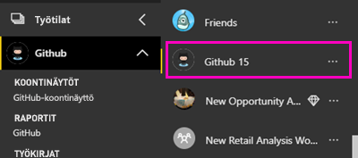
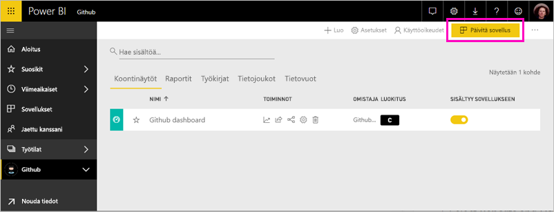

# Yhteyden muodostaminen GitHubin Power BI:n välillä
Tässä artikkelissa käydään läpi GitHub-tilin sovelluksessa Power BI-mallin tiedot vetämällä. Malli, sovellus muodostaa työtilan koontinäytön, raportteja ja tietojoukon, joiden avulla voit tarkastella GitHub-tietoihin. Power BI GitHub-sovellus näyttää GitHub-säilön tunnetaan myös säilössä panoksestasi, ongelmia, pull-pyynnöt ja aktiivisten käyttäjien merkityksellisiä tietoja.

Kun olet asentanut sovelluksen mallin, voit muuttaa koontinäyttöä ja raporttia. Sitten voit jakaa sen sovelluksena työtovereiden organisaatiossasi.

Muodosta yhteys [GitHub-mallin sovellus](https://app.powerbi.com/getdata/services/github) tai Lue lisää [GitHub-integrointi](https://powerbi.microsoft.com/integrations/github) kanssa Power BI.

Voit myös kokeilla [GitHub-opetusohjelma](service-tutorial-connect-to-github.md). Todellinen GitHub-tietoja Power BI-dokumentaation julkisen säilön asentaa siihen.

>[!NOTE]
>Malli-sovellus edellyttää pääsyä säilön GitHub-tili. Lisätietoja vaatimuksista on alla.

## Yhteyden muodostaminen
[!INCLUDE [powerbi-service-apps-get-more-apps](./includes/powerbi-service-apps-get-more-apps.md)]
   
3. Valitse **GitHub** \> **hanki se nyt**.
4. - **Asentaa Power BI-sovelluksesta?** Valitse **asentaa**.
4. - **Sovelluksia** ruudussa **GitHub** ruudun.

    

6. - **Uuden sovelluksen käytön aloittaminen**, valitse **yhdistää tiedot**.

    

5. Kirjoita säilön nimi ja omistaja. Lisätietoja [näiden parametrien löytämisestä](#FindingParams) on alla.
   
    

5. Anna GitHub-tunnistetietosi (tämä vaihe voidaan ohittaa, jos olet jo kirjautunut sisään selaimellasi). 
6. Valitse **todennusmenetelmäksi** **oAuth2** \> **Kirjaudu sisään**. 
7. Noudata Githubin todennusnäyttöjä. Myönnä Power BI-mallin sovelluksen käyttöoikeus GitHub-tietojen GitHub.
   
   
   
    Power BI muodostaa yhteyden GitHub ja tiedot.  Tiedot päivitetään kerran päivässä. Kun Power BI on tuonut tiedot, näkyviin tulee uusi GitHub-työtila sisällön.

## Muokata ja jakaa sovelluksen

Olet asentanut mallin GitHub-sovellus. Tämä tarkoittaa myös luomasi GitHub-sovelluksen työtilassa. Työtilassa voit muuttaa raportin ja koontinäytön ja jakaa sen *sovelluksen* työtovereiden organisaatiossasi. 

1. Valitse vasemmassa siirtymispalkissa työtilan nimen vieressä olevaa nuolta. Näet työtila sisältää koontinäytön ja raportin.

    

8. Valitse uusi [GitHub-koontinäyttö](https://powerbi.microsoft.com/integrations/github).    
    

3. Tarkastele uusi GitHub-työtila sisällön vasemmassa siirtymispalkissa valitsemalla **työtilat** > **GitHub**.
 
   

    Tämä näkymä on työtilan sisältöluettelosta. Näet oikeassa yläkulmassa, **Päivitä sovellus**. Kun olet valmis jakamaan sovelluksesi työtovereillesi, joka on jossa aloitat. 

    

2. Valitse **raporttien** ja **tietojoukkoja** Nähdäksesi työtilan muut elementit.

    Lue [jakaminen sovellusten](service-create-distribute-apps.md) työtovereillesi.

## Mitä sisällytetään sovellus
Seuraavat tiedot ovat käytettävissä GitHubista Power BI:ssä:     

| Taulukon nimi | Kuvaus |
| --- | --- |
| Osallistumiset |Osallistumiset-taulukko antaa kokonaismäärän, poistot ja vahvistaa osallistujan koostetaan viikoittain tekijä. Ensimmäiset 100 osallistujaa lasketaan mukaan. |
| Ongelmat |Listaa kaikki valitun säilön ongelmat ja sisältää laskelmia, kuten kokonaisajan ja keskimääräisen ongelman sulkemiseen käytetyn ajan, avoimien ongelmien kokonaismäärän ja suljettujen ongelmien kokonaismäärän. Tämä taulukko on tyhjä, jos säilössä ei ole ongelmia. |
| Noutopyynnöt |Tämä taulukko sisältää kaikki säilöön kohdistetut noutopyynnöt, sekä tiedot siitä, kuka pyynnön on tehnyt. Se sisältää myös laskelmia, kuten montako Avaa suljettu ja yhteensä pull-pyynnöt, miten kauan noutopyynnön kestänyt ja miten kauan noutopyynnön keskimääräisesti. Tämä taulukko on tyhjä, jos säilössä ei ole ongelmia. |
| Käyttäjät |Tämä taulukko sisältää luettelon GitHub-käyttäjät tai osallistujat on tehty panoksestasi, Arkistoidut ongelmat tai toteutetut noutopyynnöt valitusta säilöstä. |
| Välitavoitteet |Siinä ovat kaikki valitun säilön välitavoitteet. |
| DateTable |Tämä taulukko sisältää päivämääriä tästä päivästä aikaisempiin aiemmin, joiden avulla voit analysoida GitHub-tietojasi päivämäärän mukaan. |
| ContributionPunchCard |Tätä taulukkoa voidaan käyttää valitun osallistumisreikäkorttina valitulle säilölle. Se näyttää vahvistetut muutokset viikonpäivän ja kellonajan mukaan järjestettyinä. Tätä taulukkoa ei ole yhdistetty muihin mallin taulukoihin. |
| RepoDetails |Tämä taulukko sisältää yksityiskohtaisia tietoja valitusta säilöstä. |

## Järjestelmävaatimukset
* GitHub-tili, jolla on pääsy säilöön.  
* Ensimmäisen sisäänkirjautumisen aikana myönnetyt käyttöoikeudet on Power BI:n GitHub-sovellukseen. Katso lisätietoja käyttöoikeuksien perumisesta alapuolelta.  
* Riittävästi käytettävissä olevia API-ohjelmointirajapintakutsuja tietojen vastaanottamista ja päivittämistä varten.  

### Power BI:n valtuutuksien poisto
Estääksesi yhteyden GitHub-säilöön valtuutukset Power BI, ja voit kumota käyttöoikeudet githubissa. Tutustu tähän [GitHub-apu](https://help.github.com/articles/keeping-your-ssh-keys-and-application-access-tokens-safe/#reviewing-your-authorized-applications-oauth) ohjeaiheen.

## Parametrien löytäminen
Voit määrittää omistajan ja säilön tarkastelemalla säilöä GitHubissa:

Ensimmäisen osan ”Azure” on omistaja ja toisen osan ”azure-sdk-for-php” on säilö itse.  Nämä kaksi asiaa näkyvät myös säilön URL-osoitteessa:

    <https://github.com/Azure/azure-sdk-for-php> .

## Vianmääritys
Voit tarvittaessa varmistaa GitHub-tunnistetietosi.  

1. Toisessa selainikkunassa GitHub-sivustossa ja kirjaudu sisään GitHub. Näet, oletko kirjautuneena sisään, GitHub-sivuston oikeasta yläkulmasta.    
2. Siirry GitHubissa säilön URL-osoitteeseen, jota aiot käyttää Power BI:ssä. Esimerkki: https://github.com/dotnet/corefx.  
3. Koita seuraavaksi yhdistää GitHubiin Power BI:ssä. Käytä määritä GitHub -valintaikkunassa säilön ja säilön omistajan nimiä samalle säilölle.  

## Seuraavat vaiheet

* [Opetusohjelma: Power BI-ja GitHub-säilön yhdistäminen](service-tutorial-connect-to-github.md)
* [Luo uusi työtilat Power BI](service-create-the-new-workspaces.md)
* [Asenna ja käytä sovelluksia Power BI:ssä](consumer/end-user-apps.md)
* [Power BI-sovelluksista ulkoisiin palveluihin yhdistäminen](service-connect-to-services.md)
* Onko sinulla kysyttävää? [Voit esittää kysymyksiä Power BI -yhteisössä](http://community.powerbi.com/)

