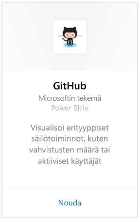
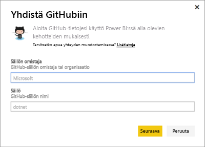
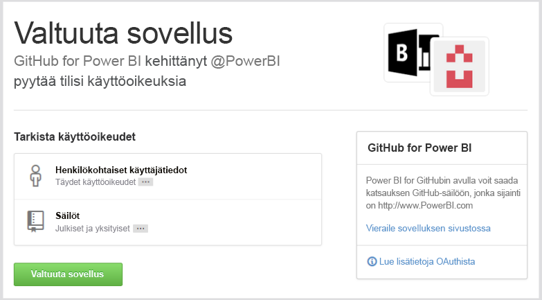
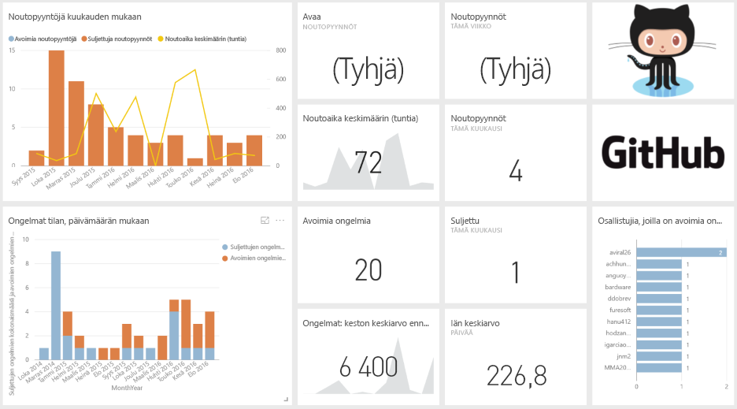
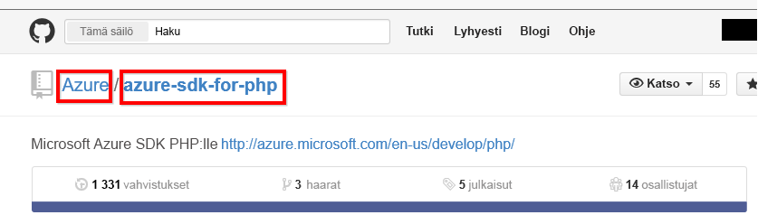

# Yhteyden muodostaminen GitHubin Power BI:n välillä
Power BI:n GitHub -sisältöpaketin avulla saat tietoa GitHub-säiliöstä, osallistumistiedoista, ongelmista, noutopyynnöistä sekä aktiivisista käyttäjistä.

Muodosta yhteys [GitHub -sisältöpakettiin](https://app.powerbi.com/getdata/services/github) tai lue lisää Power Bi:n [GitHub-integroinnista](https://powerbi.microsoft.com/integrations/github).

>[!NOTE]
>Sisältöpaketti vaatii GitHub-tilin, jotta sinulla on käyttöoikeus säilöön. Lisätietoja vaatimuksista on alla.

## Yhteyden muodostaminen
1. Valitse vasemman siirtymisruudun alareunassa **Nouda tiedot**.
   
    
2. Valitse **Palvelut**-ruudussa **Nouda**.
   
    
3. Valitse **GitHub** \> **Nouda**.
   
   
4. Kirjoita säilön nimi ja omistaja. Lisätietoja [näiden parametrien löytämisestä](#FindingParams) on alla.
   
   
5. Anna GitHub -tunnistetietosi (tämä vaihe voidaan ohittaa, jos olet jo kirjautunut sisään selaimellasi). 
6. Valitse **todennusmenetelmäksi** **oAuth2** \> **Kirjaudu sisään**. 
7. Noudata GitHubin todennusnäyttöjä. Myönnä Power BI:n GitHub-sisältöpaketille pääsy GitHub-tietoihin.
   
   
   
   Tämä muodostaa yhteyden Power BI:n ja GitHubin välillä ja sallii Power BI:lle yhteyden tietoihin.  Tiedot päivitetään kerran päivässä.
8. Kun yhteys säilöön on muodostettu, Power BI tuo tiedot. Näet vasemmassa siirtymisruudussa uuden [GitHub-koontinäytön](https://powerbi.microsoft.com/integrations/github), raportin ja tietojoukon. Uudet kohteet on merkitty keltaisella tähdellä \*.
   
   

**Mitä seuraavaksi?**

* Kokeile [kysymyksen esittämistä raporttinäkymän yläreunassa olevassa Q&A-ruudussa](consumer/end-user-q-and-a.md).
* [Muuta koontinäytön ruutuja](service-dashboard-edit-tile.md).
* [Valitse jokin ruutu](consumer/end-user-tiles.md), jolloin siihen liittyvä raportti avautuu.
* Tietojoukko on ajastettu päivittymään päivittäin, mutta voit muuttaa päivitysaikataulua tai kokeilla tietojoukon päivittämistä **Päivitä nyt** -toiminnolla haluamanasi ajankohtana

## Paketin sisältö
Seuraavat tiedot ovat käytettävissä GitHubista Power BI:ssä:     

| Taulukon nimi | Kuvaus |
| --- | --- |
| Osallistumiset |Osallistumiset-taulukko laskee lisäyksien kokonaismäärän, poistot ja vahvistaa osallistujan tekemät muutokset, jotka koostetaan viikoittain. Ensimmäiset 100 osallistujaa lasketaan mukaan. |
| Ongelmat |Listaa kaikki valitun säilön ongelmat ja sisältää laskelmia, kuten kokonaisajan ja keskimääräisen ongelman sulkemiseen käytetyn ajan, avoimien ongelmien kokonaismäärän ja suljettujen ongelmien kokonaismäärän. Tämä taulukko on tyhjä, jos säilössä ei ole ongelmia. |
| Noutopyynnöt |Tämä taulukko sisältää kaikki säilöön kohdistetut noutopyynnöt, sekä tiedot siitä, kuka pyynnön on tehnyt. Se sisältää myös laskelmia, kuten montako avointa ja suljettua noutopyyntöä on, sekä niiden kokonaismäärän, miten kauan noutopyynnön toteuttamisessa on kestänyt ja miten kauan noutopyynnön toteuttamisessa on keskimääräisesti kulunut aikaa. Tämä taulukko on tyhjä, jos säilössä ei ole ongelmia. |
| Käyttäjät |Tässä taulukossa on lueteltu valitun säilön GitHub-käyttäjät tai osallistujat, arkistoidut ongelmat tai toteutetut noutopyynnöt. |
| Välitavoitteet |Siinä ovat kaikki valitun säilön välitavoitteet. |
| DateTable |Tämä taulukko sisältää päivämääriä tästä päivästä aikaisempiin vuosiin, joiden avulla voit analysoida GitHub-tietojasi päivämäärän mukaan. |
| ContributionPunchCard |Tätä taulukkoa voidaan käyttää valitun osallistumisreikäkorttina valitulle säilölle. Se näyttää vahvistetut muutokset viikonpäivän ja kellonajan mukaan järjestettyinä. Tätä taulukkoa ei ole yhdistetty muihin mallin taulukoihin. |
| RepoDetails |Tämä taulukko sisältää yksityiskohtaisia tietoja valitusta säilöstä. |

## Järjestelmävaatimukset
* GitHub-tili, jolla on pääsy säilöön.  
* Ensimmäisen sisäänkirjautumisen aikana myönnetyt käyttöoikeudet on Power BI:n GitHub-sovellukseen. Katso lisätietoja käyttöoikeuksien perumisesta alapuolelta.  
* Riittävästi käytettävissä olevia API-ohjelmointirajapintakutsuja tietojen vastaanottamista ja päivittämistä varten.  

### Power BI:n valtuutuksien poisto
Poistaaksesi Power BI:n valtuutukset ja estääksesi yhteyden GitHub-säilöön, voit kumota käyttöoikeudet GitHubissa. Lisätietoja löytyy [GitHub-apu](https://help.github.com/articles/keeping-your-ssh-keys-and-application-access-tokens-safe/#reviewing-your-authorized-applications-oauth) -aiheesta.

## Parametrien löytäminen
Voit määrittää omistajan ja säilön tarkastelemalla säilöä GitHubissa:

Ensimmäisen osan ”Azure” on omistaja ja toisen osan ”azure-sdk-for-php” on säilö itse.  Nämä kaksi asiaa näkyvät myös säilön URL-osoitteessa:

    <https://github.com/Azure/azure-sdk-for-php> .

## Vianmääritys
Voit tarvittaessa varmistaa GitHub-tunnistetietosi.  

1. Avaa GitHubin web-sivusto uudessa ikkunassa ja kirjaudu sisään GitHubiin. Näet, oletko kirjautuneena sisään, GitHub-sivuston oikeasta yläkulmasta.    
2. Siirry GitHubissa säilön URL-osoitteeseen, jota aiot käyttää Power BI:ssä. Esimerkki: https://github.com/dotnet/corefx.  
3. Koita seuraavaksi yhdistää GitHubiin Power BI:ssä. Käytä määritä GitHub -valintaikkunassa säilön ja säilön omistajan nimiä samalle säilölle.  

## Seuraavat vaiheet
* [Mikä on Power BI?](power-bi-overview.md)
* [Nouda tiedot](service-get-data.md)
