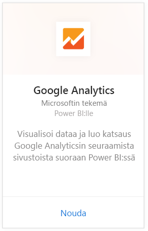
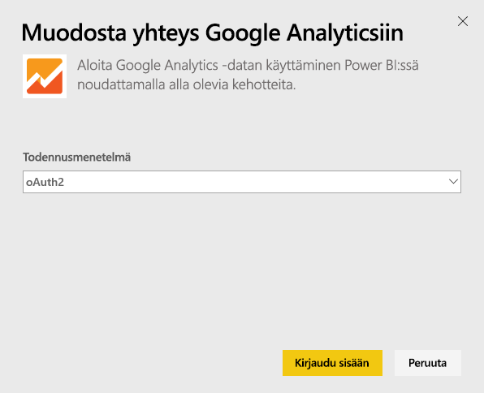
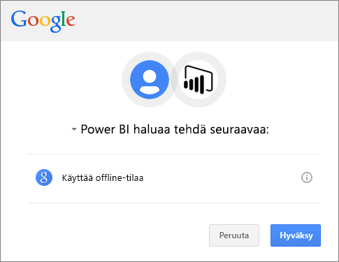
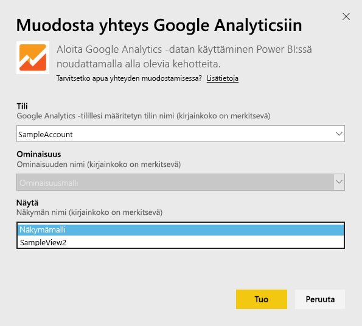
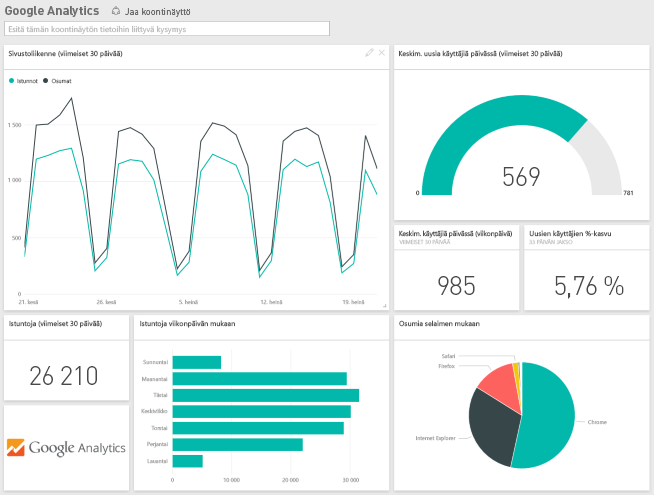
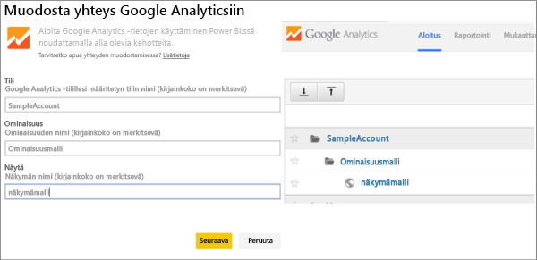

# Google Analyticsin yhdistäminen Power BI:hin
Yhteyden muodostaminen Google Analyticsiin Power BI:n kautta alkaa muodostamalla yhteys Google Analytics -tiliin. Saat Power BI:n koontinäytön ja joukon Power BI -raportteja, jotka tarjoavat merkityksellisiä tietoja sivuston liikenne- ja käyttäjädimensioista. Voit käsitellä koontinäyttöä ja raportteja, mutta et voi tallentaa muutoksia. Tiedot päivitetään automaattisesti kerran päivässä.

Muodosta yhteys [Google Analyticsiin](https://app.powerbi.com/getdata/services/google-analytics) Power BI:tä varten. Lue lisää [Google Analyticsin integroinnista](https://powerbi.microsoft.com/integrations/google-analytics) Power BI:hin.

Voit luoda mukautettuja koontinäyttöjä ja raportteja aloittamalla [Google Analytics -liittimestä](service-google-analytics-connector.md) Power BI Desktopissa. Muodosta vain yhteys Google Analytics -tiliisi ja luo omat mukautetut raportit, jotka voit julkaista Power BI -palvelussa.

## Yhteyden muodostaminen
[!INCLUDE [powerbi-service-apps-get-more-apps](./includes/powerbi-service-apps-get-more-apps.md)]

3. Valitse **Google Analytics** \> **Nouda**.
   
   
4. Anna pyydettäessä Google Analytics -tunnistetietosi. Valitse todennusmenetelmäksi **oAuth 2** ja valitse **Kirjaudu sisään**. Noudata Googlen todennustyönkulkua, joka saattaa sisältää 2-vaiheisen todennuksen, jos se on määritettynä.
   
   
5. Valitse **Hyväksy**, jotta Power BI voi käyttää Google Analytics -tietojasi.
   
   
6. Power BI muodostaa yhteyden tiettyyn Google Analytics -näkymään. Valitse sen tilin nimi, ominaisuuden nimi ja näkymän nimi, johon haluat muodostaa yhteyden. Nämä tiedot löytyvät Google Analytics -tilistäsi joko vasemmasta yläkulmasta tai **Aloitus**-välilehdestä. Lisätietoja on alla. 
   
   
5. Aloita tuontiprosessi valitsemalla **Yhdistä**. 

## Google Analytics -koontinäytön ja -raporttien tarkasteleminen
[!INCLUDE [powerbi-service-apps-open-app](./includes/powerbi-service-apps-open-app.md)]

   

[!INCLUDE [powerbi-service-apps-open-app](./includes/powerbi-service-apps-what-now.md)]

## Järjestelmävaatimukset
Jotta yhteys voidaan muodostaa Power BI:stä, sinulla on oltava [Google Analytics](https://www.google.com/analytics/) -tili. Muista Google-tileistä, joihin ei ole yhdistetty Google Analytics -tiliä, näytetään todennusvirhe.

## Vianmääritys
**Tunnistetiedot** Jos sinulla on useita Google-tilejä, käytä incognito-tilaa tai yksityistä selainikkunaa yhteyden muodostamisessa, jotta käytössä on varmasti oikea tili.

Jos näyttöön tulee virhesanoma, jonka mukaan tunnistetiedot ovat virheelliset, vaikka voit kirjautua Googleen, varmista, että käytössäsi on [Google Analytics](https://www.google.com/analytics/) -tili.

**Parametrit** Tällä hetkellä parametreille vaaditaan yksilöivät nimet. Jos näkyviin tulee virhesanoma, joka ilmaisee valitun arvon olevan kaksoiskappale, valitse toinen arvo tai muuta nimiä Google Analyticsissa, jotta ne ovat yksilöllisiä. Pyrimme aktiivisesti tekemään parannuksia tässä suhteessa.

>[!NOTE]
>Parametrien kirjainkoko on merkitsevä. Anna ne juuri sellaisina kuin ne näkyvät Google Analytics -tilissäsi.

Jatkuvatko ongelmat? Avaa tukipalvelupyyntö, jotta saat yhteyden Power BI -tiimiin:

* Valitse Power BI -sovelluksessa kysymysmerkki \> **Ota yhteyttä tukeen.**
* Valitse Power BI:n tukisivustossa (jossa luet tämän artikkelin) sivun oikealla puolella **Ota yhteyttä tukeen**.

## Seuraavat vaiheet
* [Mitä ovat Power BI:n sovellukset?](service-create-distribute-apps.md)
* [Tietojen noutaminen Power BI:ssä](service-get-data.md)
* Onko sinulla muuta kysyttävää? [Voit esittää kysymyksiä Power BI -yhteisössä](http://community.powerbi.com/)

