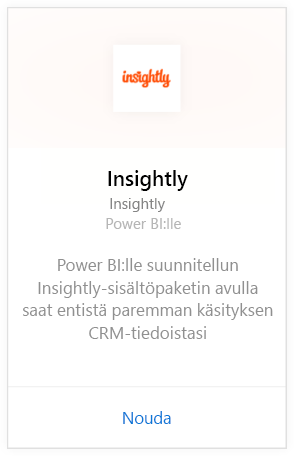
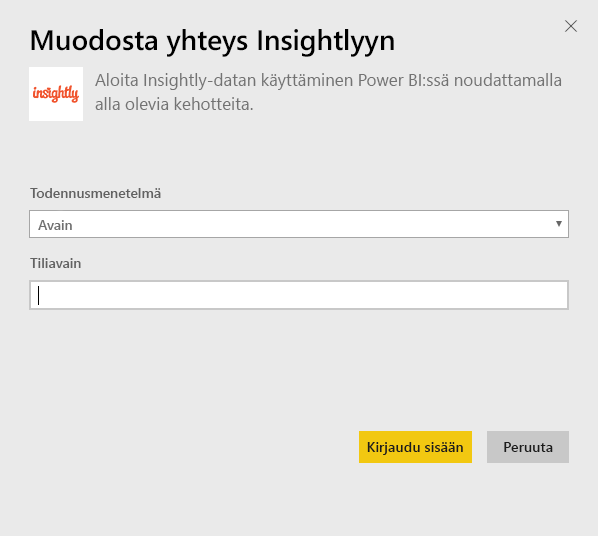
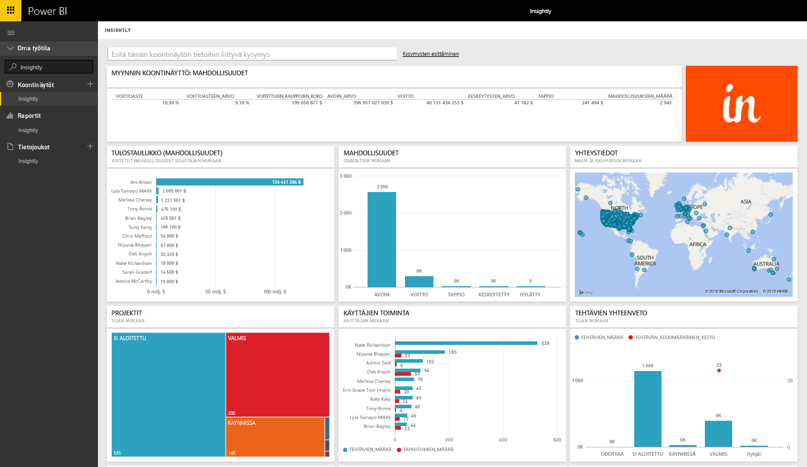
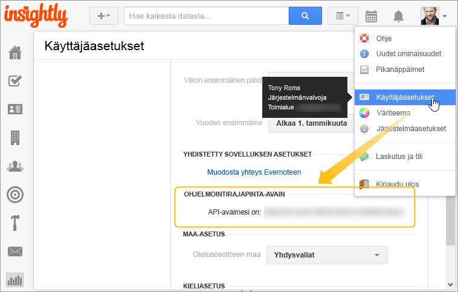

# Yhteyden muodostaminen Insightlyyn Power BI:llä
Visualisoi ja jaa Insightlyn CRM-tietoja Power BI:ssä Insightly-sisältöpaketin avulla. Yhdistä Power BI:hin käyttämällä Insightlyn ohjelmointirajapinnan avainta, jotta voit tarkastella ja luoda raportteja ja koontinäyttöjä CRM-tietojesi pohjalta. Power BI:llä voit analysoida tietoja uusilla tavoilla, luoda tehokkaita kaavioita ja näyttää kontaktit, liidit ja organisaatiot kartalla.

Muodosta yhteys [Insightly-sisältöpakettiin](https://app.powerbi.com/getdata/services/insightly) Power BI:tä varten.

## Yhteyden muodostaminen
1. Valitse vasemman siirtymisruudun alareunasta **Nouda tiedot**.
   
   
2. Valitse **Palvelut**-ruudussa **Nouda**.
   
   
3. Valitse **Insightly** \> **Nouda**.
   
   
4. Valitse todennusmenetelmäksi **Avain** ja anna Insightlyn ohjelmointirajapinta-avain. Valitse sitten **Kirjaudu sisään**. Lisätietoja [sen etsimisestä](#FindingParams) on alla.
   
   
5. Hyväksymisen jälkeen tuontiprosessi alkaa automaattisesti. Kun kaikki on valmista, uusi koontinäyttö, raportti ja malli näkyvät siirtymisruudussa. Voit tarkastella tuotuja tietoja valitsemalla koontinäytön.
   
     

**Mitä seuraavaksi?**

* Kokeile [kysymyksen esittämistä koontinäytön yläreunassa olevassa Q&A-ruudussa](power-bi-q-and-a.md)
* [Muuta koontinäytön ruutuja](service-dashboard-edit-tile.md).
* [Valitse jokin ruutu](service-dashboard-tiles.md), jolloin siihen liittyvä raportti avautuu.
* Tietojoukko on ajastettu päivittymään päivittäin, mutta voit muuttaa päivitysaikataulua tai kokeilla tietojoukon päivittämistä **Päivitä nyt** -toiminnolla haluamanasi ajankohtana.

## Paketin sisältö
Sisältöpaketti sisältää seuraavat taulukot ja seuraavien tietueiden kentät:

| Taulukot |  |  |  |
| --- | --- | --- | --- |
| Yhteystiedot |Mahdollisuudet |Jakson vaiheet |Tehtävän valmistumispäivä |
| Mukautetut kentät |Mahdollisuuden sulkemispäivä |Projektin valmistumispäivä |Tehtävät |
| Tapahtumat |Mahdollisuuden ennusteen päivämäärä |Projektit |Tiimit/jäsenet |
| Liidit |Organisaatiot |Tunnisteet |Käyttäjät |

Monet taulukot ja raportit sisältävät myös yksilöllisiä laskettuja kenttiä, kuten:  

* Taulukot, jotka on ryhmitelty mahdollisuuden ennusteen sulkupäivien, mahdollisuuden todellisten sulkupäivien, projektin valmistumispäivien ja tehtävän valmistumispäivien mukaan kuukauden, vuosineljänneksen tai vuoden analysointia varten.  
* Painotetun arvon kenttä mahdollisuuksille (mahdollisuuden arvo * voiton todennäköisyys).  
* Keskiarvo- ja kokonaiskesto-kentät tehtäville alkamis- ja valmistumispäivien perusteella.  
* Raportteja, jotka sisältävät laskettuja kenttiä mahdollisuuden voittoastetta (voitettujen määrä / mahdollisuuksien kokonaismäärä) ja voittoastearvoa (voitettujen määrä / mahdollisuuksien kokonaisarvo) varten.  

## Järjestelmävaatimukset
Insightly-tili, jossa on Insightlyn API-ohjelmointirajapinnan käyttöoikeus, vaaditaan. Näkyvyysoikeudet perustuvat ohjelmointirajapinnan avaimeen, jota käytettiin yhteyden muodostamisessa Power BI:hin. Sinulle näkyvät Insightly-tietueet näkyvät myös Power BI:n raporteissa ja koontinäytöissä, jotka jaat muiden kanssa.

## Parametrien etsiminen
**API-ohjelmointirajapinnan avain**

Voit kopioida ohjelmointirajapinta-avaimesi Insightlysta valitsemalla käyttäjäasetukset Insightlyn profiilivalikosta ja vierittämällä sitten alaspäin. Tätä merkkijonoa käytetään tietojesi yhdistämisessä Power BI:hin.

## Vianmääritys
Tiedot tuodaan Insightlyn API-ohjelmointirajapinnan kautta. Se sisältää päivittäisen rajoituksen Insightly-tilauksesi sopimustason mukaan. Rajat luetellaan API-ohjelmointirajapintaohjeiden kohdassa Rate Limiting/Throttling Requests: https://api.insight.ly/v2.2/Help#!/Overview/Introduction#ratelimit

Esitetyissä raporteissa käytetään Insightlyn oletusarvoisia kenttiä, eikä niissä saa olla omia mukautuksia. Voit tarkastella kaikkia käytettävissä olevia kenttiä muokkaamalla raporttia.

## Seuraavat vaiheet
[Aloita Power BI:n käyttö](service-get-started.md)

[Nouda tietoja Power BI:ssä](service-get-data.md)

