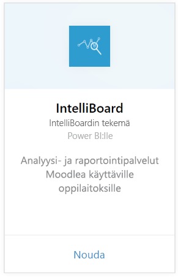
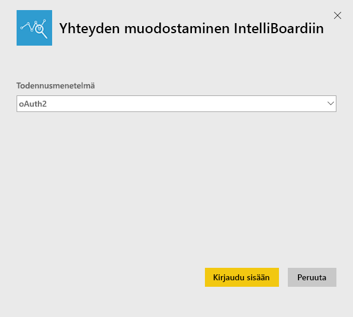
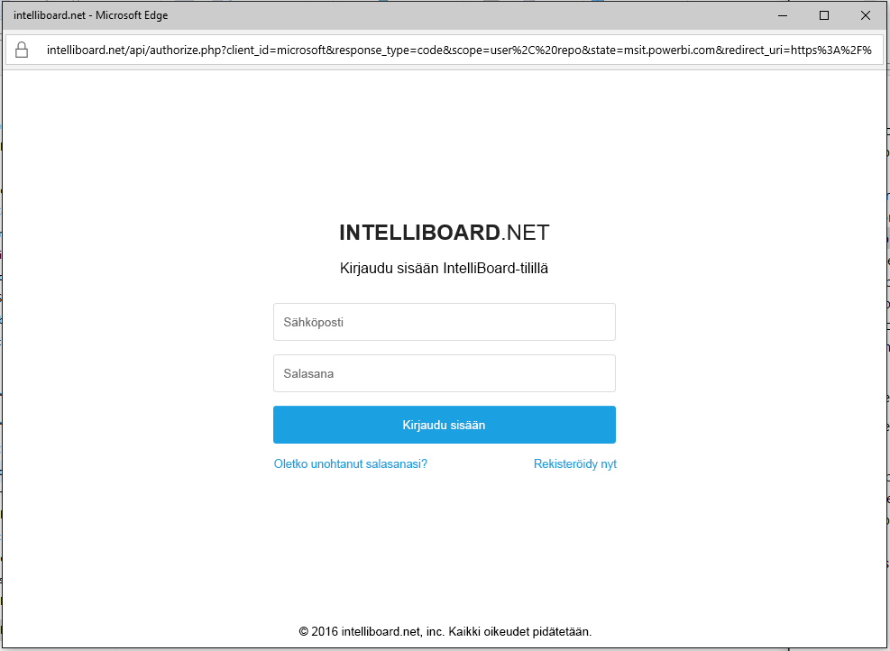
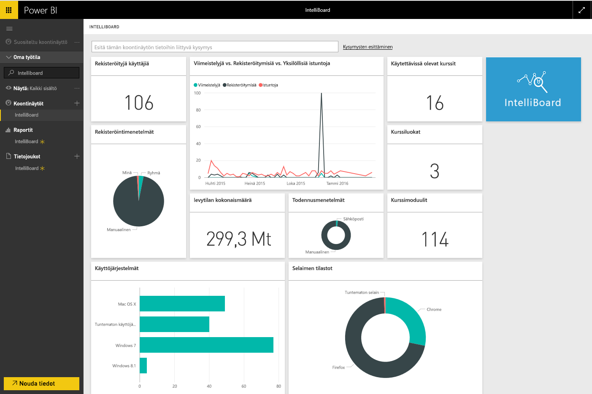

# Yhteyden muodostaminen IntelliBoardiin Power BI:llä
IntelliBoard tarjoaa yksinkertaistetun pääsyn oppimisen hallintajärjestelmäsi Moodlen tietoihin raportointipalveluiden avulla. IntelliBoard-sisältöpaketti Power BI:lle tarjoaa lisäanalytiikkaa, mukaan luettuina kursseja, rekisteröityjä käyttäjiä, yleistä suorituskykyä ja LMS:n toimintaa koskevia arvoja.

[!INCLUDE [include-short-name](./includes/service-deprecate-content-packs.md)]

Muodosta yhteys [IntelliBoard-sisältöpakettiin](https://app.powerbi.com/getdata/services/intelliboard) Power BI:lle.

## Yhteyden muodostaminen
1. Valitse vasemman siirtymisruudun alareunassa **Nouda tiedot**.  
   
    
2. Valitse **Palvelut**-ruudussa **Nouda**.  
   
    
3. Valitse **IntelliBoard** ja sitten **Nouda**.  
   
    
4. Valitse **OAuth 2** ja sitten **Kirjaudu sisään**. Anna pyydettäessä IntelliBoard-tunnistetietosi.
   
    
   
    
5. Kun yhteys on muodostettu, koontinäyttö, raportti ja tietojoukko ladataan automaattisesti. Tämän jälkeen ruudut päivitetään IntelliBoard-tilisi tiedoilla.
   
    

**Mitä seuraavaksi?**

* Kokeile [kysymyksen esittämistä raporttinäkymän yläreunassa olevassa Q&A-ruudussa](consumer/end-user-q-and-a.md).
* [Muuta koontinäytön ruutuja](service-dashboard-edit-tile.md).
* [Valitse jokin ruutu](consumer/end-user-tiles.md), jolloin siihen liittyvä raportti avautuu.
* Tietojoukko on ajastettu päivittymään päivittäin, mutta voit muuttaa päivitysaikataulua tai kokeilla tietojoukon päivittämistä **Päivitä nyt** -toiminnolla haluamanasi ajankohtana

## Paketin sisältö
Sisältöpaketti sisältää tietoja seuraavista taulukoista:  

    - Toimi  
    - Agentit  
    - Todennus  
    - Maat  
    - Kurssien edistyminen  
    - Rekisteröitymiset
    - Kieli  
    - Ympäristö  
    - Summat  
    - Käyttäjien edistyminen    

## Järjestelmävaatimukset
IntelliBoard-tili, jolla on edellä mainittujen taulukoiden käyttöoikeudet, on edellytys tämän sisältöpaketin alustamiselle.

## Seuraavat vaiheet
[Mikä on Power BI?](fundamentals/power-bi-overview.md)

[Power BI -palvelun peruskäsitteitä suunnittelijoille](service-basic-concepts.md)

