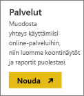
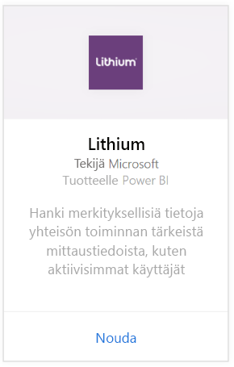
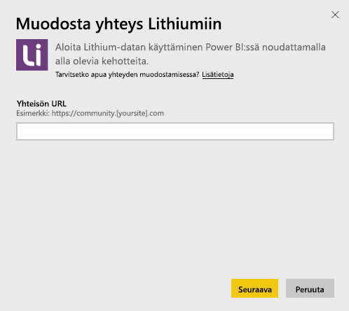
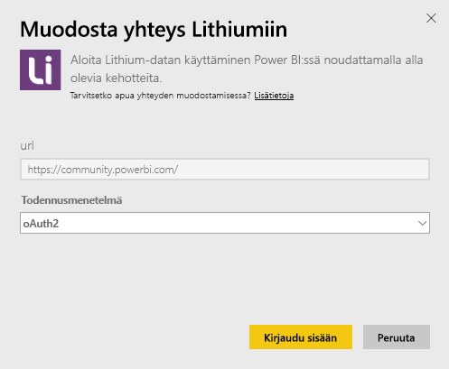
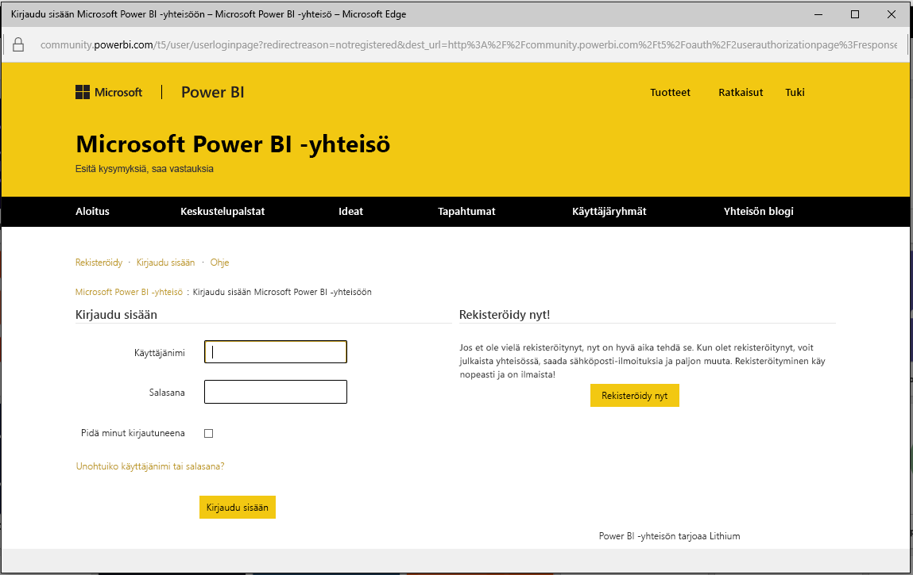
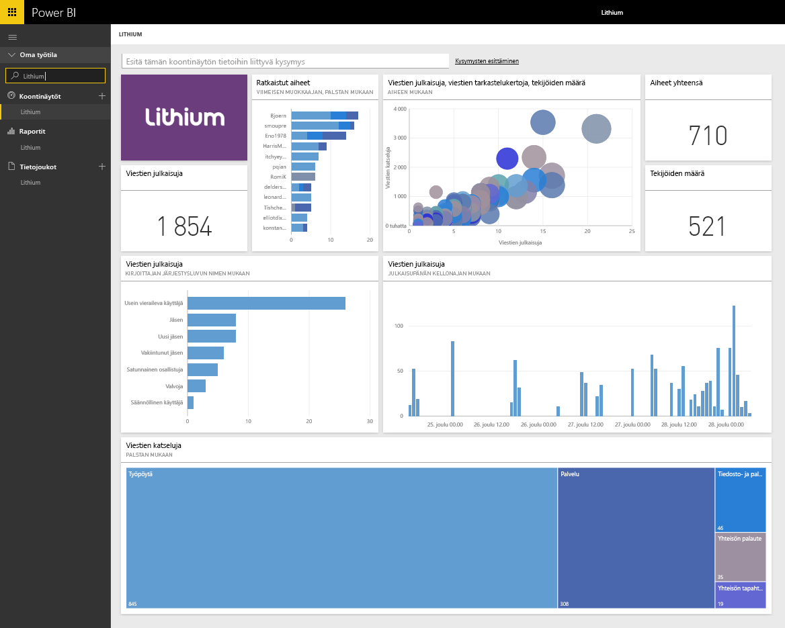

# Lithiumiin yhdistäminen Power BI:n avulla
Lithium rakentaa luotettuja suhteita maailman parhaiden tuotemerkkien ja niiden asiakkaiden välille auttaen ihmisiä saamaan vastauksia ja jakamaan kokemuksiaan. Yhdistämällä Lithium-sisältöpaketin Power BI:hin voit mitata tärkeitä tietoja verkkoyhteisöstäsi auttaen lisäämään myyntiä, pienentämään palvelukustannuksia ja lisäämään uskollisuutta. 

Yhdistä Power BI:n [Lithium-sisältöpakettiin](https://app.powerbi.com/getdata/services/lithium).

>[!NOTE]
>Power BI -sisältöpaketti käyttää Lithium-ohjelmointirajapintaa. Jos ohjelmointirajapintaan lähetetään liian paljon kutsuja, Lithiumin käytöstä saatetaan veloittaa lisämaksuja. Varmista asia Lithium-järjestelmänvalvojalta.

## Yhdistäminen
1. Valitse vasemman siirtymisruudun alareunassa **Hae tiedot**.
   
    
2. Valitse **Palvelut**-ruudusta **Nouda**.
   
    
3. Valitse **Lithium** \> **Nouda**.
   
   
4. Anna Lithium-yhteisön URL-osoite. Osoite on muodossa *https://community.yoursite.com*.
   
   
5. Anna pyydettäessä Lithium-tunnistetiedot. Valitse todennusmenetelmäksi **oAuth 2**, napsauta **Kirjaudu sisään** ja noudata Lithium-todentamisen vaiheita.
   
   
   
   
6. Kun kirjautuminen on valmis, tuonti alkaa. Kun tuonti on valmis, uusi koontinäyttö, raportti ja malli näkyvät siirtymisruudussa. Voit tarkastella tuotuja tietoja valitsemalla koontinäytön.
   
    

**Mitä seuraavaksi?**

* Kokeile [kysymyksen esittämistä koontinäytön yläreunassa olevassa Q&A-ruudussa](power-bi-q-and-a.md).
* [Muuta koontinäytön ruutuja](service-dashboard-edit-tile.md).
* [Valitse jokin ruutu](service-dashboard-tiles.md), jolloin siihen liittyvä raportti avautuu.
* Tietojoukko on ajastettu päivittymään päivittäin, mutta voit muuttaa päivitysaikataulua tai kokeilla tietojoukon päivittämistä **Päivitä nyt** -toiminnolla haluamanasi ajankohtana.

## Järjestelmävaatimukset
Lithium-sisältöpaketti edellyttää Lithium-yhteisön versiota 15.9 tai sitä uudempaa. Varmista asia Lithium-järjestelmänvalvojalta.

## Seuraavat vaiheet
[Power BI:n käytön aloittaminen](service-get-started.md)

[Power BI:n peruskäsitteet](service-basic-concepts.md)

