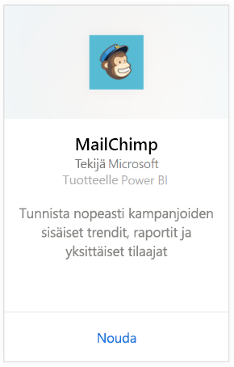
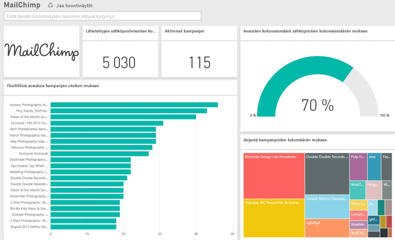

# MailChimpiin yhdistäminen Power BI:n avulla
Power BI -sisältöpaketti hakee tietoja MailChimp-tililtäsi ja luo koontinäytön, raportteja ja tietojoukon, joiden avulla voit tutkia tietojasi. Hae analytiikkatietoja, jotta voit luoda [MailChimp-koontinäyttöjä](https://powerbi.microsoft.com/integrations/mailchimp) ja tunnistaa kampanjoihin, raportteihin ja yksittäisiin tilaajiin liittyviä trendejä nopeasti. Tiedot on määritetty päivittymään päivittäin, niin että seuraamasi tiedot ovat varmasti ajan tasalla.

Yhdistä Power BI:n [MailChimp-sisältöpakettiin](https://app.powerbi.com/getdata/services/mailchimp).

## Yhteyden muodostaminen
1. Valitse vasemman siirtymisruudun alareunassa **Nouda tiedot**.
   
    
2. Valitse **Palvelut**-ruudussa **Nouda**.
   
   
3. Valitse **MailChimp** \> **Nouda**.
   
   
4. Valitse todennusmenetelmäksi **oAuth2** \> **Kirjaudu sisään**.
   
    Anna pyydettäessä MailChimpin tunnistetiedot ja noudata todennusprosessia.
   
    Kun yhdistät ensimmäisen kerran, sinua pyydetään sallimaan Power BI:lle vain luku -oikeudet tilillesi. Valitse **Salli** aloittaaksesi tuonnin, joka voi kestää muutamia minuutteja sen mukaan, kuinka paljon tililläsi on tietoja.
   
    
5. Kun Power BI on tuonut tiedot, näet vasemmassa siirtymisruudussa uuden koontinäytön, raportin ja tietojoukon. Tämä on oletuskoontinäyttö, jonka Power BI on luonut tietojen näyttämistä varten. Voit muokata tätä koontinäyttöä, jotta näet tiedot juuri haluamallasi tavalla.
   
   

**Mitä seuraavaksi?**

* Kokeile [kysymyksen esittämistä raporttinäkymän yläreunassa olevassa Q&A-ruudussa](power-bi-q-and-a.md).
* [Muuta koontinäytön ruutuja](service-dashboard-edit-tile.md).
* [Valitse jokin ruutu](service-dashboard-tiles.md), jolloin siihen liittyvä raportti avautuu.
* Tietojoukko on ajastettu päivittymään päivittäin, mutta voit muuttaa päivitysaikataulua tai kokeilla tietojoukon päivittämistä **Päivitä nyt** -toiminnolla haluamanasi ajankohtana

## Seuraavat vaiheet
[Power BI:n käytön aloittaminen](service-get-started.md)

[Power BI:n peruskäsitteet](service-basic-concepts.md)

