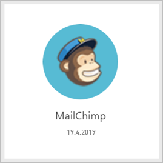
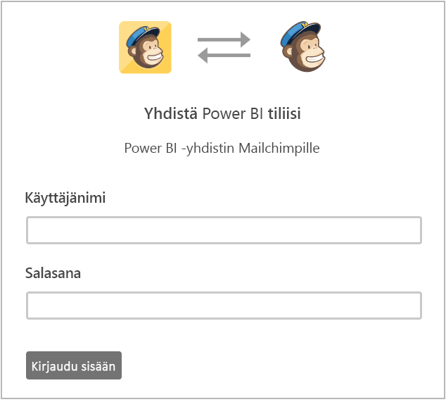
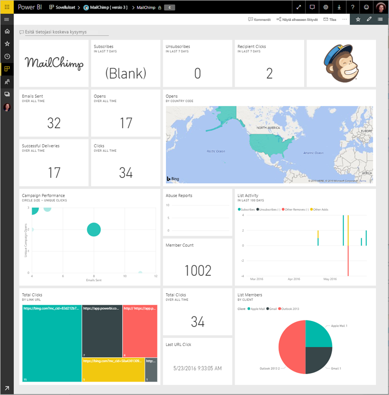
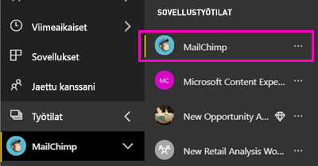
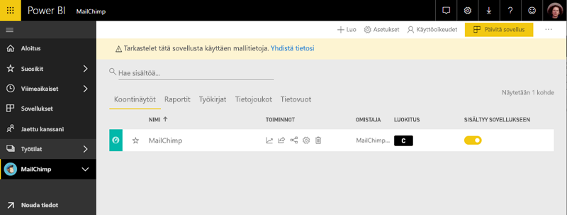

# MailChimpiin yhdistäminen Power BI:n avulla
Tässä artikkelissa opastetaan vetämällä Power BI-mallin sovelluksen MailChimp-tilisi tiedot. Malli, sovellus muodostaa työtilan koontinäytön, joukon raportteja ja tietojoukon, joiden avulla voit tarkastella MailChimp-tietojen kanssa. Hae analytiikkatietoja, jotta voit luoda [MailChimp-koontinäyttöjä](https://powerbi.microsoft.com/integrations/mailchimp) ja tunnistaa kampanjoihin, raportteihin ja yksittäisiin tilaajiin liittyviä trendejä nopeasti. Tiedot päivitetään päivittäin, varmistaa varmasti tiedot ovat ajan tasalla.

Kun olet asentanut sovelluksen mallin, voit muuttaa koontinäyttöä ja raporttia. Sitten voit jakaa sen sovelluksena työtovereiden organisaatiossasi.

Muodosta yhteys [MailChimp mallin sovelluksen](https://app.powerbi.com/getdata/services/mailchimp) Power BI.

## Yhteyden muodostaminen

[!INCLUDE [powerbi-service-apps-get-more-apps](./includes/powerbi-service-apps-get-more-apps.md)]

3. Valitse **MailChimp** \> **hanki se nyt**.
4. - **Asentaa Power BI-sovelluksesta?** Valitse **asentaa**.
4. - **Sovelluksia** ruudussa **MailChimp** ruudun.

    

6. - **Uuden sovelluksen käytön aloittaminen**, valitse **yhdistää tiedot**.

    

1. Valitse todennusmenetelmäksi **oAuth2**\>**Kirjaudu sisään**.
   
    Anna pyydettäessä MailChimpin tunnistetiedot ja noudata todennusprosessia.
   
    Ensimmäisen kerran, kun muodostat yhteyden, Power BI kysyy, haluatko sallia vain luku -käyttöoikeudet tiliisi. Aloita tuontiprosessi valitsemalla **Salli**. Voi kestää muutaman minuutin kuluttua tilisi riippuen.
   
    

5. Kun Power BI on tuonut tiedot, MailChimp-koontinäyttö avautuu.
   
    

## Muokata ja jakaa sovelluksen

Olet asentanut sovelluksen MailChimp-malli. Tämä tarkoittaa myös luomaasi MailChimp-sovelluksen työtilassa. Työtilassa voit muuttaa raportin ja koontinäytön ja jakaa sen *sovelluksen* työtovereiden organisaatiossasi. 

1. Tarkastele uusia MailChimp-työtilan sisällön vasemmassa siirtymispalkissa valitsemalla **työtilat** > **MailChimp**. 

    

    Tämä näkymä on työtilan sisältöluettelosta. Näet oikeassa yläkulmassa, **Päivitä sovellus**. Kun olet valmis jakamaan sovelluksesi työtovereillesi, joka on jossa aloitat.

    

2. Valitse **raporttien** ja **tietojoukkoja** Nähdäksesi työtilan muut elementit. 

    Lue [jakaminen sovellusten](service-create-distribute-apps.md) työtovereillesi.

## Seuraavat vaiheet

* [Luo uusi työtilat Power BI](service-create-the-new-workspaces.md)
* [Asenna ja käytä sovelluksia Power BI:ssä](consumer/end-user-apps.md)
* [Power BI -sovellukset ulkoisille palveluille](service-connect-to-services.md)
* Ilmenikö kysyttävää? [Voit esittää kysymyksiä Power BI -yhteisössä](http://community.powerbi.com/)

