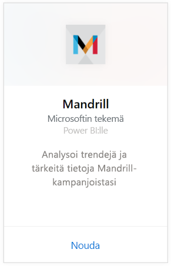
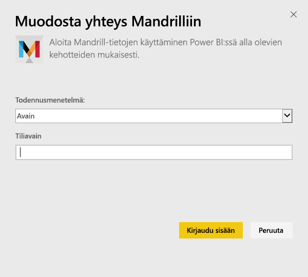
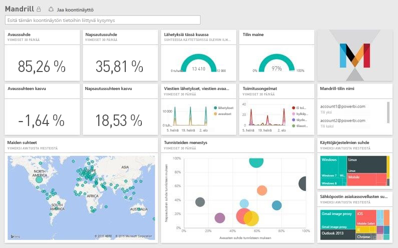

# Yhteyden muodostaminen Mandrilliin Power BI:llä
Power BI -sisältöpaketti hakee tietoja Mandrill-tililtäsi ja luo koontinäytön, joukon raportteja ja tietojoukon, joiden avulla voit tarkastella tietojasi. Mandrillin analytiikan avulla saat nopeasti merkityksellisiä tietoja uutiskirjeestäsi tai markkinointikampanjastasi. Tiedot on määritetty päivittymään päivittäin, niin että seuraamasi tiedot ovat varmasti ajan tasalla.

Muodosta yhteys [Mandrill-sisältöpakettiin Power BI:lle.](http://app.powerbi.com/getdata/services/mandrill)

## Yhteyden muodostaminen
1. Valitse vasemman siirtymisruudun alareunassa **Nouda tiedot**.
   
    
2. Valitse **Palvelut**-ruudussa **Nouda**.
   
    
3. Valitse **Mandrill** > **Nouda**.
   
    
4. Valitse kohtaan **Todennusmenetelmä** **Avain** ja anna ohjelmointirajapinnan avaimesi. Löydät avaimen Mandrill-koontinäytön **Asetukset**-välilehdeltä. Valitse **Kirjaudu sisään** aloittaaksesi tuonnin, joka voi kestää muutamia minuutteja sen mukaan, kuinka paljon tililläsi on tietoja.
   
    
5. Kun Power BI on tuonut tiedot, näet vasemmassa siirtymisruudussa uuden koontinäytön, raportin ja tietojoukon. Tämä on oletuskoontinäyttö, jonka Power BI on luonut tietojesi näyttämistä varten.
   
    

**Mitä seuraavaksi?**

* Kokeile [kysymyksen esittämistä raporttinäkymän yläreunassa olevassa Q&A-ruudussa](power-bi-q-and-a.md).
* [Muuta koontinäytön ruutuja](service-dashboard-edit-tile.md).
* [Valitse jokin ruutu](service-dashboard-tiles.md), jolloin siihen liittyvä raportti avautuu.
* Tietojoukko on ajastettu päivittymään päivittäin, mutta voit muuttaa päivitysaikataulua tai kokeilla tietojoukon päivittämistä **Päivitä nyt** -toiminnolla haluamanasi ajankohtana

## Seuraavat vaiheet
[Mikä on Power BI?](power-bi-overview.md)

[Power BI:n peruskäsitteet](service-basic-concepts.md)

