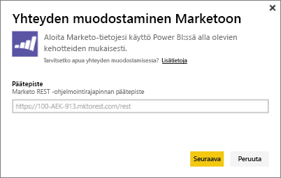
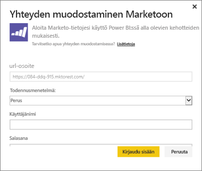
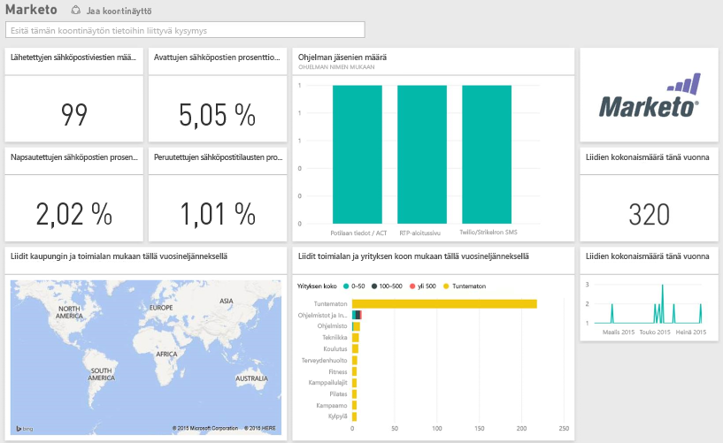

# Yhteyden muodostaminen Marketoon Power BI:llä
Power BI -sisältöpaketti Marketolle mahdollistaa merkityksellisten tietojen saamisen Marketo-tilistäsi liideihin ja niiden toimintaan liittyvillä tiedoilla. Tämän yhteyden luominen noutaa tietosi ja tarjoaa automaattisesti koontinäytön ja asiaankuuluvat raportit kyseisten tietojen perusteella.

Muodosta yhteys [Marketo-sisältöpakettiin](https://app.powerbi.com/getdata/services/marketo) Power BI:lle.

## Yhteyden muodostaminen
1. Valitse vasemman siirtymisruudun alareunassa **Nouda tiedot**.
   
   
2. Valitse **Palvelut**-ruudussa **Nouda**.
   
    
3. Valitse **Marketo** \> **Nouda**.
   
   
4. Anna Marketon tai Marketo-järjestelmänvalvojasi toimittama Marketo REST -päätepiste ja valitse Seuraava.
   
   
   
   Lue lisää Marketo REST -päätepisteestä: [http://developers.marketo.com/documentation/rest/endpoint-url/ ](http://developers.marketo.com/documentation/rest/endpoint-url/).
5. Anna todentamismenetelmää **Perus** käyttämällä asiakastunnus, johon kuuluvat **käyttäjänimi** ja asiakassalaisuus eli **salasana**. Asiakkaan tunnus ja asiakassalaisuus ovat käytettävissä Marketossa tai marketo-järjestelmänvalvojaltasi ([http://developers.marketo.com/documentation/rest/custom-service/](http://developers.marketo.com/documentation/rest/custom-service/)). 
   
   
   
   Näin *Marketo Power BI:lle* -sisältöpaketti pääsee käyttämään [Marketo-analytiikan](https://powerbi.microsoft.com/integrations/marketo) tietoja, ja voit analysoida tietoja Power BI:ssä. Tiedot päivitetään kerran päivässä.
6. Kun yhteys Marketo-tiliisi on muodostettu, ladataan koontinäyttö, jossa ovat kaikki tietosi:
   
   

**Mitä seuraavaksi?**

* Kokeile [kysymyksen esittämistä raporttinäkymän yläreunassa olevassa Q&A-ruudussa](consumer/end-user-q-and-a.md).
* [Muuta koontinäytön ruutuja](service-dashboard-edit-tile.md).
* [Valitse jokin ruutu](consumer/end-user-tiles.md), jolloin siihen liittyvä raportti avautuu.
* Tietojoukko on ajastettu päivittymään päivittäin, mutta voit muuttaa päivitysaikataulua tai kokeilla tietojoukon päivittämistä **Päivitä nyt** -toiminnolla haluamanasi ajankohtana

## Paketin sisältö
Seuraavat tiedot ovat saatavilla Marketosta Power BI:ssä, jos toiminto on tapahtunut tästä päivästä katsoen vuoden sisällä:

| Taulukon nimi | Kuvaus |
| --- | --- |
| EmailActivities |Liideille tai yhteystiedoille lähetettyjä sähköposteja koskevat tiedot, mukaan luettuina tiedot seuraavista: laitteet, luokat, toimittamattomien viestien määrä ja prosenttiosuus, napsautettujen viestien määrä ja prosenttiosuus, avattujen viestien määrä ja prosenttiosuus sekä ohjelman nimi. Power BI:ssä näytettävä sähköpostiaktiviteetit on absoluuttinen sähköpostien toimitettavuutta koskeva raportti, se ei sovella tietoihin mitään muuta logiikkaa. Tämän vuoksi jotkut tulokset voivat olla erilaisia Marketo-asiakkaan ja Power BI:n välillä. |
| ProgramActivites |Tietoa ohjelmista, joiden tilassa on tapahtunut muutos. Tähän sisältyvät tiedot, kuten syy, onnistumiset, ohjelman hankinnan määrä ja prosenttiosuus sekä ohjelman onnistumisten määrä ja prosenttiosuus. |
| WebPageActivities |Tiedot käyttäjän vierailuista verkkosivuilla, mukaan luettuina hakuagentti, käyttäjäagentti, verkkosivu ja kellonaika. |
| Datetable |Tämän päivän ja kuluneen vuoden päivämäärät.  Tämän avulla voit analysoida Marketo-tietoja päivämäärän mukaan. |
| Liidit |Liidin tiedot, kuten yritys, tuoton koko, työntekijöiden määrä, maa, ala, liidin pistemäärä ja liidin tila. Liidit noudetaan sen mukaan, miten ne esiintyvät sähköposti-, ohjelma- ja verkkosivutoimintoja koskevissa tiedoissa. |

Kaikki päivämäärät ovat UTC-muodossa. Päivämäärät voivat vaihdella sen mukaan, millä aikavyöhykkeellä tilisi on (vastaavasti kuin Marketo-asiakkaan yhteydessä)

## Järjestelmävaatimukset
* Marketo-tilillä, jota käytät yhteyden muodostamiseen, on oltava liidien ja toimintojen käyttöoikeudet.
* Riittävästi API-kutsuja saatavilla tietoihin yhdistämiseksi.  Marketolla on ohjelmointirajapinta kullekin tilille.  Kun raja on saavutettu, et voi ladata tietoja Power BI:hin. 

**Ohjelmointirajapintojen rajoitusta koskevat tiedot**

Tietojen tuominen Marketosta käyttää Marketo-ohjelmointirajapintoja. Jokaisella Marketon asiakkaalla on yhteensä enintään 10 000 päivittäisen API-kutsun rajoitus; kutsut jaetaan kaikkien Marketo-ohjelmointirajapintoja käyttävien sovellusten välillä. Voit käyttää ohjelmointirajapintoja muita integrointeja sekä Power BI -integrointia varten. Lisätietoa ohjelmointirajapinnoista on kohteessa: <http://developers.marketo.com/documentation/rest/>.

Niiden API-kutsujen määrä, joita Power BI tekee Marketoon, riippuu Marketo-tilisi tietojen määrästä. Power BI tuo kaikki liidit ja toiminnot viime vuodelta. Tässä on esimerkki Marketosta peräisin olevista tiedoista sekä niiden API-kutsujen määrästä, joita Power BI käyttää tuonnin yhteydessä:  

| Tietotyyppi | Rivien määrä | API-kutsut |
| --- | --- | --- |
| Liidien tiedot |15 000 |50 |
| Sähköpostitoiminnot |150 000 |1 000 |
| Ohjelman toiminnot |15 000 |100 |
| Verkkotoiminnot |150 000 |1 000 |
| Ohjelman muutokset |7 500 |50 |
| **API-kutsuja yhteensä** | |**2 200** |

## Seuraavat vaiheet
[Mikä on Power BI?](power-bi-overview.md)

[Tietojen noutaminen Power BI:hin](service-get-data.md)

[Power BI -blogi: seuraa ja analysoi Marketo-tietojasi Power BI:llä](http://blogs.msdn.com/b/powerbi/archive/2015/03/19/monitor-and-analyze-your-marketo-data-with-power-bi.aspx)

