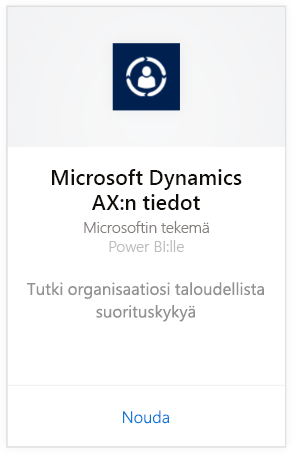
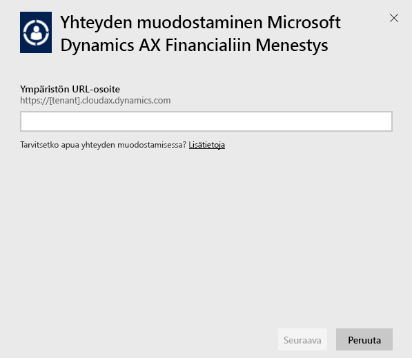
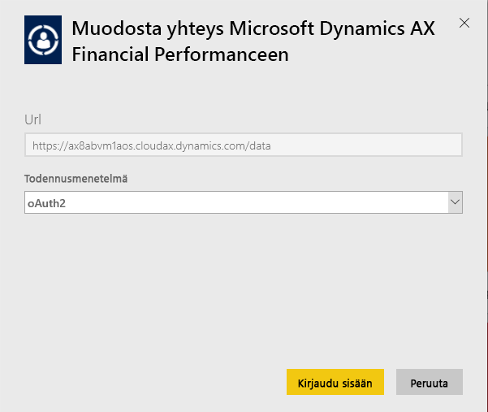
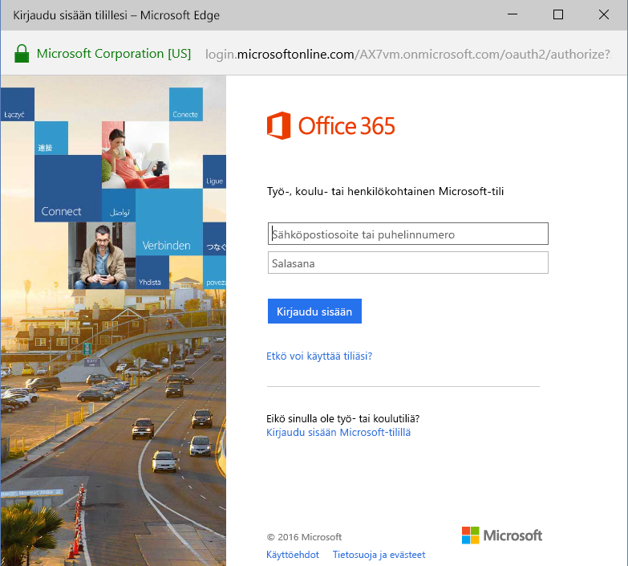
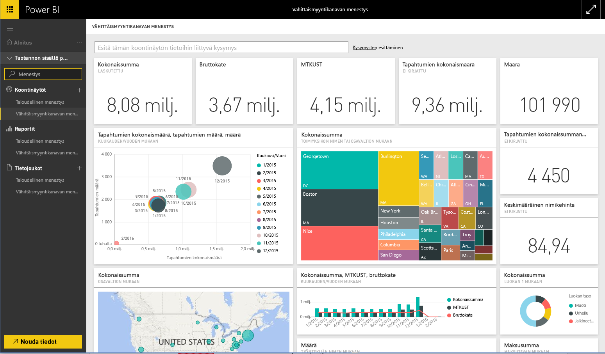

# Yhteyden muodostaminen Microsoft Dynamics AX -sisältöpakettiin Power BI:n avulla
Microsoft Dynamics AX sisältää kolme Power BI -sisältöpakettia, jotka on suunnattu eri yrityskäyttäjille. Erityisesti talousjohtajille suunniteltu Taloudellinen menestys -sisältöpaketti tarjoaa pääsyn organisaatiosi taloudellista suorituskykyä koskeviin merkityksellisiin tietoihin. Vähittäismyyntikanavan menestys -sisältöpaketti on suunnattu kanavajohtajille, ja se keskittyy myynnin suorituskykyyn trendien ennustamiseksi ja merkityksellisten tietojen tunnistamiseksi hyödyntämällä suoraan vähittäismyyntiä ja kauppaa koskevia tietoja. Kustannustenhallinta on suunniteltu operatiivisille johtajille ja talousjohtajille, ja se tarjoaa tietoja toiminnan suorituskyvystä.

[!INCLUDE [include-short-name](./includes/service-deprecate-content-packs.md)]

Muodosta yhteys Microsoft Dynamics AX:n [Vähittäismyyntikanavan menestys](https://app.powerbi.com/getdata/services/dynamics-ax-retail-channel-performance)-, [Taloudellinen menestys](https://app.powerbi.com/getdata/services/dynamics-ax-financial-performance)- tai [Kustannustenhallinta](https://app.powerbi.com/getdata/services/dynamics-ax-cost-management) -sisältöpakettiin Power BI:lle.

## Yhteyden muodostaminen
1. Valitse vasemman siirtymisruudun alareunassa **Nouda tiedot**.
   
   
2. Valitse **Palvelut**-ruudussa **Nouda**.
   
   
3. Valitse jokin Dynamics AX -sisältöpaketeista ja valitse **Nouda**.
   
   
4. Määritä Dynamics AX 7 -ympäristön URL-osoite. Lisätietoja [näiden parametrien löytämisestä](#FindingParams) on alla.
   
   
5. Valitse **todennusmenetelmäksi** **oAuth2** \> **Kirjaudu sisään**. Kirjoita Dynamics AX -tunnistetietosi pyydettäessä.
   
    
   
    
6. Hyväksymisen jälkeen tuontiprosessi alkaa automaattisesti. Kun kaikki on valmista, uusi raporttinäkymä, raportti ja malli näkyvät siirtymisruudussa. Voit tarkastella tuotuja tietoja valitsemalla raporttinäkymän.
   
     

**Mitä seuraavaksi?**

* Kokeile [kysymyksen esittämistä raporttinäkymän yläreunassa olevassa Q&A-ruudussa](consumer/end-user-q-and-a.md).
* [Muuta koontinäytön ruutuja](service-dashboard-edit-tile.md).
* [Valitse jokin ruutu](consumer/end-user-tiles.md), jolloin siihen liittyvä raportti avautuu.
* Tietojoukko on ajastettu päivittymään päivittäin, mutta voit muuttaa päivitysaikataulua tai kokeilla tietojoukon päivittämistä **Päivitä nyt** -toiminnolla haluamanasi ajankohtana

## Paketin sisältö
Sisältöpaketti käyttää Dynamics AX 7 OData -syötettä vähittäismyyntikanavan menestykseen, taloudelliseen menestykseen ja kustannustenhallintaan liittyvien tietojen tuomiseen.

## Järjestelmävaatimukset
Tämä sisältöpaketti edellyttää Dynamics AX 7 -ympäristön URL-osoitetta ja käyttäjällä on oltava OData-syötteen käyttöoikeus.

## Parametrien löytäminen

Dynamics AX 7 -ympäristön URL-osoite näkyy selaimessa, kun käyttäjä kirjautuu sisään. Kopioi vain Dynamics AX -pääympäristön URL-osoite Power BI -valintaikkunaan.

## Vianmääritys
Tietojen lataaminen voi kestää jonkin aikaa esiintymän koosta riippuen. Jos näet Power BI:ssä tyhjiä raportteja, vahvista, että sinulla raporttien edellyttämien OData-taulukoiden käyttöoikeus.

## Seuraavat vaiheet
[Power BI:n käytön aloittaminen](service-get-started.md)

[Tietojen noutaminen Power BI:ssä](service-get-data.md)

