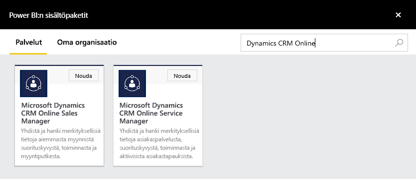
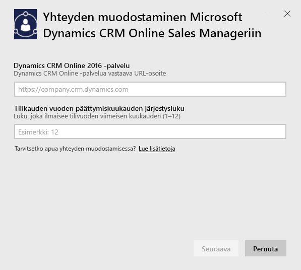
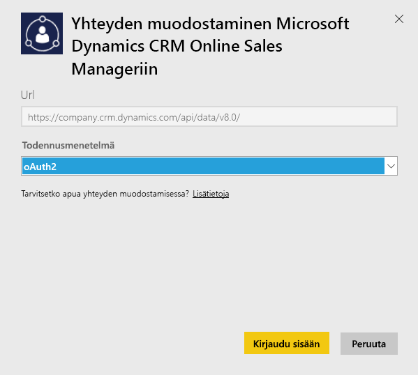

# Yhteyden muodostaminen Microsoft Dynamics CRM:ään Power BI:n avulla
Power BI:lle kehitetyn Microsoft Dynamics CRM Onlinen avulla voit helposti käyttää ja analysoida tietojasi. Power BI luo OData-syötteen perusteella kuvaavan mallin, joka sisältää kaikki tarvittavat entiteetit ja mittaustiedot, kuten tilit, toiminnan, mahdollisuudet, tuotteen, liidit, käyttäjät ja muuta. Kun olet asentanut sovelluksen, voit tarkastella raporttinäkymää ja raportteja Power BI -palvelussa ([https://powerbi.com](https://powerbi.com)) ja Power BI -mobiilisovelluksissa. 

Yhteyden muodostaminen Dynamics CRM Online [Sales Manageriin](https://msit.powerbi.com/groups/me/getdata/services/dynamics-crm-sales-manager) tai [Service Manageriin](https://msit.powerbi.com/groups/me/getdata/services/dynamics-crm-customer-service). Lue lisää Power BI:n [Dynamics CRM Online -integroinnista](https://powerbi.microsoft.com/integrations/microsoft-dynamicscrm).

Tämä yhteys vaatii **Microsoft Dynamics CRM Online 2016 -version tai sitä uudemman version**. Lisätietoja [vaatimuksista](#Requirements) on alla.

## Yhteyden muodostaminen
[!INCLUDE [powerbi-service-apps-get-more-apps](./includes/powerbi-service-apps-get-more-apps.md)]

1. Valitse **Microsoft Dynamics CRM Sales Manager** tai **Microsoft Dynamics CRM Service Manager** ja valitse **Yhdistä**.
   
   
2. Anna tiliisi liitetty palvelun URL-osoite.  Tämä löytyy lomakkeesta `https://company.crm.dynamics.com`; katso lisätiedot [alta](#FindingParams).
   
   
3. Anna tunnistetietosi, kun niitä pyydetään (tämän vaiheen voi ohittaa, jos olet jo kirjautunut sisään selaimellasi). Kirjoita todentamismenetelmäksi **oAuth2** ja valitse **Kirjaudu sisään**:
   
   
4. Kun yhteys on muodostettu, myyntipäällikölle tai palvelupäällikölle mukautetun raporttinäkymän, johon on lisätty omia tietojasi:
   
   

## Microsoft Dynamics CRM -raporttinäkymän ja raporttien tarkastelu
[!INCLUDE [powerbi-service-apps-open-app](./includes/powerbi-service-apps-open-app.md)]

[!INCLUDE [powerbi-service-apps-open-app](./includes/powerbi-service-apps-what-now.md)]

## Paketin sisältö
Seuraavissa osioissa on [Myyntipäällikön](#Sales) ja [Palvelupäällikön](#Service) persoonille sisällytetyt tiedot.

Huomaa, että Dynamics CRM Onlinen käyttäjälle määritetty käyttöoikeusrooli rajoittaa näytettäviä tietoja.

Raporttinäkymä ja raportit on suunniteltu antamaan toiminnallisia raportteja lyhyen aikavälin tiedoista, joiden painopiste on työryhmässä tai ryhmässä. Yksittäisellä kyselyllä voi noutaa enintään 100 000 tietuetta Dynamics CRM Onlinesta. Jos tämä raja ylittyy organisaation tietojen suuren määrän vuoksi, valmistelu epäonnistuu, kun tietojen päivittäminen lopetetaan Dynamics CRM Onlinessa. Jos tilisi on liian suuri, harkitse Power BI Desktopiin yhdistämistä mukautetun ratkaisun kautta.

### Myyntipäällikkö
Raporttinäkymä ja raportit sisältävät tärkeitä mittareita, kuten:  

* Voitettu tuotto   
* Voittoaste   
* Avoin tuotto   
* Menetetty tuotto   
* Ennustettu tuotto  
* Keskimääräinen kaupan koko ja muita tietoja.  

Ne sisältävät myös tärkeitä kaavioita, kuten:  

* Voittojen ja tappioiden trendit, voitettu tuotto vs. tuoton arvioitu trendi  
* Voitettu tuotto eri dimensioiden, kuten alan, piirin ja alueen mukaan   
* Myynnin johtajat tuoton, toimintojen,   
* parhaiden tilien, suurinten voitettujen/hävittyjen sopimusten,    
* uusien liidien trendien, myyntiputkien ja monen muun mittarin mukaan.   

Nämä mittarit ja kaaviot auttavat ymmärtämään myyntiorganisaation suorituskykyä ja analysoimaan koko myyntiryhmän myyntiputkea.

Seuraavassa taulukossa on lueteltu tässä palvelussa käytettävät CRM-entiteetit. Lisäksi se antaa tietoja kunkin entiteetin tietueisiin käytetyistä suodattimista.

| CRM-entiteetti | Käytetyt suodattimet |
| --- | --- |
| Tili |Kaikki tilit, joilla on toisiinsa liittyviä mahdollisuuksia, joita on muutettu viimeisen 365 päivän aikana. |
| Toiminta |Kaikki toiminnat, joita on muokattu viimeisen 90 päivän aikana   [modifiedon] > tänään - 90 päivää |
| Liiketoimintayksikkö |Kaikki liiketoimintayksiköt, joita ei ole poistettu käytöstä   [isdisabled] = false |
| Liidi |Kaikki liidit, joita on muokattu viimeisen 180 päivän aikana   [modifiedon] > tänään - 180 päivää |
| Mahdollisuus |Kaikki mahdollisuudet, joita on muokattu viimeisen 365 päivän aikana   [modifiedon] > tänään - 365 päivää |
| Mahdollisuuden tuote |Kaikki mahdollisuuksien tuotteet, joita on muokattu viimeisen 365 päivän aikana   [modifiedon] > tänään - 365 päivää |
| Tuote |Kaikki aktiiviset tuotteet   [statecode] <> 1 |
| Alue |Kaikki alueet |
| Käyttäjä |Kaikki aktiiviset käyttäjät, jotka eivät ole delegoituja järjestelmänvalvojia    [isdisabled] = false ja [accessmode] <> 4 |

### Palvelupäällikkö
Raporttinäkymä ja raportit sisältävät tärkeitä mittareita, kuten:  

* CSAT-prosenttiosuus   
* SLA Met -prosenttiosuus   
* Eskaloitujen tapausten prosenttiosuus   
* Keskimääräinen käsittelyaika   
* Ratkaistut palvelupyynnöt yhteensä  
* Aktiiviset palvelupyynnöt yhteensä  
* Knowledge Base -artikkelien käyttökerrat tapauksissa ja paljon muuta.    

Ne sisältävät myös tärkeitä kaavioita, kuten:   

* Saapuvia, ratkaisuja ja eskaloituja palvelupyyntöjä koskevat trendit   
* Palvelupyynnöt eri dimensioiden mukaan, kuten alkuperä, sijainti, prioriteetti, tyyppi  
* Johtajat CSAT-prosenttiosuuden, SLA Met -prosenttiosuuden, toiminnan ja ratkaistujen tapauksien mukaan  
* Yleisimmin käytetyt ja yleisimmin tarkastellut Knowledge Base -artikkelit ja paljon muuta.  
    Nämä mittarit ja kaaviot auttavat ymmärtämään tukiorganisaation suorituskykyä ja analysoimaan aktiivisten palvelupyyntöjen palvelutiimiin ja palvelunjonoihin aiheuttamaa kuormitusta.

Seuraavassa taulukossa on lueteltu tässä palvelussa käytettävät CRM-entiteetit. Lisäksi se antaa tietoja kunkin entiteetin tietueisiin käytetyistä suodattimista.

| CRM-entiteetti | Käytetyt suodattimet |
| --- | --- |
| Tili |Kaikki tilit, joilla on toisiinsa liittyviä palvelupyyntöjä, joita on muutettu viimeisen 90 päivän aikana. |
| Toiminta |Kaikki toiminnat, joita on muokattu viimeisen 90 päivän aikana   [modifiedon] > tänään - 90 päivää |
| Palvelupyyntö |Kaikki tapaukset, joita on muokattu viimeisen 90 päivän aikana   [modifiedon] > tänään - 90 päivää |
| Palvelupyynnön toiminta |Kaikki palvelupyyntöjen ratkaisu toiminnat, joita on muokattu viimeisen 90 päivän aikana   [modifiedon] > tänään - 90 päivää |
| Yhteyshenkilö |Kaikki yhteyshenkilöt, joilla on toisiinsa liittyviä palvelupyyntöjä, joita on muutettu viimeisen 90 päivän aikana. |
| Tietoartikkeli |Kaikki tietoartikkeleiden uusimmat versiot    [islatestversion] = true |
| Tietoartikkelin tapaus |Kaikki tietoartikkelien tapaukset, joita on muokattu viimeisten 90 päivän aikana   [modifiedon] > tänään - 90 päivää |
| Jono |Kaikki aktiiviset jonot    [statecode] = 0 |
| Jonokohde |Kaikki palvelupyyntöön liittyvät jonokohteet, jotka on luotu viimeisen 365 päivän aikana    [createdon] > tänään - 365 päivää ja   [objecttypecode] = 112 |
| Käyttäjä |Kaikki aktiiviset käyttäjät    [isdisabled] = false |

## Järjestelmävaatimukset
* Kelvollinen Dynamics CRM Online 2016 tai uudempi esiintymä (Power BI ei toimi paikallisen CRM-version kanssa). Jos sinulla ei ole 2016-versiota tai sitä uudempaa:
* Järjestelmänvalvojan on otettava käyttöön OData-päätepiste sivuston asetuksissa.
* Tili, jonka missä tahansa taulukossa on alle 100 000 tietuetta. Huomaa, että tietueiden tuonti epäonnistuu, jos tilillä on yli 100 000 tietuetta.

## Parametrien löytäminen
Esiintymän osoite löytyy selaimen URL-palkista. Se on yleensä seuraavaa muotoa: `https://[instance_name].crm.dynamics.com`.

Power BI tukee vain Dynamics CRM 2016 -päätepisteitä. Yhteys ei toimi CRM Onlinen aiempien versioiden kanssa. Power BI Desktopin avulla voit muodostaa suoraan yhteyden tiliisi.

## Vianmääritys
Jos sinulla on ongelmia yhteyden muodostamisessa, tarkista, että  

* olet antanut oikean esiintymän URL-osoitteen (tarkista järjestelmänvalvojalta)  
* esiintymä on CRM Online 2016  
* OData-päätepiste on otettu käyttöön  

Yritä muodostaa yhteys suoraan Power BI Desktopissa OData-URL-osoitteella `https://[instance_name].crm.dynamics.com/api/data/v8.0/`.

Jos käytössäsi on Dynamics CRM Online 2016, mutta sinulla on yhä yhteysongelmia, pyydä CRM-järjestelmänvalvojaa vahvistamaan, että kaikki saatavilla olevat päivitykset on asennettu.

Jos sinulla ei ole CRM Online 2016:ta tai sitä uudempaa versiota, et voi muodostaa yhteyttä tiliisi Power BI Desktopilla.

Jos saat virheilmoituksen ”Tietojen päivittäminen epäonnistui, koska kysely on ylittänyt sallitun 100 000 tietueen enimmäismäärän”, yritä muodostaa yhteys suoraan Power BI Desktopista tai käytä CRM-ratkaisumallia.

## Seuraavat vaiheet
* [Mitä ovat Power BI:n sovellukset?](service-install-use-apps.md)
* [Tietojen noutaminen Power BI:ssä](service-get-data.md)
* Onko sinulla muuta kysyttävää? [Voit esittää kysymyksiä Power BI -yhteisössä](http://community.powerbi.com/)

