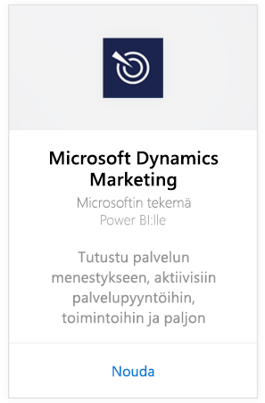
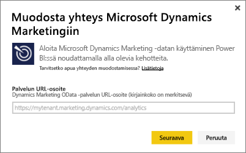
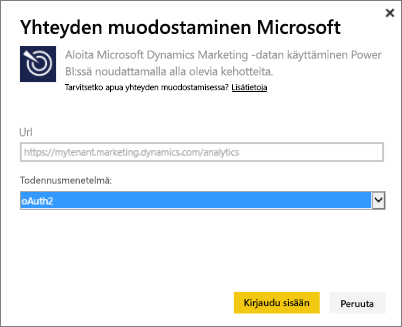
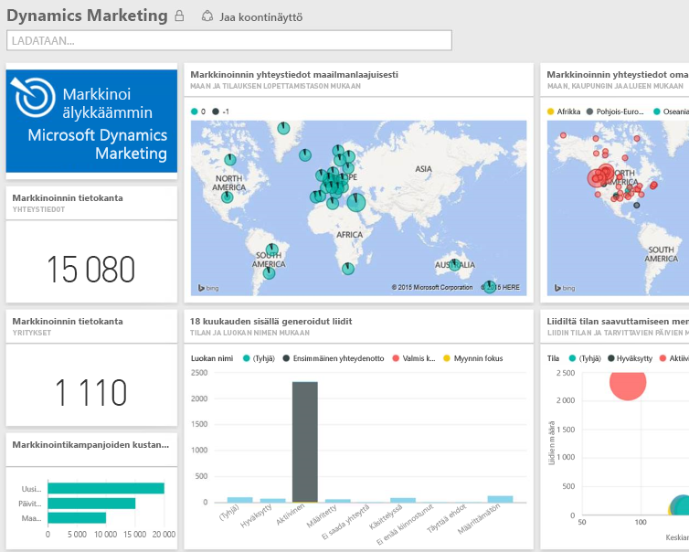

# Yhteyden muodostaminen Microsoft Dynamics Marketingiin Power BI:n avulla
Microsoft Dynamics Marketingin Power BI -sisältöpaketin avulla voit helposti käyttää ja analysoida tietojasi Dynamics Marketingista. Sisältöpaketti hyödyntää OData-syötteen päällä kuvaavaa mallia, joka sisältää kaikki kohteet ja mittarit, kuten ohjelmat, kampanjat, markkinoinnin yhteyshenkilöt ja yritykset, liidit, liidien vuorovaikutukset ja liidien pisteyttämisen, sähköpostimarkkinoinnin viestit ja verkkosivustot, havainnot käyttäytymisestä, budjetit, kirjanpitotapahtumat, suorituskykyilmaisimet jne. 

Muodosta yhteys Power BI:lle tarkoitettuun [Dynamics Marketing -sisältöpakettiin](https://app.powerbi.com/getdata/services/microsoft-dynamics-marketing).

>[!NOTE]
>Sinun on määritettävä kelvollinen OData-URL-osoite Dynamics Marketingin esiintymää varten (sisältöpaketti ei toimi paikallisen CRM-version kanssa). Lisävaatimukset ovat alla.

## Yhteyden muodostaminen
1. Valitse vasemman siirtymisruudun alareunassa Nouda tiedot.
   
    
2. Valitse **Palvelut**-ruudussa **Nouda**.
   
    
3. Valitse **Microsoft Dynamics Marketing** \> **Nouda**.
   
   
4. Anna tiliisi liitetty OData-URL-osoite.  Sen muoto on ”`https://[instance\_name].marketing.dynamics.com/analytics.`”
   
   
5. Anna tunnistetietosi, kun niitä pyydetään (tämän vaiheen voi ohittaa, jos olet jo kirjautunut sisään selaimellasi). Kirjoita todentamismenetelmäksi **oAuth2** ja valitse **Kirjaudu sisään**:
   
   
6. Kun yhteys on muodostettu, näet Dynamics Marketingin koontinäytön, joka on päivitetty tiedoillasi. Keltaiset tähtikertomerkit vasemmassa siirtymisruudussa osoittavat uudet kohteet.
   
   

**Mitä seuraavaksi?**

* Kokeile [kysymyksen esittämistä raporttinäkymän yläreunassa olevassa Q&A-ruudussa](consumer/end-user-q-and-a.md).
* [Muuta koontinäytön ruutuja](service-dashboard-edit-tile.md).
* [Valitse jokin ruutu](consumer/end-user-tiles.md), jolloin siihen liittyvä raportti avautuu.
* Tietojoukko on ajastettu päivittymään päivittäin, mutta voit muuttaa päivitysaikataulua tai kokeilla tietojoukon päivittämistä **Päivitä nyt** -toiminnolla haluamanasi ajankohtana

## Järjestelmävaatimukset
* Sinun on määritettävä kelvollinen OData-URL-osoite Dynamics Marketingin esiintymää varten (sisältöpaketti ei toimi paikallisen CRM-version kanssa).  
* Järjestelmänvalvojan on otettava käyttöön OData-päätepiste sivuston asetuksissa. OData-päätepisteen osoite löytyy siirtymällä **Organisaation tietopalvelu** -osaan ja valitsemalla **Aloitus \> Asetukset \> Sivuston asetukset**.  OData-URL-osoitteen muoto on: https:// [esiintymä\_nimi].marketing.dynamics.com/analytics  
* Käyttäjätilin/käyttäjätietojen, joilla käytät Microsoft Dynamics Marketingia, on oltava samat kuin joilla olet rekisteröitynyt Power BI:n käyttäjäksi. Kun kirjaudut sisään Microsoft Dynamics Marketingiin, sinut kirjataan sisään automaattisesti samoilla käyttäjätiedoilla kuin Power BI:ssä. Jos haluat kirjautua sisään Microsoft Dynamics Marketingiin toisella tilillä, rekisteröidy Power BI:n käyttäjäksi tällä kyseisellä tilillä. Toivomme voivamme ratkaista tämän ongelman tulevassa julkaisuversiossa.   

## Vianmääritys
Jos saat Kirjautuminen epäonnistui -ilmoituksen, kun yrität muodostaa yhteyttä Dynamics CRM -tiliisi, varmista että olet kirjautumassa sisään Power BI:hin samalla tilillä, jolla käytät CRM Online OData -syötettä. Kokeile kirjautua syötteeseen myös selaimellasi.

Pyydä järjestelmänvalvojaasi vahvistamaan, että OData-URL-osoite on oikein ja että OData-päätepiste on käytössä.

Tarkista käyttämäsi Dynamics Marketing -versio. Versioihin 18.0 ja 18.1 tehtiin lisäkorjauksia, joten jos edelleen havaitset ongelmia ja käytät vanhempaa versiota, harkitse päivittämistä uudempaan.

Jos ongelmat jatkuvat, ota yhteyttä Power BI:n tiimiin tekemällä tukipalvelupyyntö:

* Valitse Power BI -sovelluksessa kysymysmerkki \> **Ota yhteyttä tukeen**.
* Valitse Power BI:n tukisivustossa (jossa luet tämän artikkelin) sivun oikealla puolella **Ota yhteyttä tukeen**.

## Seuraavat vaiheet
[Tietojen noutaminen Power BI:hin](service-get-data.md)

[Mikä on Power BI?](power-bi-overview.md)

