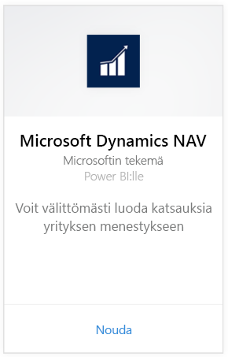
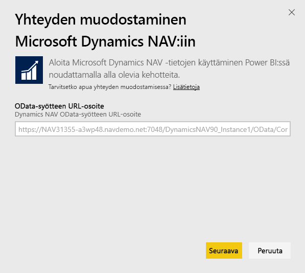
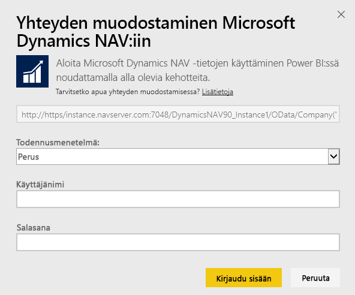
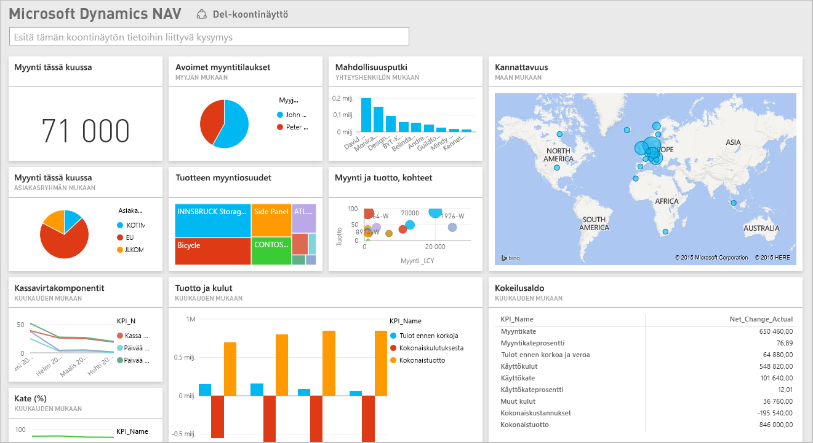

# Yhteyden muodostaminen Microsoft Dynamics NAViin Power BI:n avulla
Merkityksellisten tietojen saaminen Microsoft Dynamics NAV-tietoihin on helppoa Power BI:n avulla. Power BI noutaa sekä Myynti- että Rahoitus-tiedot ja luo niiden pohjalta sovelluksen raporttinäkymin ja raportein. Power BI edellyttää oikeuksia taulukoihin, joista tiedot on noudettu, tässä tapauksessa myynti- ja rahoitustiedot. Lisätietoja vaatimuksista on alla. Kun olet asentanut sovelluksen, voit tarkastella raporttinäkymää ja raportteja Power BI -palvelussa ([https://powerbi.com](https://powerbi.com)) ja Power BI -mobiilisovelluksissa. 

[Yhteyden muodostaminen Microsoft Dynamics NAV for Power BI:n kanssa](https://app.powerbi.com/getdata/services/microsoft-dynamics-nav) tai Lue lisää [Dynamics NAV-integroinnista](https://powerbi.microsoft.com/integrations/microsoft-dynamics-nav) Power BI:n avulla.

## Yhteyden muodostaminen
[!INCLUDE [powerbi-service-apps-get-more-apps](./includes/powerbi-service-apps-get-more-apps.md)]

1. Valitse **Microsoft Dynamics NAV** ja valitse sitten **Hae**.  
   
2. Kirjoita pyydettäessä Microsoft Dynamics NAV OData URL. URL:n pitää vastata seuraavaa kuvaa:
   
    `https//instance.navserver.com:7048/DynamicsNAV90_Instance1/OData/Company('CRONUS%20International%20Ltd.')`
   
   * "instance.navserver.com" jossa oma NAV-palvelimen nimi
   * ”DynamicsNAV90\_Instance1” NAV-palvelimen esiintymän nimi
   * "Company('CRONUS%20International%20Ltd.')" ja NAV-yritysnimesi
     
     Helppo tapa hankkia tarvittava URL-osoite on siirtyä Dynamics NAVin verkkopalveluihin, etsiä sieltä powerbifinance-verkkopalvelu ja kopioida Odata-URL-osoite, mutta jättää pois ”/powerbifinance...”  
     
3. Valitse **Perus** ja anna Microsoft Dynamics NAV-tunnuksesi.
   
    Tarvitset järjestelmänvalvojan tunnistetiedot (tai ainakin käyttöoikeudet myynti- ja talous-tietoihin) Microsoft Dynamics NAV-tilillesi.  Vain perustodennusta (käyttäjänimi ja salasana) tuetaan tällä hetkellä.
   
    
4. Power BI noutaa Microsoft Dynamics NAV -tietosi ja luo käyttövalmiin raporttinäkymän ja raportin puolestasi.   
   

## Tarkastele raporttinäkymä ja raportit
[!INCLUDE [powerbi-service-apps-open-app](./includes/powerbi-service-apps-open-app.md)]

[!INCLUDE [powerbi-service-apps-open-app](./includes/powerbi-service-apps-what-now.md)]

## Paketin sisältö
Raporttinäkymä ja raportit sisältävät tietoja seuraavista taulukoista (kirjainkoko on merkitsevä):  

* ItemSalesAndProfit  
* ItemSalesByCustomer  
* powerbifinance  
* SalesDashboard  
* SalesOpportunities  
* SalesOrdersBySalesPerson  
* TopCustomerOverview  

## Järjestelmävaatimukset
Jotta voit tuoda Microsoft Dynamics NAV -tietoja Power BI:hin, sinulla on oltava käyttöoikeudet myynti- ja taloustietojen taulukoihin, joista tiedot noudetaan (lueteltu yllä). Taulukoiden pitää myös sisältää joitakin tietoja, tyhjät taulukot aiheuttavat tällä hetkellä tuonnin epäonnistumisen.

## Vianmääritys
Power BI käyttää Microsoft Dynamics NAV-verkkopalveluita tietojen hakemiseen. Jos sinulla on paljon tietoja Microsoft Dynamics NAV-esiintymässä, voit pienentää verkkopalvelun käytön vaikutusta muuttamalla päivitystaajuutta tarpeidesi mukaan. Toinen vaihtoehto on, että yksi järjestelmänvalvoja luo sovelluksen ja jakaa sen toisille sen sijaan, että jokainen järjestelmänvalvoja luo omansa.

**"Parametrien vahvistaminen epäonnistui. Varmista, että kaikki parametrit ovat kelvollisia."**  
Jos näet tämän virheen Microsoft Dynamics NAV URL-osoitteen kirjoittamisen jälkeen. Varmista, että seuraavat edellytykset täyttyvät:

* URL-osoite vastaa juuri tätä mallia:
  
    `https//instance.navserver.com:7048/DynamicsNAV90_Instance1/OData/Company('CRONUS%20International%20Ltd.')`
  
  * "instance.navserver.com" jossa oma NAV-palvelimen nimi
  * ”DynamicsNAV90\_Instance1” NAV-palvelimen esiintymän nimi
  * "Company('CRONUS%20International%20Ltd.')" ja NAV-yritysnimesi
* Varmista, että kaikki kirjaimet ovat pieniä.  
* Varmista, että URL-osoitteen alku on https.  
* Varmista, että URL-osoitteen lopussa ei ole vinoviivaa.

**”Kirjautuminen epäonnistui”**  
Jos näyttöön tulee ”kirjautuminen epäonnistui”, kun olet kirjautunut sisään Microsoft Dynamics NAV -tunnistetietojen avulla, jonkin seuraavista syistä on mahdollinen:

* Käyttämälläsi tilillä ei ole oikeuksia noutaa Microsoft Dynamics NAV -tietoja tililtäsi. Varmista, ettei kyseessä ole järjestelmänvalvojatili ja yritä uudelleen.
* Dynamics NAV-esiintymällä, johon yrität muodostaa yhteyttä, ei ole kelvollista SSL-varmennetta. Tässä tapauksessa näkyviin tulee tarkempi virhesanoma (jonka mukaan luotettua SSL-suhdetta ei voi muodostaa). Huomaa, että itse allekirjoitettuja varmenteita ei tueta.

**Oho!**  
Jos näet ”Oho!”-virheikkunan, kun olet jo ohittanut todennusvalintaikkunan, Power BI on kohdannut ongelman ladattaessa tietoja.

* Tarkista, että URL-osoite noudattaa yllä määritettyä muotoa. Yleinen virhe on määritys:
  
    `https//instance.navserver.com:7048/DynamicsNAV90\_Instance1/OData`
  
    Siinä on kuitenkin oltava 'Company('CRONUS%20International%20Ltd.')' -osio, jossa on NAV-yritysnimesi:
  
    `https//instance.navserver.com:7048/DynamicsNAV90\_Instance1/OData/Company('CRONUS%20International%20Ltd.')`

## Seuraavat vaiheet
* [Mitä ovat Power BI:n sovellukset?](service-install-use-apps.md)
* [Tietojen noutaminen Power BI:ssä](service-get-data.md)
* Onko sinulla muuta kysyttävää? [Voit esittää kysymyksiä Power BI -yhteisössä](http://community.powerbi.com/)

