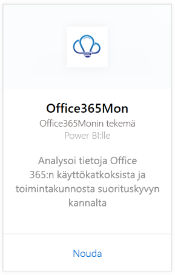
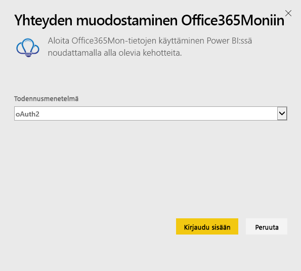
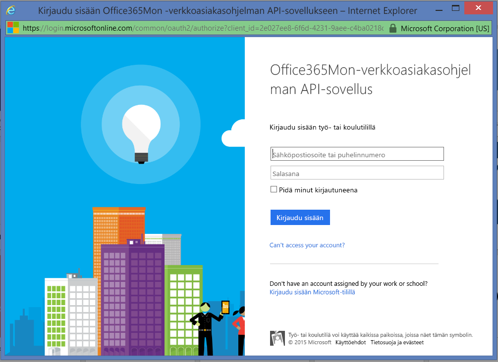
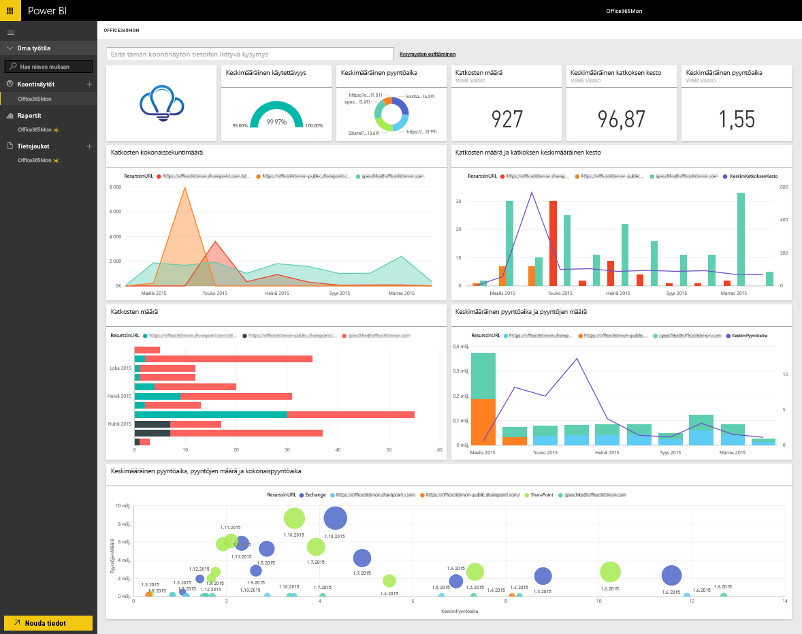

# Yhteyden muodostaminen Office365Moniin Power BI:n avulla
Office 365:n käyttökatkosten ja kunnon suorituskyvyn tietojen analysoiminen on helppoa Power BI:n ja Office365Mon-sisältöpaketin avulla. Power BI noutaa tiedot myös käyttökatkoksista ja kunnosta ja luo niiden pohjalta valmiin koontinäytön ja raportit.

Muodosta yhteys [Office365Mon-sisältöpakettiin](https://app.powerbi.com/groups/me/getdata/services/office365mon) Power BI:lle.

>[!NOTE]
>Office365Mon-järjestelmänvalvojatiliä tarvitaan yhteyden muodostamiseen Power BI-sisältöpakettiin ja lataamiseen.

## Yhteyden muodostaminen
1. Valitse vasemman siirtymisruudun alareunassa **Nouda tiedot**.
   
   
2. Valitse **Palvelut**-ruudussa **Nouda**.
   
    
3. Valitse **Office365Mon** \> **Nouda**.
   
   
4. Valitse todennusmenetelmäksi **oAuth2**\>**Kirjaudu sisään**.
   
   Anna pyydettäessä Office365Monin tunnistetiedot ja noudata todennusprosessia.
   
   
   
   
5. Kun Power BI on tuonut tiedot, näet vasemmassa siirtymisruudussa uuden koontinäytön, raportin ja tietojoukon. Uudet kohteet on merkitty keltaisella tähdellä \*, valitse Office365Mon-merkintä.
   
   

**Mitä seuraavaksi?**

* Kokeile [kysymyksen esittämistä raporttinäkymän yläreunassa olevassa Q&A-ruudussa](consumer/end-user-q-and-a.md).
* [Muuta koontinäytön ruutuja](service-dashboard-edit-tile.md).
* [Valitse jokin ruutu](consumer/end-user-tiles.md), jolloin siihen liittyvä raportti avautuu.
* Tietojoukko on ajastettu päivittymään päivittäin, mutta voit muuttaa päivitysaikataulua tai kokeilla tietojoukon päivittämistä **Päivitä nyt** -toiminnolla haluamanasi ajankohtana

## Vianmääritys
Jos saat  **”kirjautuminen epäonnistui”**-virheilmoituksen, kun olet käyttänyt Office365Mon-tilauksen tunnistetietojasi kirjautumiseen, käyttämälläsi tilillä ei ole oikeutta hakea Office365Mon-tietoja tililtäsi. Varmista, että kyseessä on järjestelmänvalvojatili ja yritä uudelleen.

## Seuraavat vaiheet
[Mikä on Power BI?](power-bi-overview.md)

[Tietojen noutaminen Power BI:hin](service-get-data.md)

