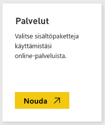
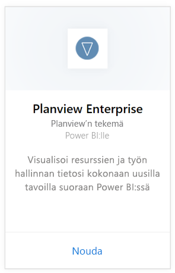
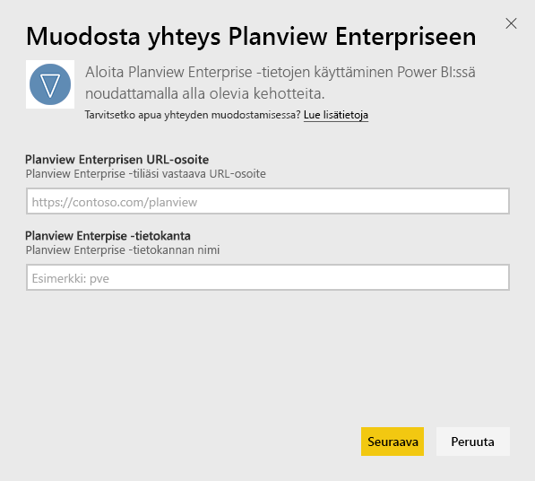
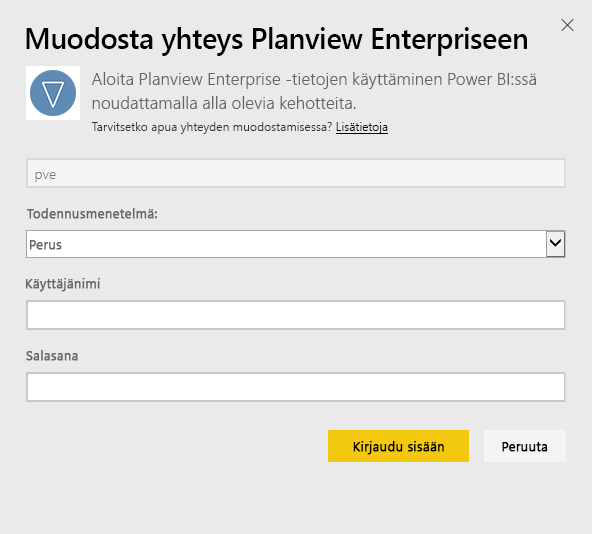
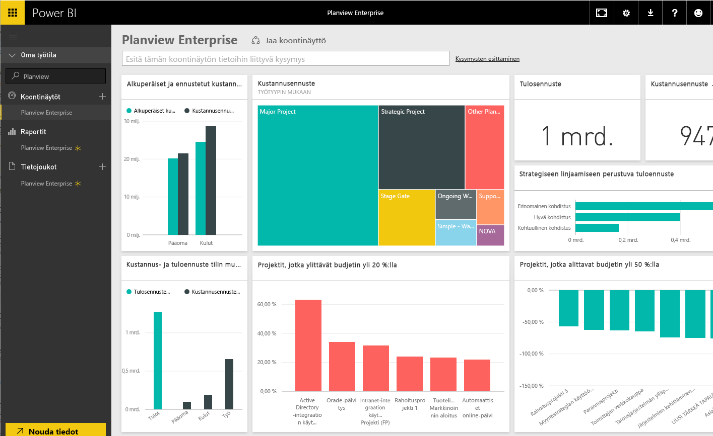

# Yhteyden muodostaminen Planview Enterpriseen Power BI:llä
Planview Enterprise -sisältöpaketin avulla voit visualisoida resurssien ja työn hallinnan tietoja kokonaan uudella tavalla suoraan Power BI:ssä. Käytä Planview Enterprise-tunnistetietojasi, niin näet vuorovaikutteisesti portfolio-sijoituksesi kulutuksen sekä budjetin ylitykset ja alitukset. Näin saat tietää, kuinka hyvin projektisi kohdistuvat yrityksen strategisiin prioriteetteihin. Voit myös laajentaa valmista raporttinäkymää ja raportteja, jotta saat sinulle tärkeimmät merkitykselliset tiedot.

Yhteyden muodostaminen [Planview Enterprise -sisältöpakettiin Power BI:ssä](https://app.powerbi.com/getdata/services/planview-enterprise)

>[!NOTE]
>Tuodaksesi Planview Enterprise -tietosi Power BI:hin sinun on oltava Planview Enterprise -käyttäjä, jonka roolissa on käytössä Reporting Portal Viewer -ominaisuus. Lisävaatimukset ovat alla.

## Yhteyden muodostaminen
1. Valitse vasemman siirtymisruudun alareunassa **Nouda tiedot**.
   
    
2. Valitse **Palvelut**-ruudussa **Nouda**.
   
    
3. Valitse Power BI -sivulla **Planview Enterprise** ja valitse sitten **Nouda**:  
    
4. Kirjoita Planview Enterprise URL -tekstikenttään sen Planview Enterprise -palvelimen URL-osoite, jota haluat käyttää. Kirjoita Planview Enterprise -tietokannan nimi Planview Enterprise Database -kenttään ja valitse sitten Seuraava.  
    
5. Valitse Todennusmenetelmä-luettelosta **Perus**, jos se ei jo ole valittuna. Kirjoita tilisi **Käyttäjänimi** ja **Salasana** ja valitse **Kirjaudu sisään**.  
   
6. Valitse vasemmanpuoleisessa ruudussa Planview Enterprise raporttinäkymien luettelosta.  
     Power BI tuo Planview Enterprise -tiedot raporttinäkymään. Huomaa, että tietojen lataamiseen voi kulua jonkin aikaa.  
    

**Mitä seuraavaksi?**

* Kokeile [kysymyksen esittämistä raporttinäkymän yläreunassa olevassa Q&A-ruudussa](power-bi-q-and-a.md).
* [Muuta raporttinäkymän ruutuja](service-dashboard-edit-tile.md).
* [Valitse jokin ruutu](service-dashboard-tiles.md), jolloin siihen liittyvä raportti avautuu.
* Tietojoukko on ajastettu päivittymään päivittäin, mutta voit muuttaa päivitysaikataulua tai kokeilla tietojoukon päivittämistä **Päivitä nyt** -toiminnolla haluamanasi ajankohtana.

## Järjestelmävaatimukset
Tuodaksesi Planview Enterprise -tietosi Power BI:hin sinun on oltava Planview Enterprise -käyttäjä, jonka roolissa on käytössä Reporting Portal Viewer -ominaisuus. Lisävaatimukset ovat alla.

Tässä prosessissa oletetaan, että olet jo kirjautunut sisään Microsoft Power BI -aloitussivulla käyttäen Power BI -tiliä. Jos sinulla ei ole Power BI -tiliä, luo uusi maksuton Power BI -tili Power BI -aloitussivulla. Valitse sitten Nouda tiedot.

## Seuraavat vaiheet:

[Power BI:n käytön aloittaminen](service-get-started.md)

[Tietojen noutaminen Power BI:hin](service-get-data.md)