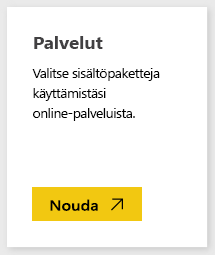
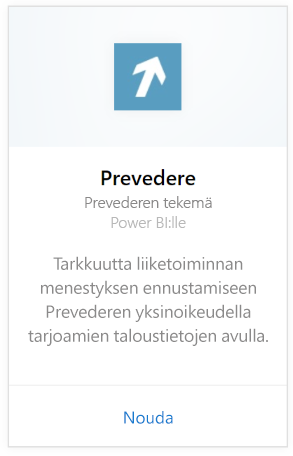
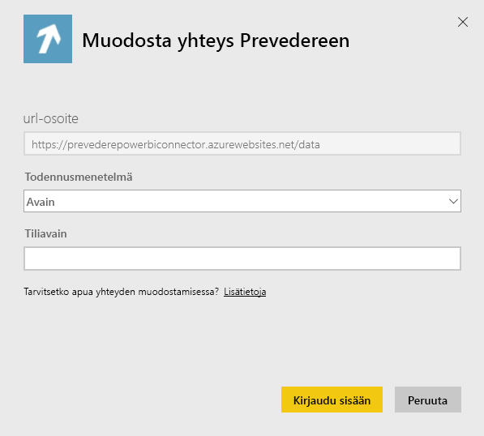
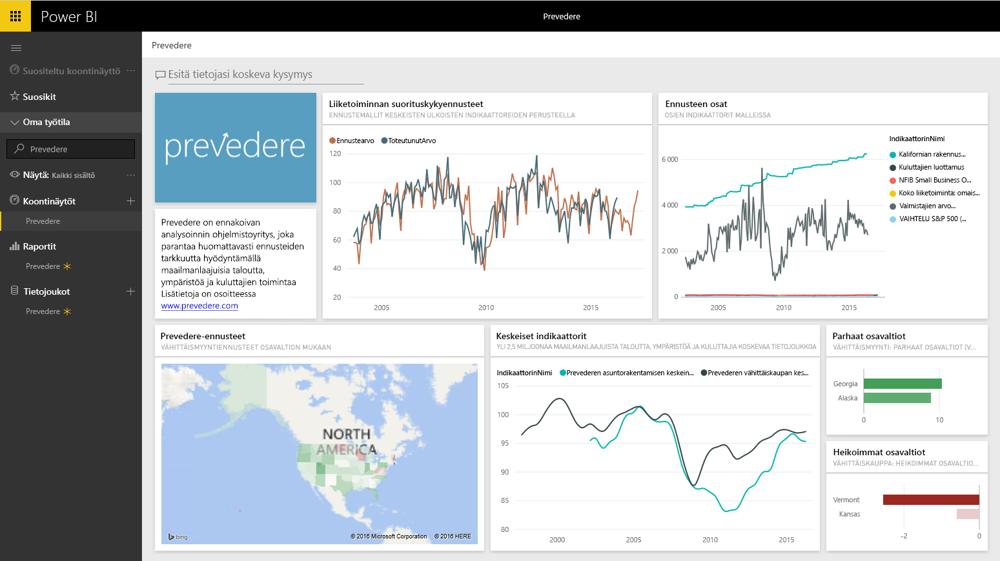

# Yhteyden muodostaminen Prevedereen Power BI:llä
Pääset käyttämään yksinoikeudella tarjottavia ja tärkeitä taloustietoja liiketoimintasi kehittämiseksi varmasti ja ennakoivasti.

Muodosta yhteys [Prevedere-sisältöpakettiin](https://app.powerbi.com/getdata/services/prevedere) Power BI:lle.

>[!NOTE]
>Jos et ole nykyinen Prevedere-käyttäjä, voit kokeilla sitä käyttämällä [malliavainta](https://prevederepowerbiconnector.azurewebsites.net/static/learnmore.html).

## Yhteyden muodostaminen
1. Valitse vasemman siirtymisruudun alareunassa **Nouda tiedot**.
   
   
2. Valitse **Palvelut**-ruudussa **Nouda**.
   
   
3. Valitse **Prevedere** ja sitten **Nouda**.
   
   
4. Valitse kohtaan **Todennusmenetelmä** **Avain** ja anna Prevedere-ohjelmointirajapinnan avaimesi.
   
    
5. Aloita tuontiprosessi valitsemalla **Kirjaudu sisään**. Kun kaikki on valmista, uusi koontinäyttö, raportti ja malli tulevat näkyviin siirtymisruutuun. Voit tarkastella tuotuja tietoja valitsemalla raporttinäkymän.
   
     

**Mitä seuraavaksi?**

* Kokeile [kysymyksen esittämistä raporttinäkymän yläreunassa olevassa Q&A-ruudussa](consumer/end-user-q-and-a.md).
* [Muuta koontinäytön ruutuja](service-dashboard-edit-tile.md).
* [Valitse jokin ruutu](consumer/end-user-tiles.md), jolloin siihen liittyvä raportti avautuu.
* Tietojoukko on ajastettu päivittymään päivittäin, mutta voit muuttaa päivitysaikataulua tai kokeilla tietojoukon päivittämistä **Päivitä nyt** -toiminnolla haluamanasi ajankohtana

## Paketin sisältö
Sisältöpaketin avulla saat merkityksellisiä tietoja jälleenmyyntiennusteista, ennustemalleista, keskeisistä indikaattoreista ja muusta.

## Järjestelmävaatimukset
Tämä sisältöpaketti edellyttää Prevedere-ohjelmointirajapinnan avaimen tai malliavaimen (katso alla) käyttöoikeutta.

## Parametrien löytäminen

Nykyiset asiakkaat voivat käyttää tietojaan ohjelmointirajapinnan avaimen avulla. Jos et ole vielä asiakas, voit tarkastella mallia tiedoista ja analyyseistä käyttämällä [malliavainta](https://prevederepowerbiconnector.azurewebsites.net/static/learnmore.html).

## Vianmääritys
Tietojen lataaminen voi kestää jonkin aikaa esiintymän koosta riippuen.

## Seuraavat vaiheet
[Power BI:n käytön aloittaminen](service-get-started.md)

[Tietojen noutaminen Power BI:ssä](service-get-data.md)

