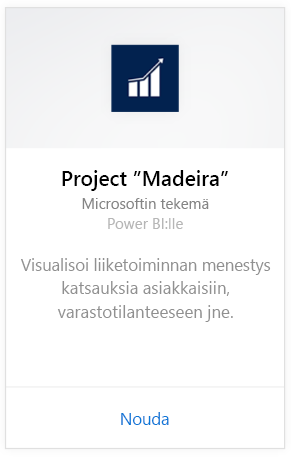
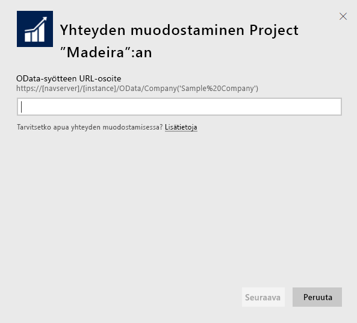
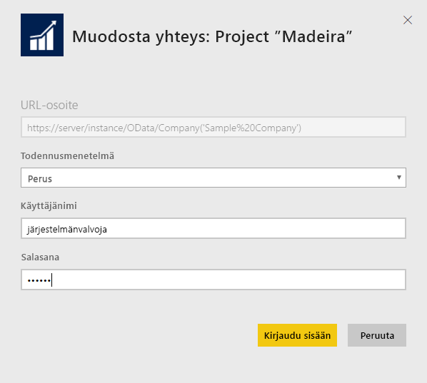
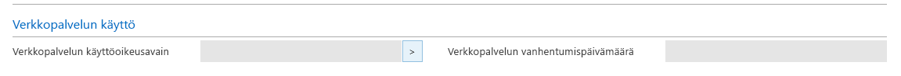
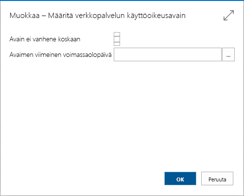
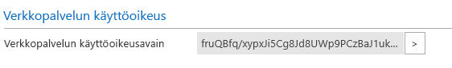

# Yhteyden muodostaminen Project ”Madeiraan” Power BI:llä
Power BI:n ja Project ”Madeira” -sisältöpaketin avulla saat helposti merkityksellisiä tietoja Project ”Madeirasta”. Power BI noutaa sekä Myynti- että Rahoitus-tiedot ja luo niiden pohjalta valmiin koontinäytön ja raportit.
Muodosta yhteys Project ”Madeira” for Power BI:hin tai lue lisää Project ”Madeiran” integroinnista Power BI:hin.

>[!NOTE]
>Tämä sisältöpaketti edellyttää oikeuksia taulukoihin, joista tiedot noudetaan, tässä tapauksessa myynti- ja rahoitustietoihin. Lisätietoja vaatimuksista on [alla](#Requirements).

Muodosta yhteys Power BI:n [Project ”Madeira” Analytics -sisältöpakettiin](https://app.powerbi.com/getdata/services/project-madeira).

## Yhteyden muodostaminen
1. Valitse vasemman siirtymisruudun alareunassa **Nouda tiedot**.  
    
2. Valitse **Palvelut**-ruudussa **Nouda**.  
    
3. Valitse ensin **Project ”Madeira”** ja sitten **Nouda**.  
    
4. Anna pyydettäessä Project ”Madeiran” URL-osoite. URL-osoitteen on oltava täsmälleen seuraavan mallin mukainen: https://mycronusus.projectmadeira.com:7048/NAV/OData/Company('CRONUS%20US'), jossa yrityksen nimi on Project ”Madeira”. Huomaa, että lopussa ei ole vinoviivaa, ja käytössä on oltava https-yhteys. Lisätietoja URL-osoitteen etsimisestä on [alla](#FindingParams).  
   
    
5. Valitse pyydettäessä todennusmenetelmäksi Perus, kirjoita käyttäjänimeksi Project ”Madeira” -sähköpostiosoitteesi ja anna sitten salasanaksi Project ”Madeira” -tilisi verkkopalvelun käyttöoikeusavain. Jos olet jo kirjautunut Project ”Madeiraan” selaimessa, tunnistetietoja ei välttämättä pyydetä. Lisätietoja käyttöoikeusavaimen luomisesta on [alla](#FindingParams).  
   
    >[!NOTE]
    >Sinun on oltava Project ”Madeira” -pääkäyttäjä.
   
   
6. Kun yhteys on muodostettu, koontinäyttö, raportti ja tietojoukko ladataan automaattisesti. Tämän jälkeen ruudut päivitetään tilisi tiedoilla.  
   
    

**Mitä seuraavaksi?**

* Kokeile [kysymyksen esittämistä raporttinäkymän yläreunassa olevassa Q&A-ruudussa](power-bi-q-and-a.md).
* [Muuta koontinäytön ruutuja](service-dashboard-edit-tile.md).
* [Valitse jokin ruutu](service-dashboard-tiles.md), jolloin siihen liittyvä raportti avautuu.
* Tietojoukko on ajastettu päivittymään päivittäin, mutta voit muuttaa päivitysaikataulua tai kokeilla tietojoukon päivittämistä **Päivitä nyt** -toiminnolla haluamanasi ajankohtana

## Järjestelmävaatimukset
Jotta voit tuoda Project ”Madeiran” tietoja Power BI:hin, sinulla on oltava käyttöoikeudet myynti- ja rahoitustietojen taulukoihin, joista tiedot noudetaan. Sisältöpaketin edellyttämiin taulukoihin (kirjainkoko on merkitsevä) kuuluvat seuraavat:  
 
    ´´´ 
    - ItemSalesAndProfit  
    - ItemSalesByCustomer  
    - powerbifinance  
    - SalesDashboard  
    - SalesOpportunities  
    - SalesOrdersBySalesPerson  
    - TopCustomerOverview  
    ´´´ 

## Parametrien etsiminen
**Oikean URL-osoitteen hankkiminen** Helppo tapa hankkia tarvittava URL-osoite on siirtyä Project ”Madeirassa” verkkopalveluihin, etsiä sieltä powerbifinance-verkkopalvelu ja kopioida Odata-URL-osoite (napsauta hiiren kakkospainiketta ja valitse Kopioi pikakuvake), mutta jättää pois ”/powerbifinance...” -osio URL-merkkijonosta.

**Verkkopalvelun käyttöoikeusavaimet** Jotta voit käyttää Project ”Madeiran” tietoja, sinun on luotava verkkopalvelun käyttöoikeusavain käyttäjätilillesi. Hae Project ”Madeiran” käyttäjäsivu ja avaa sitten käyttäjätilisi kortti. Täällä voit luoda uuden verkkopalvelun käyttöoikeusavaimen ja kopioida sen Power BI:n yhteyssivun salasanakenttään.

Kun aloitat verkkopalvelun käyttöoikeusavaimien käytön, sinun on käytettävä niitä jatkossakin. Valitse siis avautuvassa sanomassa OK.
Avainta luodessasi voit valita, vanhentuuko se tiettynä ajankohtana vai ei.

Kun valitset OK, avain on luotu, joten voit kopioida sen Power BI:n yhteyssivun salasanakenttään.

## Vianmääritys
Power BI -koontinäyttö käyttää yllä lueteltuja julkaistuja verkkopalveluita, ja se näyttää esittely-yrityksen tietoja tai oman yrityksesi tietoja, jos tuot tietoja nykyisestä talousratkaisustasi. Jos jokin menee kuitenkin vikaan, tässä osiossa on ratkaisuja yleisimpiin ongelmiin.

**"Parametrien vahvistaminen epäonnistui. Varmista, että kaikki parametrit ovat kelvollisia."**

Jos näet tämän virhesanoman, kun olet antanut Project ”Madeiran” URL-osoitteen, varmista, että seuraavat edellytykset täyttyvät:  

   - URL-osoite on täsmälleen seuraavan mallin mukainen: https://*mycronusus*.projectmadeira.com:7048/NAV/OData/Company('*CRONUS%20US*')  
   - Poista kaikki sulkumerkeissä olevan yrityksen nimen perässä oleva teksti.  
   - Varmista, että URL-osoitteen lopussa ei ole vinoviivaa.  
   - Varmista, että URL-osoite on käyttää suojattua yhteyttä eli että URL-osoitteen alkuosana on https.  

**”Sisäänkirjautuminen epäonnistui”** Jos yrität kirjautua koontinäyttöön Project ”Madeiran” tunnistetiedoilla ja näyttöön tulee kirjautumisen epäonnistumisesta kertova virhesanoma, syynä voi olla jokin seuraavista:  

   - Käyttämälläsi tilillä ei ole oikeuksia lukea Project ”Madeiran” tietoja tililtäsi. Tarkista Project ”Madeiran” käyttäjätilisi ja varmista, että olet käyttänyt salasanana oikeaa verkkopalvelun käyttöoikeusavainta. Yritä sitten uudelleen.  
   - Project ”Madeira” -esiintymällä, johon yrität muodostaa yhteyden, ei ole kelvollista SSL-varmennetta. Tässä tapauksessa näkyviin tulee tarkempi virhesanoma (jonka mukaan luotettua SSL-suhdetta ei voi muodostaa). Huomaa, että itse allekirjoitettuja varmenteita ei tueta.  

**”Virhe”** Jos todentamisvalintaikkunan jälkeen näyttöön tulee Virhe-valintaikkuna, syynä on useimmin ongelma yhteyden muodostamisessa sisältöpaketin tietoihin. Tarkista, että URL-osoite on aiemmin esitetyn mallin mukainen:  
    https://*mycronusus*.projectmadeira.com:7048/NAV/OData/Company('*CRONUS%20US*')

Yleinen virhe on määrittää jonkin verkkopalvelun täydellinen URL-osoite:  
    https://*mycronusus*.projectmadeira.com:7048/NAV/OData/Company('*CRONUS%20US*')/powerbifinance

Olet myös saattanut unohtaa määrittää yrityksen nimen:   
    https://*mycronusus*.projectmadeira.com:7048/NAV/OData/

## Seuraavat vaiheet
[Power BI:n käytön aloittaminen](service-get-started.md)

[Power BI:n peruskäsitteet](service-basic-concepts.md)

