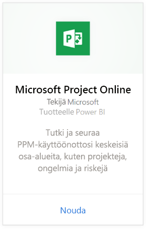
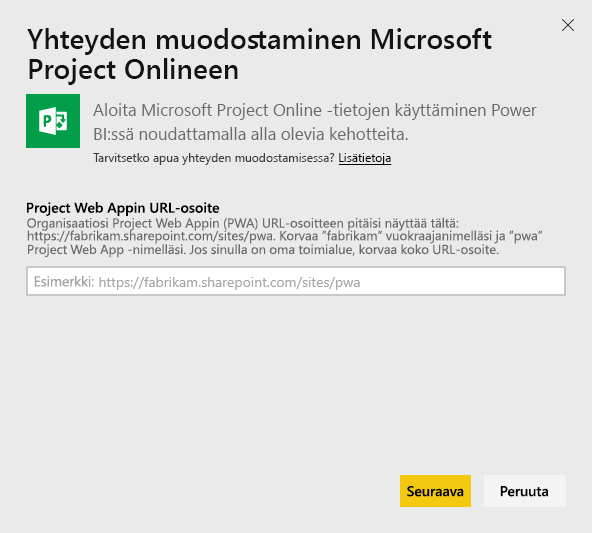
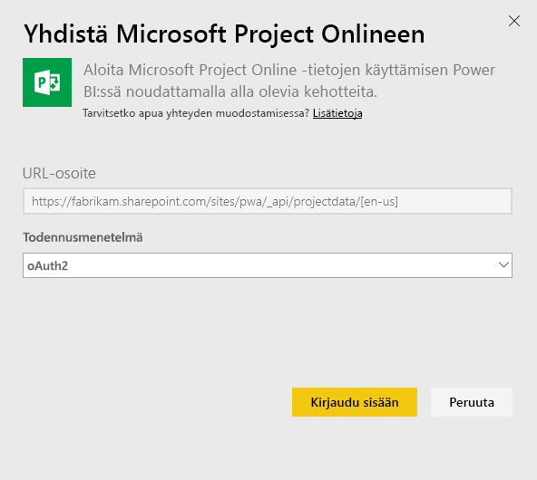
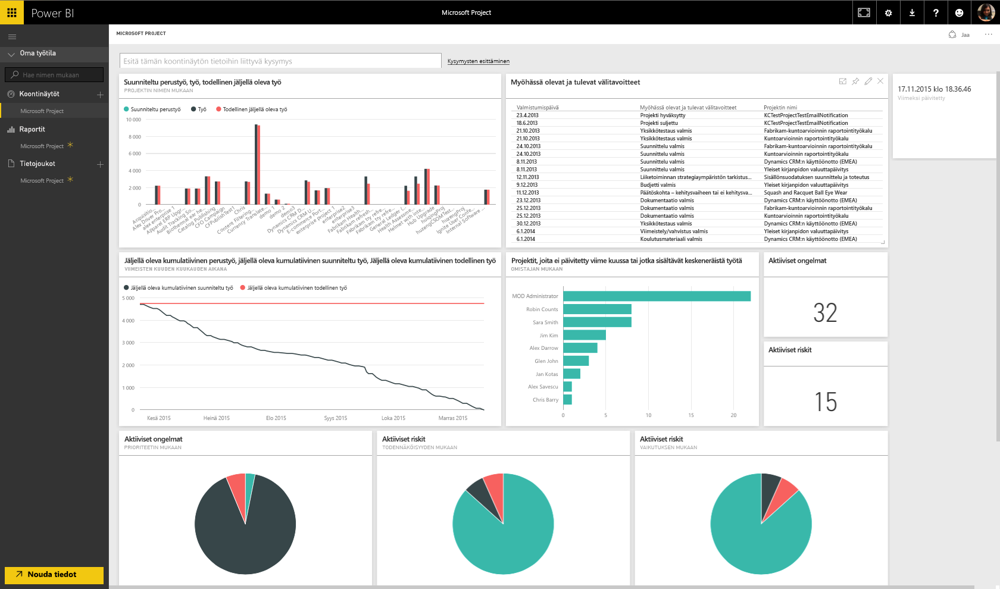
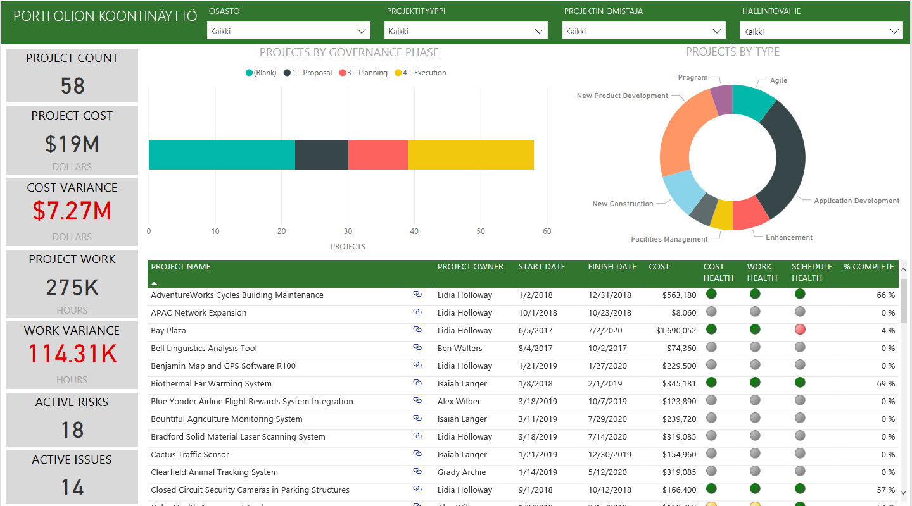
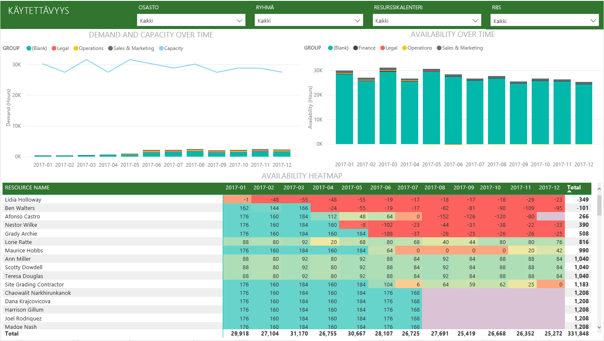
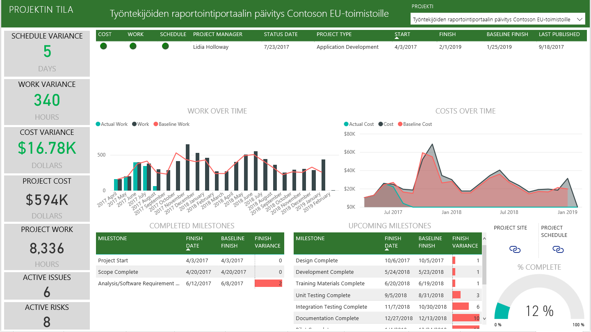

# Yhteyden muodostaminen Project Onlineen Power BI:llä
Microsoft Project Online on joustava online-ratkaisu projektiportfolion hallintaan (PPM) ja päivittäiseen työhön. Project Onlinella organisaatiot voivat aloittaa ja priorisoida projektiportfolion sijoituksia sekä toimittaa suunnitellun liiketoiminta-arvon. Power BI:n Project Online -sisältöpaketin avulla voit saada merkityksellisiä tietoja Project Onlinesta projektien, portfolioiden ja resurssien hallinnan helpottamiseksi.

Muodosta yhteys [Project Online -sisältöpakettiin](https://app.powerbi.com/getdata/services/project-online) Power BI:tä varten.

## Yhteyden muodostaminen
1. Valitse vasemman siirtymisruudun alareunassa **Nouda tiedot**.
   
    
2. Valitse **Palvelut**-ruudussa **Nouda**.
   
   
3. Valitse **Microsoft Project Online** \> **Nouda**.
   
   
4. Kirjoita **Project Web Appin URL-osoite** -tekstiruutuun yhdistettävän Project Web Appin (PWA) URL-osoite ja valitse **Seuraava**. Huomaa, että se poiketa esimerkistä, jos käytössäsi on mukautettu toimialue. Valitse **PWA-sivuston kieli** -tekstiruutu ja kirjoita numero, joka vastaa PWA-sivuston kieltä. Kirjoita numero ”1” englannille, ”2” ranskalle, ”3” saksalle, ”4” portugalille (Brasilia), ”5” portugalille (Portugali) ja ”6” espanjalle. 
   
    
5. Valitse todennusmenetelmäksi **oAuth2**\>**Kirjaudu sisään**. Anna pyydettäessä Project Onlinen tunnistetietosi ja noudata todennusprosessia.
   
    
    
Huomaa, että sinulla on oltava yhdistettävässä Project Web Appissa portfolion tarkastelijan, portfolion ylläpitäjän tai järjestelmänvalvojan oikeudet.

6. Näet ilmoituksen tietojesi lataamisesta. Lataaminen voi kestää jonkin aikaa tilin koosta riippuen. Kun Power BI on tuonut tiedot, näet vasemmassa siirtymisruudussa uuden koontinäytön, 13 raporttia ja tietojoukon. Tämä on oletuskoontinäyttö, jonka Power BI on luonut tietojen näyttämistä varten. Voit muokata tätä koontinäyttöä, jotta näet tiedot juuri haluamallasi tavalla.

   

7. Kun koontinäyttö ja raportit ovat valmiita, jatka eteenpäin ja aloita Project Online -tietojesi tarkasteleminen! Sisältöpaketin mukana toimitetaan 13 monipuolista ja yksityiskohtaista raporttia portfolion yleiskatsausta varten (6 raporttisivua), resurssin yleiskatsaus (5 raporttisivua) ja projektin tila (2 raporttisivua). 

   
   
   
   
   

**Mitä seuraavaksi?**

* Kokeile [kysymyksen esittämistä raporttinäkymän yläreunassa olevassa Q&A-ruudussa](consumer/end-user-q-and-a.md).
* [Muuta koontinäytön ruutuja](service-dashboard-edit-tile.md).
* [Valitse jokin ruutu](consumer/end-user-tiles.md), jolloin siihen liittyvä raportti avautuu.
* Tietojoukko on ajastettu päivittymään päivittäin, mutta voit muuttaa päivitysaikataulua tai kokeilla tietojoukon päivittämistä **Päivitä nyt** -toiminnolla haluamanasi ajankohtana

**Laajenna sisältöpakettia**

Lataa [GitHub PBIT -tiedosto](https://github.com/OfficeDev/Project-Power-BI-Content-Packs), jotta voit edelleen mukauttaa ja päivittää sisältöpakettia

## Seuraavat vaiheet
[Power BI:n käytön aloittaminen](service-get-started.md)

[Tietojen noutaminen Power BI:ssä](service-get-data.md)

