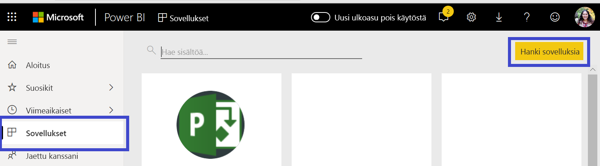
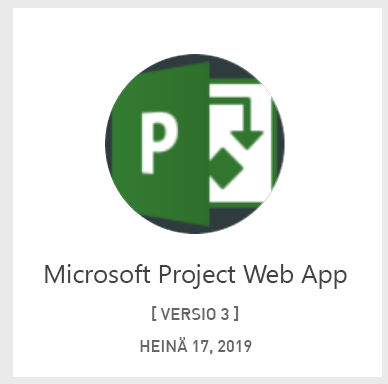
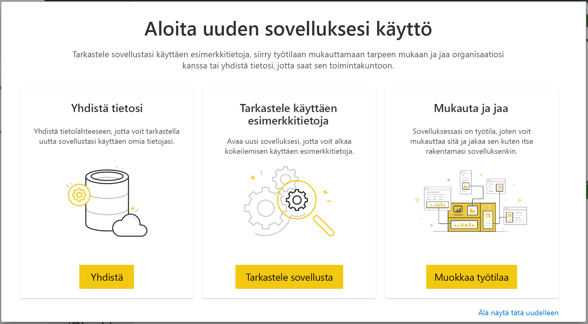

# Yhteyden muodostaminen Project Web Appiin Power BI:llä
Microsoft Project Web App on joustava online-ratkaisu projektisalkun hallintaan (PPM) ja päivittäiseen työhön. Project Web Appin avulla organisaatiot voivat aloittaa ja priorisoida projektisalkun sijoituksia sekä toimittaa suunnitellun liiketoiminta-arvon. Power BI:n Project Web App -mallisovelluksen avulla voit saada merkityksellisiä tietoja Project-verkkosovelluksesta projektien, salkkujen ja resurssien hallinnan helpottamiseksi.

Muodosta yhteys Power BI:n [Project Web App -mallisovellukseen](https://appsource.microsoft.com/product/power-bi/pbi_msprojectonline.pbi-microsoftprojectwebapp).

## Yhdistäminen

1. Valitse **Sovellukset** siirtymisruudussa > valitse **Hanki sovelluksia** oikeassa yläkulmassa.

    

2. Valitse **Palvelut**-ruudusta **Nouda**.
   
   
3. Valitse AppSourcessa **Sovellukset**-välilehti ja hae tai valitse **Microsoft Project Web App**.
   
4. Kun näkyviin tulee sanoma **Asennetaanko tämä Power BI -sovellus?** , valitse **Asenna**. 

   
5. Valitse **Sovellukset**-ruudusta **Microsoft Project Web App** -ruutu. 
   
   
6. Valitse **Aloita uuden sovelluksesi käyttö** -kohdassa **Yhdistä tiedot**.
   
   
7. Kirjoita yhdistettävän Project Web Appin (PWA) URL-osoite **Project Web Appin URL-osoite** -tekstiruutuun.  Huomaa, että se poiketa esimerkistä, jos käytössäsi on mukautettu toimialue. Valitse **PWA-sivuston kieli** -tekstiruutu ja kirjoita numero, joka vastaa PWA-sivuston kieltä. Kirjoita numero ”1” englannille, ”2” ranskalle, ”3” saksalle, ”4” portugalille (Brasilia), ”5” portugalille (Portugali) ja ”6” espanjalle. 
   
   
8. Valitse todennusmenetelmäksi **oAuth2** \> **Kirjaudu sisään**. Anna pyydettäessä Project Web Appin tunnistetietosi ja noudata todennusprosessia.

    > [!NOTE]
    > Sinulla on oltava yhdistettävässä Project Web Appissa portfolion tarkastelijan, portfolion ylläpitäjän tai järjestelmänvalvojan oikeudet.

9. Näet ilmoituksen tietojesi lataamisesta. Lataaminen voi kestää jonkin aikaa tilin koosta riippuen. Kun Power BI on tuonut tiedot, näet uuden työtilasi sisällön. Saatat joutua päivittämään tietojoukon, jotta saat uusimmat päivitykset. 

    Kun Power BI on tuonut tiedot, näet siirtymisruudussa 13-sivuisen raportin ja tietojoukon. 

10. Kun raportit ovat valmiita, jatka eteenpäin ja aloita Project Web App -tietojesi tarkasteleminen! Mallisovelluksen mukana toimitetaan 13 monipuolista ja yksityiskohtaista raporttia salkun yleiskatsausta varten (6 raporttisivua), resurssin yleiskatsaus (5 raporttisivua) ja projektin tila (2 raporttisivua). 

    
   
    
   
    

**Mitä nyt?**

* Tietojoukko on ajastettu päivittymään päivittäin, mutta voit muuttaa päivitysaikataulua tai kokeilla tietojoukon päivittämistä **Päivitä nyt** -toiminnolla haluamanasi ajankohtana.

**Laajenna mallisovellusta**

Lataa [GitHub PBIT -tiedosto](https://github.com/OfficeDev/Project-Power-BI-Content-Packs), jotta voit edelleen mukauttaa ja päivittää sisältöpakettia.

## Seuraavat vaiheet
[Power BI:n käytön aloittaminen](service-get-started.md)

[Tietojen noutaminen Power BI:ssä](service-get-data.md)

