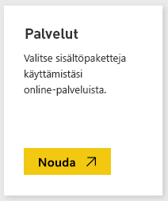
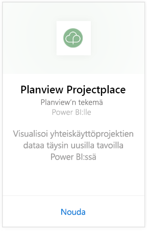
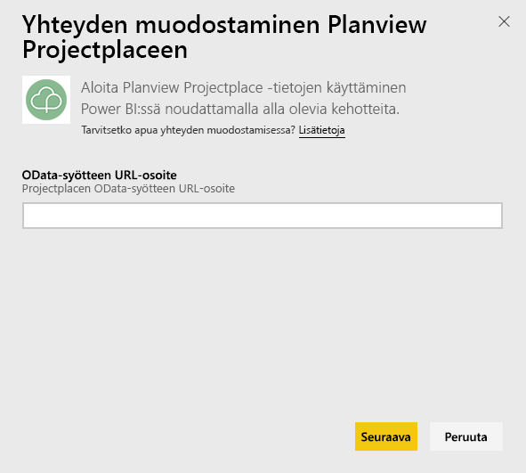
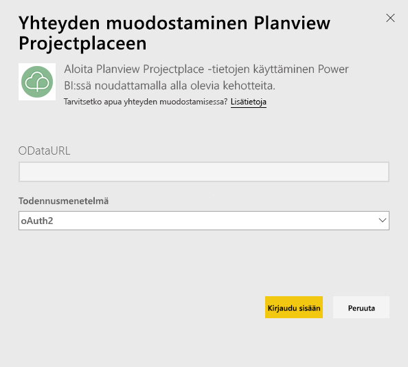
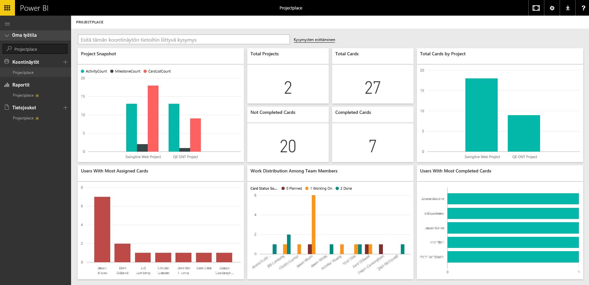

# Yhteyden muodostaminen Planview Projectplaceen Power BI:ssä
Planview Projectplace -sisältöpaketin avulla voit visualisoida yhteistyöprojektitietosi kokonaan uusilla tavoilla suoraan Power BI:ssä. Tarkastele Projectplace-kirjautumisen tunnistetietojesi avulla vuorovaikutteisesti projektin tärkeitä tilastotietoja, selvitä aktiivisimmat ja tuottavimmat ryhmänjäsenesi ja tunnista riskialttiit kohteet ja toimet Projectplace-tilisi projekteissa. Voit myös laajentaa valmista koontinäyttöä ja raportteja, jotta saat sinulle tärkeimmät merkitykselliset tiedot.

[Yhteyden muodostaminen Projectplace-sisältöpakettiin Power BI:ssä](https://app.powerbi.com/getdata/services/projectplace)

>[!NOTE]
>Projectplace-tietojen tuominen Power BI:hin edellyttää, että olet Projectplace-käyttäjä. Lisävaatimukset ovat alla.

## Yhteyden muodostaminen
1. Valitse vasemman siirtymisruudun alareunassa **Nouda tiedot**.
   
    
2. Valitse **Palvelut**-ruudussa **Nouda**.
   
    
3. Valitse Power BI -sivulla **Planview Projectplace** ja valitse sitten **Nouda**:  
   
    
4. Kirjoita OData-syötteen URL-osoite -ruutuun käytettävän Projectplace OData -syötteen URL-osoite seuraavassa kuvassa esitetyllä tavalla:
   
    
5. Valitse Todennusmenetelmä-luettelosta **OAuth**, jos se ei jo ole valittuna. Valitse **Kirjaudu sisään** ja noudata kirjautumisohjeita.  
   
   
6. Valitse vasemmanpuoleisessa ruudussa **Projectplace** koontinäyttöjen luettelosta. Power BI tuo Projectplace-tiedot koontinäyttöön. Huomaa, että tietojen lataamiseen voi kulua jonkin aikaa.  
   
    Koontinäyttö sisältää ruutuja, jotka näyttävät Projectplace-tietokannan tiedot. Seuraavassa kuvassa on esimerkki oletusarvoisesta Projectplace-koontinäytöstä Power BI:ssä.
   
    

**Mitä seuraavaksi?**

* Kokeile [kysymyksen esittämistä raporttinäkymän yläreunassa olevassa Q&A-ruudussa](power-bi-q-and-a.md).
* [Muuta koontinäytön ruutuja](service-dashboard-edit-tile.md).
* [Valitse jokin ruutu](service-dashboard-tiles.md), jolloin siihen liittyvä raportti avautuu.
* Tietojoukko on ajastettu päivittymään päivittäin, mutta voit muuttaa päivitysaikataulua tai kokeilla tietojoukon päivittämistä **Päivitä nyt** -toiminnolla haluamanasi ajankohtana

## Järjestelmävaatimukset
Projectplace-tietojen tuominen Power BI:hin edellyttää, että olet Projectplace-käyttäjä. Tässä prosessissa oletetaan, että olet jo kirjautunut sisään Microsoft Power BI -aloitussivulla käyttäen Power BI -tiliä. Jos sinulla ei ole Power BI -tiliä, siirry osoitteeseen [powerbi.com](https://powerbi.microsoft.com/get-started/) ja valitse kohdasta **Power BI - Pilviyhteistyö ja -jakaminen** **Kokeile ilmaiseksi**. Valitse sitten **Nouda tiedot**.

## Seuraavat vaiheet
[Mikä on Power BI?](power-bi-overview.md)

[Power BI:n peruskäsitteet](service-basic-concepts.md)

