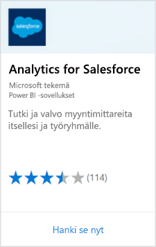
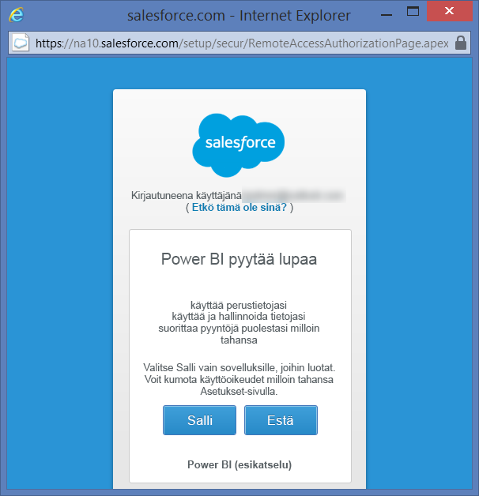
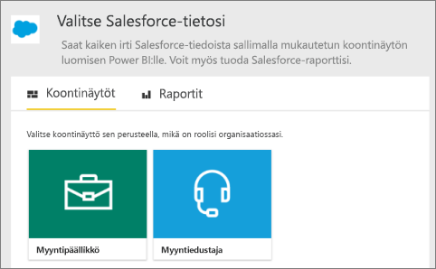
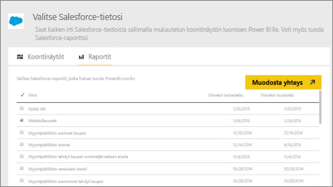
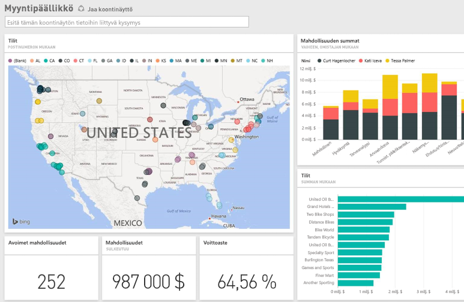

# Yhteyden muodostaminen Salesforceen Power BI:n avulla
Power BI:ssä voit muodostaa helposti yhteyden Salesforce.com-tiliisi. Kun yhteys on luotu, tietosi noudetaan ja koontinäyttö sekä tietoihisi perustuvat raportit esitetään automaattisesti.

Muodosta yhteys Power BI:n [Salesforce-sisältöpakettiin](https://app.powerbi.com/getdata/services/salesforce) tai lue lisätietoja Power BI:n [Salesforce-integroinnista](https://powerbi.microsoft.com/integrations/salesforce).

## Yhteyden muodostaminen
1. Valitse vasemman siirtymisruudun alareunasta **Nouda tiedot**.
   
    
2. Valitse **Palvelut**-ruudussa **Nouda**.
   
    
3. Valitse **Salesforce** ja valitse **Nouda**.  
   
   
4. Aloita kirjautuminen valitsemalla **Kirjaudu sisään**.
   
    
5. Anna Salesforce-tunnistetietosi pyydettäessä. Valitse **Salli**, jotta Power BI voi käyttää Salesforce-perustietoja ja muita tietoja.
   
   
6. Määritä avattavan luettelon vaihtoehdolla, mitä haluat tuoda Power BI:hin:
   
   * **Koontinäyttö**
     
     Valitse valmis koontinäyttö henkilöroolin mukaan (esimerkiksi **Myyntipäällikkö**). Nämä koontinäytöt tuovat määrätyt vakiotiedot Salesforcesta. Ne eivät sisällä mukautettuja kenttiä.
     
     
   * **Raportit**
     
     Valitse vähintään yksi mukautettu raportti Salesforce-tililtäsi. Nämä raportit vastaavat näkymiä Salesforcessa ja ne voivat sisältää mukautettujen kenttien tai objektien tietoja.
     
     
     
     Jos et näe raportteja, lisää tai luo niitä Salesforce-tilissäsi ja yritä muodostaa yhteys uudelleen.
7. Aloita tuontiprosessi valitsemalla **Yhdistä**. Näet tuonnin aikana ilmoituksen, jonka mukaan tuonti on käynnissä. Kun tuonti on valmis, näet Salesforce-tietojesi koontinäytön, raportin ja tietojoukon vasemmalla olevassa siirtymisruudussa.
   
   

Voit muokata tätä koontinäyttöä, jotta näet tiedot juuri haluamallasi tavalla. Voit esittää kysymyksiä Q&A:lla. Voit vaihtoehtoisesti napsauttaa ruutua ja [avata taustalla olevan raportin](consumer/end-user-tiles.md) ja [muokata ruutuja](service-dashboard-edit-tile.md) koontinäytössä.

**Mitä seuraavaksi?**

* Kokeile [kysymyksen esittämistä koontinäytön yläreunassa olevassa Q&A-ruudussa](consumer/end-user-q-and-a.md).
* [Muuta koontinäytön ruutuja](service-dashboard-edit-tile.md) <<<<<<< HEAD
* [Valitse jokin ruutu](consumer/end-user-tiles.md), jolloin siihen liittyvä raportti avautuu =======
* [Valitse jokin ruutu](service-dashboard-tiles.md), jolloin siihen liittyvä raportti avautuu.
>>>>>>> 66fe62d8f200efd9cfeb465eeb5f370dbbaa63be
* Tietojoukko on ajastettu päivittymään päivittäin, mutta voit muuttaa päivitysaikataulua tai kokeilla tietojoukon päivittämistä **Päivitä nyt** -toiminnolla haluamanasi ajankohtana

## Järjestelmävaatimukset ja huomioon otettavat seikat
- Yhdistetty tuotannon Salesforce-tiliin, jossa API-ohjelmointirajapinnan käyttö on sallittu
- Käyttöoikeudet on myönnetty Power BI -sovellukselle sisäänkirjautumisen aikana
- Tilillä on käytettävissä riittävästi API-ohjelmointirajapintakutsuja tietojen vastaanottamiseen ja päivittämiseen
- Päivitystä varten tarvitaan kelvollinen todennustunnus. Varmista, että tuotuna on enintään 5 Salesforce-tietojoukkoa, koska Salesforcessa todennustunnusten enimmäisraja sovellusta kohden on 5.
- Salesforce-raporttien ohjelmointirajapinnassa on rajoitus, joka tukee enintään 2 000 riviä tietoja.

## Vianmääritys
Jos kohtaat virheitä, tarkista edellä mainitut vaatimukset. Huomaa myös, että kirjautumista mukautettuun tai eristettyyn toimialueeseen ei tueta tällä hetkellä.

### ”Yhteyden muodostaminen etäpalvelimeen ei onnistu” -sanoma

Jos saat sanoman ”Yhteyden muodostaminen etäpalvelimeen ei onnistu”, kun yrität muodostaa yhteyden Salesforce-tiliin, katso tätä ratkaisua Outsystems-foorumissa: [Salesforce-liittimen loki virhesanomassa: Yhteyden muodostaminen etäpalvelimeen ei onnistu](https://www.outsystems.com/forums/Forum_TopicView.aspx?TopicId=17674&TopicName=log-in-error-message-unable-to-connect-to-the-remote-server&)

## Seuraavat vaiheet
[Mikä on Power BI?](power-bi-overview.md)

[Nouda tiedot](service-get-data.md)

