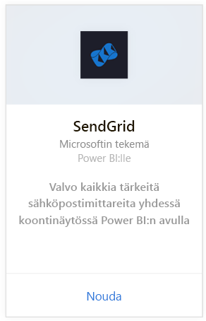
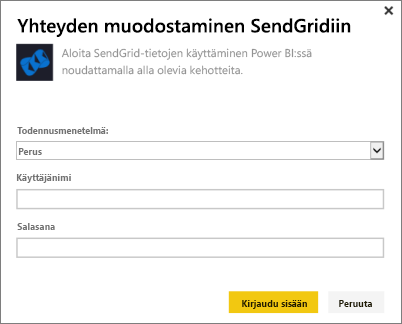
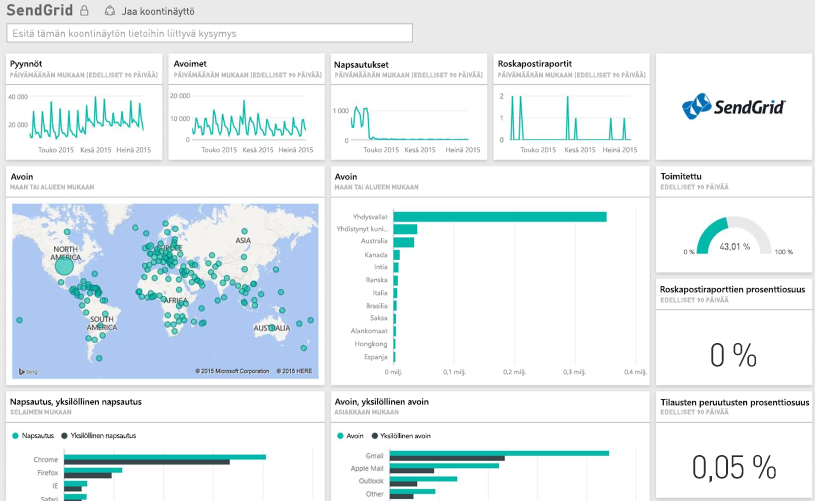

# Yhteyden muodostaminen SendGridiin Power BI:lla
SendGrid Power BI -sisältöpaketin avulla voit poimia merkityksellisiä tietoja ja tilastoja SendGrid-tililtäsi. Käyttämällä SendGrid-sisältöpakettia voit visualisoida SendGrid-tilastoja koontinäytössä.

[!INCLUDE [include-short-name](./includes/service-deprecate-content-packs.md)]

Muodosta yhteys [SendGrid-sisältöpakettiin](https://app.powerbi.com/getdata/services/sendgrid) Power BI:lle.

## Yhteyden muodostaminen
1. Valitse vasemman siirtymisruudun alareunassa **Nouda tiedot**.
   
    
2. Valitse **Palvelut**-ruudussa **Nouda**.
   
    
3. Valitse **SendGrid**-sisältöpaketti ja sitten **Nouda**.
   
    
4. Anna pyydettäessä SendGrid-käyttäjänimi ja salasana. Valitse **Kirjaudu sisään**.
   
   
5. Kun Power BI on tuonut tiedot, näet vasemmassa siirtymisruudussa uuden koontinäytön, raportin ja tietojoukon, johon on täytetty sähköpostitilastot viimeisten 90 päivän ajalta. Uudet kohteet on merkitty keltaisella tähdellä \*.
   
   

**Mitä seuraavaksi?**

* Kokeile [kysymyksen esittämistä raporttinäkymän yläreunassa olevassa Q&A-ruudussa](consumer/end-user-q-and-a.md).
* [Muuta koontinäytön ruutuja](service-dashboard-edit-tile.md).
* [Valitse jokin ruutu](consumer/end-user-tiles.md), jolloin siihen liittyvä raportti avautuu.
* Tietojoukko on ajastettu päivittymään päivittäin, mutta voit muuttaa päivitysaikataulua tai kokeilla tietojoukon päivittämistä **Päivitä nyt** -toiminnolla haluamanasi ajankohtana

## Paketin sisältö
Seuraavat arvot ovat käytettävissä SendGrid-koontinäytössä:

* Yleisiä sähköpostitilastoja - pyynnöt, toimitetut, palautetut, roskaposti estetty, roskapostiraportit jne.
* Sähköpostitilastot luokan mukaan
* Sähköpostitilastot maantieteellisen sijainnin mukaan
* Sähköpostitilastot ISP:n mukaan
* Sähköpostitilastot laitteen, asiakkaan ja selaimen mukaan

## Seuraavat vaiheet
[Mikä on Power BI?](power-bi-overview.md)

[Nouda tiedot](service-get-data.md)

