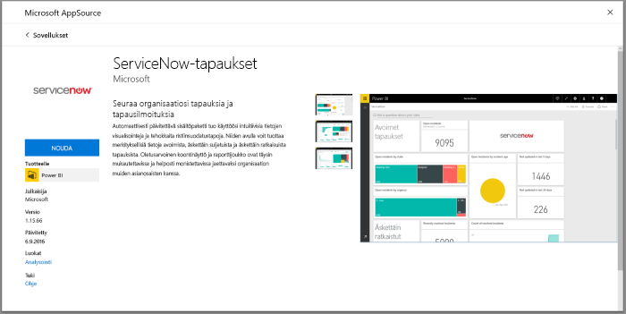

# Yhteyden muodostaminen ServiceNow Power BI:lle ongelmien raportointia varten
ServiceNow tarjoaa useita tuotteita ja ratkaisuja, kuten business, toiminnot ja IT-hallinta liiketoimintasi edistämiseksi. Tämä sisältöpaketti sisältää useita raportteja ja merkityksellisiä tietoja avoimista, äskettäin ratkaistuista ja viimeksi kuitatuista tapauksista.  

Yhteyden muodostaminen [ServiceNow-tapausten](https://app.powerbi.com/getdata/services/servicenow) Power BI-sisältöpakettiin.

## Yhteyden muodostaminen
1. Valitse vasemman siirtymisruudun alareunassa **Nouda tiedot**.
   
    
2. Valitse **Palvelut**-ruudussa **Nouda**.
   
    
3. Valitse **ServiceNow -tapaukset** \> **Nouda**.
   
   
4. Anna ServiceNow URL-osoite ja päivien tai tietueiden tuotava alue. Huomaa, että heti, kun raja ylittyy, tuonti pysähtyy.
   
   
5. Kirjoita pyydettäessä ServiceNow **Basic** -tunnistetietosi. Huomaa, että kertakirjautumista ei vielä tueta, lisätietoja järjestelmävaatimuksista on alla.
   
   
6. Kun kirjautuminen on valmis, tuonti alkaa. Kun kaikki on valmista, uusi raporttinäkymä, raportti ja malli näkyvät siirtymisruudussa. Voit tarkastella tuotuja tietoja valitsemalla raporttinäkymän.
   
    

**Mitä seuraavaksi?**

* Kokeile [kysymyksen esittämistä koontinäytön yläreunassa olevassa Q&A-ruudussa](power-bi-q-and-a.md)
* [Muuta koontinäytön ruutuja](service-dashboard-edit-tile.md).
* [Valitse jokin ruutu](service-dashboard-tiles.md), jolloin siihen liittyvä raportti avautuu.
* Tietojoukko on ajastettu päivittymään päivittäin, mutta voit muuttaa päivitysaikataulua tai kokeilla tietojoukon päivittämistä **Päivitä nyt** -toiminnolla haluamanasi ajankohtana

## Järjestelmävaatimukset
Yhteyden muodostamiseksi tarvitaan seuraavaa:  

* Tili, jolla pääset osoitteeseen yourorganization.service-now.com perustodennusta varten (kertakirjautumisen ei tueta tässä versiossa)  
* Tilillä on oltava rest_service-rooli ja tapauksen taulukon lukuoikeudet  

## Vianmääritys
Jos saat tunnistetietoa koskevan virheen latauksen aikana, tarkista käyttövaatimukset yltä. Jos sinulla on oikeat oikeudet ja kohtaat yhä ongelmia, käsittele asiaa ServiceNow-järjestelmänvalvojan kanssa ja varmista, että sinulla on lisäoikeudet, joita voidaan vaatia mukautettuun esiintymään.

Jos havaitset pitkä latausaikoja, tarkista tapausten määrä ja päivien määrä yhteyden aikana ja harkitse määrien pienentämistä.

## Seuraavat vaiheet
[Power BI:n käytön aloittaminen](service-get-started.md)

[Power BI:n peruskäsitteet](service-basic-concepts.md)

