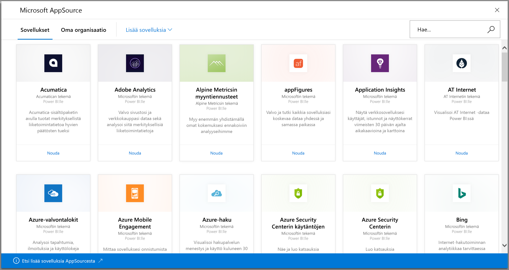
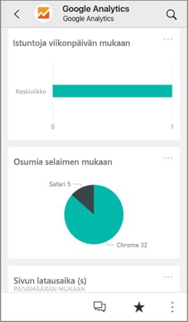
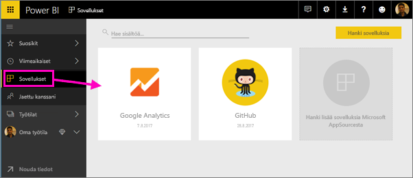
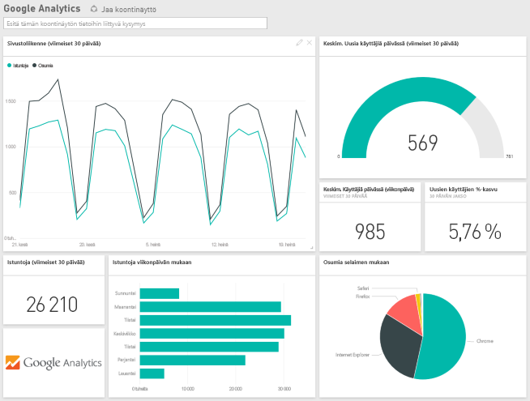
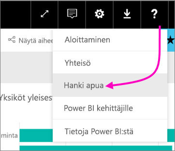

# Käyttämiesi palveluiden yhdistäminen Power BI:hin
Power BI:n avulla voit yhdistää moniin liiketoiminnassasi käyttämiin palveluihin, kuten Salesforce, Microsoft Dynamics ja Google Analytics. Power BI käynnistyy käyttäen tunnistetietojasi ja muodostaa yhteyden palveluun. Se luo Power BI *-työtilan*, jossa on koontinäyttö ja Power BI -raportteja, jotka näyttävät automaattisesti tietosi ja antavat visuaalisesti merkityksellisiä tietoja liiketoiminnastasi.

>[!IMPORTANT]
>Poistamme useita sisältöpaketteja käytöstä 25. syyskuuta 2019. Kaikki asennetut sisältöpaketit toimivat edelleen, mutta et voi asentaa uutta tämän päivämäärän jälkeen. [Mallisovellukset](https://docs.microsoft.com/power-bi/service-template-apps-overview) korvaavat palvelun sisältöpaketit.

Kirjaudu sisään Power BI:hin, niin voit tarkastella kaikkia [palveluja, joihin voit muodostaa yhteyden](https://app.powerbi.com/getdata/services). 

Kun olet asentanut sovelluksen, voit tarkastella koontinäyttöä ja raportteja sovelluksessa ja työtilaa Power BI -palvelussa ([https://app.powerbi.com](https://app.powerbi.com)). Voit tarkastella niitä myös Power BI -mobiilisovelluksissa. Voit muokata työtilassa koontinäyttöä ja raportteja organisaatiosi tarpeiden mukaiseksi ja jakaa ne työtovereillesi *sovelluksena*. 

## Aloittaminen
[!INCLUDE [powerbi-service-apps-get-more-apps](./includes/powerbi-service-apps-get-more-apps.md)]

## Muokkaa koontinäyttöä ja raportteja
Kun tuonti on valmis, uusi sovellus ilmestyy Sovellukset-sivulle.

1. Valitse vasemmassa siirtymisruudussa **Sovellukset** ja valitse sovellus.
   
     
2. Voit esittää kysymyksen kirjoittamalla kysymysten ja vastausten ruutuun tai napsauttamalla ruutua pohjana olevan raportin avaamiseksi. 
   
    
   
    Muuta koontinäyttöä ja raportteja organisaatiosi tarpeiden mukaiseksi. Sen jälkeen voit [jakaa sovelluksesi työtovereillesi](service-create-distribute-apps.md).

## Paketin sisältö
Kun olet muodostanut yhteyden palveluun, näet juuri luomasi sovelluksen ja työtilan sekä koontinäytön, raportit ja tietojoukon. Tiedot palvelusta keskittyvät tiettyyn skenaarioon ja kaikki palvelun tiedot eivät välttämättä sisälly siihen. Tiedot on ajastettu päivittymään automaattisesti kerran päivässä. Voit hallita aikataulua valitsemalla tietojoukon.

Voit myös [muodostaa Power BI Desktopissa yhteyden moniin palveluihin](desktop-data-sources.md), kuten Google Analyticsiin, ja luoda omia mukautettuja koontinäyttöjä ja raportteja.  

Lisätietoja yhteyden muodostamisesta tiettyihin palveluihin löytyy yksittäisistä ohjesivustoista.

## Vianmääritys
**Tyhjät ruudut**  
Kun Power BI ottaa ensimmäistä kertaa yhteyttä palveluun, saatat nähdä tyhjiä ruutuja koontinäytölläsi. Jos näet kahden tunnin kuluttua yhä tyhjän koontinäytön, yhteyden muodostaminen on todennäköisesti epäonnistunut. Jos et näe virhesanomaa, jossa on tietoja ongelman korjaamisesta, tee tukipyyntö.

* Valitse kysymysmerkkikuvake ( **?** ) oikeassa yläkulmassa > **Hanki apua**.
  
    

**Puuttuvia tietoja**  
Koontinäyttö ja raportit sisältävät tietoa palvelusta, joka keskittyy tiettyyn skenaarioon. Jos etsit tiettyä mittausarvoa sovelluksessa etkä näe sitä, lisää idea [Power BI Support](https://support.powerbi.com/forums/265200-power-bi) -tukisivulle.

## Palveluiden ehdottaminen
Käytätkö palvelua, jota haluaisit ehdottaa Power BI -sovelluksen luomiseen? Käy [Power BI Support](https://support.powerbi.com/forums/265200-power-bi) -tukisivulla ja kerro meille siitä.

Jos olet kiinnostunut luomaan mallisovelluksia ja jakamaan niitä itse, katso [Mallisovelluksen luominen Power BI:ssä](service-template-apps-create.md). Power BI -kumppanit voivat muodostaa Power BI -sovelluksia ja ottaa ne käyttöön Power BI -asiakkaille. Koodausta tarvitaan hyvin vähän tai ei lainkaan. 

## Seuraavat vaiheet
* [Jaa sovelluksia työtovereillesi](service-create-distribute-apps.md)
* [Luo uusia työtiloja Power BI:ssä](service-create-the-new-workspaces.md)
* Onko sinulla kysyttävää? [Voit esittää kysymyksiä Power BI -yhteisössä](http://community.powerbi.com/)
* Onko sinulla kysyttävää? [Voit esittää kysymyksiä Power BI -yhteisössä](http://community.powerbi.com/)

